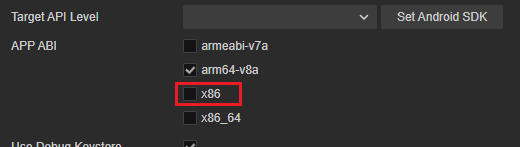
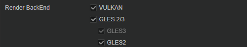
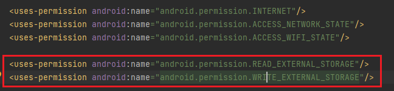

# Google Play Games on PC

[Google Play Games （GPG）](https://play.google.com/googleplaygames#section-system-requirements) 是由谷歌开发，可以让您的移动端 APK 在 PC 上发布、游玩的相关技术。

自 v3.8 起，Cocos Creator 将提供发布到 GPG 的支持。这样将有助于您安卓版本游戏在 PC 平台发布以获取更多的增长。

为了顺利在 GPG 上发布，我们建议您先阅读 [GPG 官方网站](https://developer.android.com/games/playgames/overview?hl=zh-cn) 以便快速介入 GPG SDK。

## 接入指南

为了让您的应用可以顺利上架，请检查下列的步骤是否都已经设置。

1. 为了让游戏可以在 Windows 上运行（包括 intel 和 AMD 芯片），您需要采用 x86 架构进行构建。在 Cocos Creator 构建时，选中 [APP ABI](../native-options.md#app-abi) 并勾选 x86_64：

    

    > x86_64 同时支持 x86 和 x64 建构，为应对未来的需求变化，我们建议您勾选 x86_64。

2. GPG 采用的 OpenGL ES 版本是 3.1，请不要使用高于 3.1 版本。Cocos Creator 支持的最高版本的 OpenGL ES 是 3.1。请参考下图。
3. Vulkan 的版本不高于 1.1，对于 Cocos Creator 来说，要支持 Vulkan，在构建选项中需要勾选 Vulkan 即可，请参考下图。

    

4. 需要去除相关的移动端平台的特性和权限，根据 [功能测试要求](https://developer.android.com/games/playgames/pc-compatibility?hl=zh-cn#unsupported-features-1) 以及 [质量测试要求](https://developer.android.com/games/playgames/pc-compatibility?hl=zh-cn#unsupported-features-2) 的要求将里面相关权限删除。目前 Cocos Creator 默认的构建工程并未涉及这些特性或权限。
5. 删除安卓应用的权限对话框，[详情](https://developer.android.com/games/playgames/pc-compatibility#permissions-dialogs)。
6. 删除不支持的 Google Play API，[详情](https://developer.android.com/games/playgames/pc-compatibility#unsupported-google-apis)。
7. 当应用需要读写外部存储时，需要启用分区存储，示例如下：

    - 在工程目录中找到 AndroidManifest.xml:

        

    - 在添加权限：

        

    - [详情](https://developer.android.com/games/playgames/pc-compatibility#scoped-storage)。

8. 缩放 UI

    Cocos Creator 支持自适应 UI，对于绝大部分移动端游戏来说，分辨率是在应用启动时就确定了，因此不用考虑适配的问题，但是在 GPG 上，由于用户可以通过外界来调整窗口的大小，因此需要单独去适配分辨率。

    我们建议您可以选择 **Widget** 组件用，并确保其 **Align Mode** 为 **On_WINDOW_RESIZE** 或 **ALWAYS**。

    

    - [GPG 界面缩放](https://developer.android.com/games/playgames/graphics?hl=zh-cn#ui-scaling)
    - [多分辨率适配方案](../../../ui-system/components/engine/multi-resolution.md)
    - [Widget 组件参考](../../../ui-system/components/editor/widget.md) 对子 UI 进行适配

    更多详情请查看 [UI 实践指南](../../../ui-system/components/engine/usage-ui.md)。

    对于大屏幕的设备的适配工作，您可以参考谷歌 [适用于大屏设备开发的响应式布局](https://developer.android.com/large-screens)。

    </img>

9. GPG 要求支持 16:9 的长宽比。为了获得理想的玩家体验，游戏还应支持 21：9、16：10 和 3：2。
纵向模式的游戏只需要支持 9:16 的长宽比。如果你的游戏缺乏横向支持，Google Play Games会在全屏模式下渲染黑条。同样可以参考上述的 **Widget** 组件部分。
1. 适配窗口变换，GPG 游戏渲染的分辨率将在游戏启动时、窗口大小重设时、全屏和窗口模型切换时改变游戏的渲染分辨率，[详情](https://developer.android.com/games/playgames/graphics#dynamic-display)。同样可以参考上述的 **Widget** 组件部分。

## 发布流程

GPG 的发布流程和安卓的发布流程类似，您可以参考下列文档以获取发布支持。

- [安装和运行](./build-and-run.md)
- [安卓构建示例](../android/build-example.md)
- [原生发布](../native-options.md)

## 内容

- [集成 Input SDK](../gpg-input-sdk.md)

## 相关链接

- [GPG 官方网站](https://developer.android.com/games/playgames/overview?hl=zh-cn)
