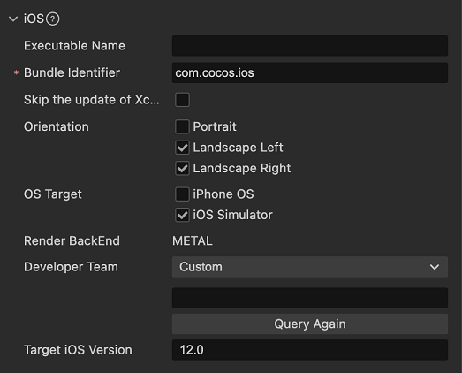

# iOS 平台构建选项

## 配置选项

### 应用 ID 名称（Bundle Identifier）

包名，通常以产品网站 URL 倒序排列，如 `com.mycompany.myproduct`。

> **注意**：包名中只能包含数字 (0~9)、字母 (A~Z、a~z)、中划线（-）和点（.），此外包名最后一部分必须以字母开头，不能以下划线或数字开头。详情请参考 [包的唯一标识符](https://developer.apple.com/documentation/bundleresources/information_property_list/cfbundleidentifier)。

### 跳过 Xcode 工程的更新

若勾选该项，则再次构建工程时，CMake 打包工具不会触发更新 Xcode 工程，以保留之前对 Xcode 工程文件的修改内容。但需要注意的是，后续若对 CMake 配置文件进行修改，也不会再更新 Xcode 工程。

> 这个选项对使用 CocoaPods, 或者需要持久化对 Xcode 工程的修改十分有用. 在没有勾选的情况下, 每次构建都会覆盖 `pod install` 的修改.  勾选之后就不用担心被覆盖了.

### 屏幕方向

//TODO

### 目标系统

//TODO

### 渲染后端

**渲染后端** 目前支持 **METAL**，详情可参考官方文档 [Metal](https://developer.apple.com/cn/metal/)。

### 开发者

该项用于配置构建编译 iOS 工程时的 Development Team 签名信息。若使用 Xcode 编译时，在 Xcode 中手动配置了签名信息，则以 Xcode 中的配置为准。当执行重新构建时，该项的值会覆盖 Xcode 中配置的值。

### 目标版本

该项主要用于指定发布 iOS 平台时的 iOS 软件版本，默认值为 **12.0**。构建后版本号会记录在发布包目录 `proj/cfg.cmake` 文件的 `TARGET_IOS_VERSION` 字段中。