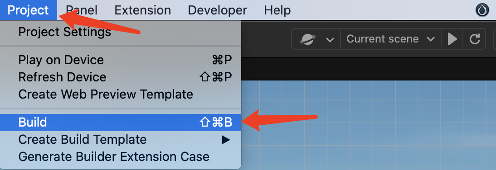
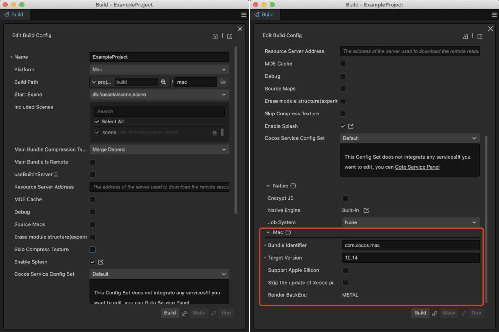
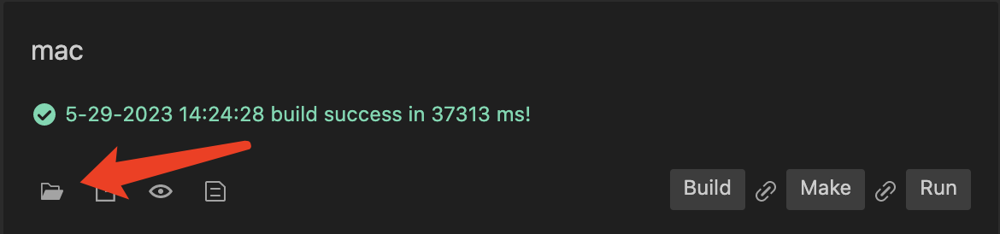
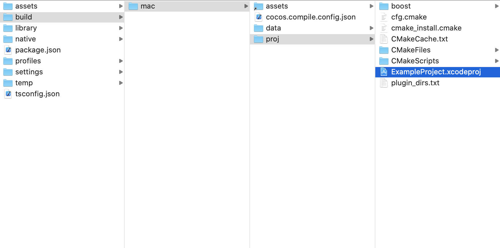
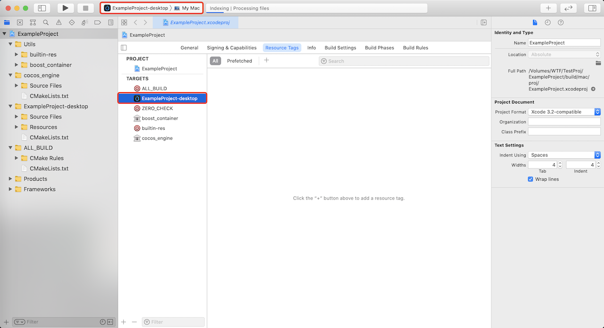
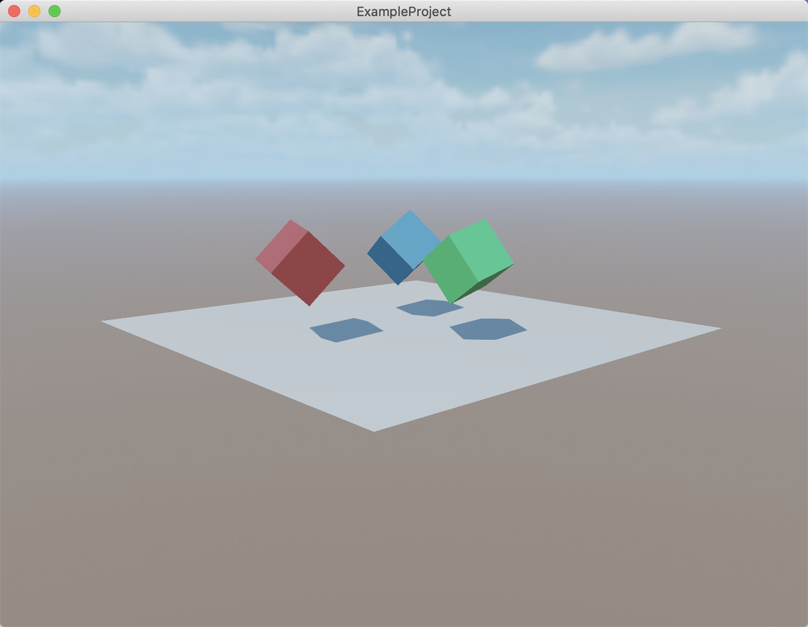
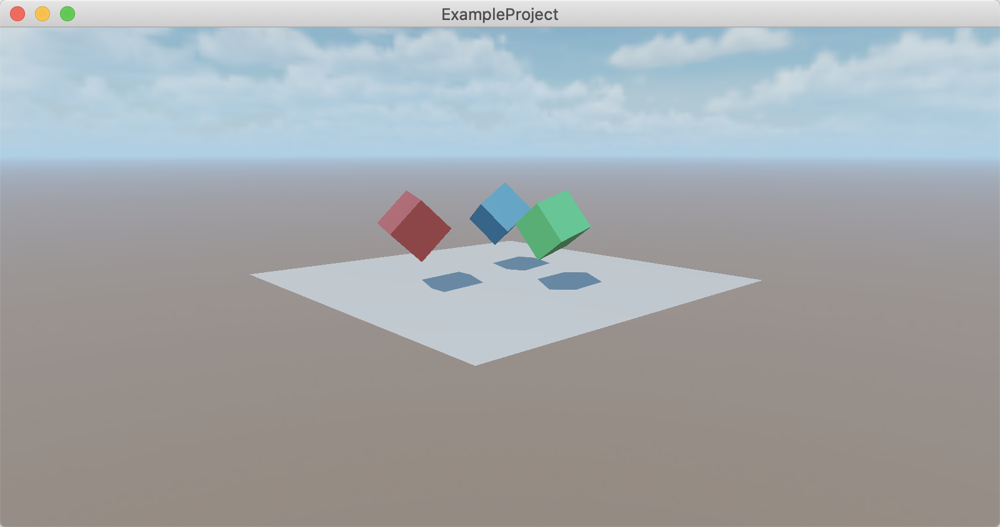

# macOS 构建示例

本文将演示 Cocos Creator 项目发布为 macOS 应用程序的流程，需要以下准备工作：
- 一台 安装了 XCode 的 MacOS 设备
- 一个苹果开发者账号

## 发布流程

### 注册开发者账号

首先，需要拥有一个苹果开发者账号，如果没有，请先前往 [注册页面](https://appleid.apple.com/account) 进行注册。

### 确认 macOS 系统 和 Xcode 版本

Cocos Creator 打包环境要求：
- Xcode 版本为 **11.5** 及以上。
- macOS 版本为 **10.14** 及以上。

> **注意**：默认情况下 AppStore 中对应的 Xcode 与系统匹配，如果要使用特定版本的 Xcode，可前往 [Xcode 下载页](https://developer.apple.com/xcode/download/) 下载。

### 准备测试项目

打开一个已有的项目，或者新建一个测试项目

### 构建



如上图所示，在 Cocos Creator 顶部菜单中选择 **项目(Project)** -> **构建(Build)**，可打开下面的构建面板。



#### 配置通用选项

上图中，左边部分为 Cocos Creator 支持的所有平台都需要配置的公共参数，可以前往 [通用发布配置](./../build-options.md) 查看详情。

#### 配置 macOS 专有选项

平台（Platform）选择为 **Mac**，面板向下滑动，可以看到如右图所示的原生（Native）平台和 macOS 平台特有的配置，详情请查看 [原生平台通用构建选项](./../native-options.md) 和 [macOS 发布选项](./build-options-mac.md)。

#### 填写包名

包名（Bundle Identifier）是必须配置的选项，一般使用 `com.mycompany.myproduct` 组合，比如，本示例用的是 com.cocos.mac。

#### 执行构建

配置完成后，点击 **构建发布（Build）** 按钮，即可生成 Xcode 项目。

构建成功后，可以点击如下所示的打开文件按钮，打开生成的项目路径。



如果未更改过生成路径，可在同目录下找到 build/mac/proj 目录，内容如下所示：



### 在 Xcode 中编译运行

双击 `build/mac/proj/项目名称.xcodeproj`，即可用 Xcode 打开项目。



选择如图所示的 **项目名称-desktop** 作为编译目标，点击编译并运行按钮，即可启动项目。



### 修改分辨率

可以通过 `native/engine/common/classes/Game.cpp` 中的 `_windowInfo` 进行修改：

默认分辨率为 800 x 600，我们以把分辨率改为 800 x 400 为例。

```C++
int Game::init() {
  _windowInfo.title = GAME_NAME;
  // configure window size
  _windowInfo.width  = 800;
  _windowInfo.height = 400;
}
```

修改完成后，在 Xcode 中再次编译运行，效果如下图所示：



## 进阶

### 脚本与原生通信

有时候项目需要从脚本层调用一些 iOS 的系统功能，或者当集成了某个第三方的 iOS SDK 后，调要通过脚本代码调用其 API，此时就需要用到脚本层与原生层的通信机制。

完整的通信机制请参考：

- [基于反射机制实现 JavaScript 与 iOS/macOS 系统原生通信](../../../advanced-topics/oc-reflection.md)。
- [使用 JsbBridge 实现 JavaScript 与 Objective-C 通信](./../../../advanced-topics/js-oc-bridge.md)

### 在原生环境调试代码

有一些问题，只有在特定设备上才会出现，如果能够在对应设备上调试代码，就能快速定位问题，找到解决方案。

Cocos Creator 提供了原生调试机制，可以很方便地在设备上调试游戏代码，请参考：[原生平台 JavaScript 调试](./../debug-jsb.md)

## 特性与系统版本

不同的特性会依赖特定的系统版本，请往 [特性与系统版本](./../../../advanced-topics/supported-versions.md)查看详情。
