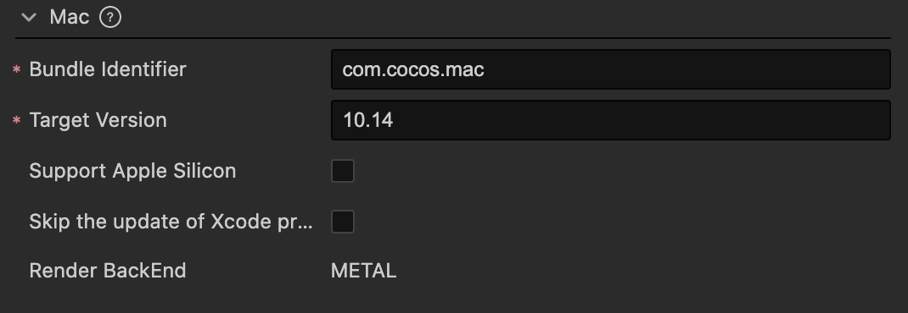

# Mac 平台构建选项

## Bundle Identifier

包名，通常以产品网站 URL 倒序排列，如 `com.mycompany.myproduct`。

> **注意**：包名中只能包含数字 (0~9)、字母 (A~Z、a~z)、中划线（-）和点（.），此外包名最后一部分必须以字母开头，不能以下划线或数字开头。详情请参考 [包的唯一标识符](https://developer.apple.com/documentation/bundleresources/information_property_list/cfbundleidentifier)。

## 目标版本

该项主要用于指定发布 Mac 平台时的 macOS 系统版本，默认值为 **10.14**。构建后版本号会记录在发布包目录 `proj/cfg.cmake` 文件的 `TARGET_OSX_VERSION` 字段中。

## Support Apple Silicon

该项用于更好地提示一些已知的引擎模块在 Apple M1（Silicon）架构设备上的支持问题。

## 跳过 Xcode 工程的更新

若勾选该项，则再次构建工程时，CMake 打包工具不会触发更新 Xcode 工程，以保留之前对 Xcode 工程文件的修改内容。但需要注意的是，后续若对 CMake 配置文件进行修改，也不会再更新 Xcode 工程。
