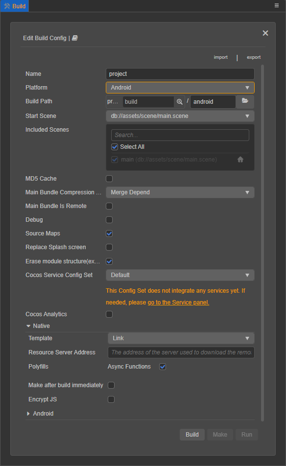
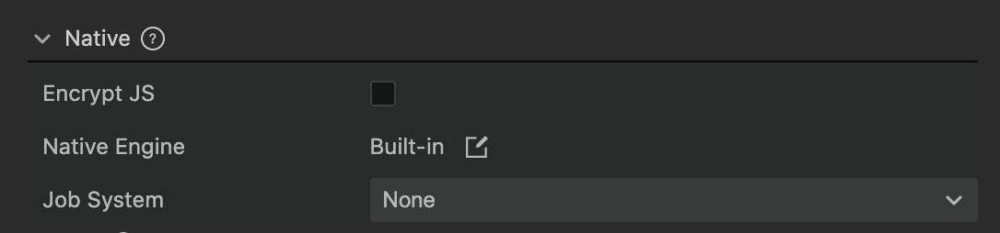
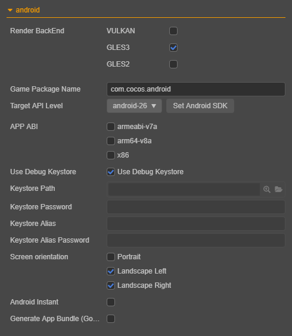
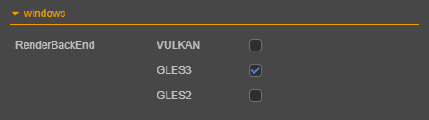
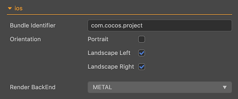
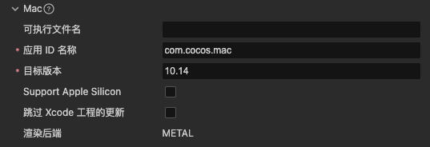
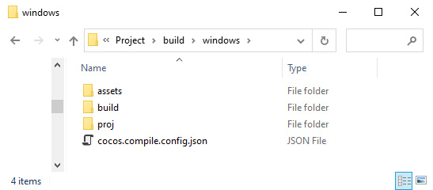
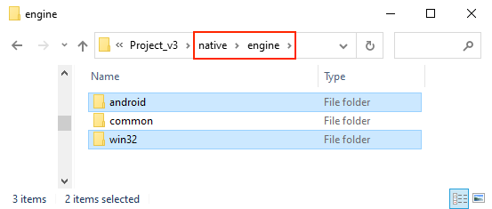
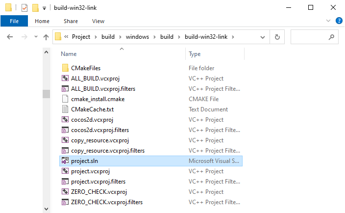

# 打包发布到原生平台

点击菜单栏的 **项目 -> 构建发布**，打开构建发布面板。

目前可以选择的原生平台包括 Android、iOS、Mac、Windows 四个，其中发布到 iOS、Mac 和 Windows 的选项只能在相应的操作系统中才会出现。

## 环境配置

发布到原生平台需要安装配置一些必要的环境，详情请参考 [安装配置原生开发环境](setup-native-development.md)。

## 构建选项

各平台通用的构建选项，详情请参考 [通用构建选项](build-options.md)。

### 原生平台通用构建选项

由于目前构建机制上的调整，不同平台的处理均以插件的形式注入 **构建发布** 面板。 
在 **构建发布** 面板的 **发布平台** 中选择要构建的原生平台后，将会看到除了具体原生平台的展开选项外还有一个 **Native** 的展开选项。**Native** 中的构建选项在各个原生平台上都是一致的。

#### 选择源码模板（Template）

从 Cocos Creator 3.0 开始，为了体验一致，**模板 (Template)** 中可使用的引擎模板为 **Link**，移除了原先的 **Default** 模板。

Link 模板不会拷贝 Cocos2d-x 源码到构建目录下，而是使用共享的 Cocos2d-x 源码。这样可以有效减少构建目录占用的空间，并且对 Cocos2d-x 源码的修改也可以得到共享。

> **关于源码引擎**
>
> Cocos2d-x 引擎中包括了源码引擎，它们适用的范围是：
> 1. 源码引擎初次构建和编译某个工程时需要很长的时间编译 C++ 代码，视电脑配置而定，这个时间可能在 5~20 分钟。对于同一个项目，已经编译过一次之后，下次再编译需要的时间会大大缩短。
> 2. 源码引擎构建出的工程，使用原生开发环境编译和运行（如 Android Studio、Xcode 等 IDE），是可以进行调试和错误捕获的。

目前 Cocos Creator 安装目录下的 `resources\3d\cocos2d-x-lite` 文件夹中已经包含了自带的 Cocos2d-x 源码引擎。若需要自定义引擎，详情请参考 [引擎定制工作流程](../../advanced-topics/engine-customization.md)。

#### 资源服务器地址

当包体过大时，可将资源上传到资源服务器，通过网络请求下载。该项用于填写资源存放在远程服务器上的地址，开发者需要在构建后手动将发布包目录下的 `remote` 文件夹上传到所填写的资源服务器地址上。详情可参考 [上传资源到远程服务器](../../asset/cache-manager.md)

#### Polyfills

该项是脚本系统支持的一些新特性的 polyfills 选项，目前仅支持 **异步函数**。勾选后生成的项目会带上对应的 polyfills，也就是会增大包体，开发者可以根据实际需求选择是否使用。

#### 构建后立即生成

若勾选该项，构建完成后会自动执行 **生成** 步骤，不需要再手动操作。

#### 加密脚本

该项用于加密发布后的脚本。会在构建后的 `assets` 目录下生成 jsc 文件，这个文件是加密过的。而 js 文件会备份在 `script-backup` 目录下以便调试，打包时不会进入 APP 中。

**脚本加密密钥**：在 Native 平台上会使用这个值作为加密 js 文件的密钥。项目新建时会随机生成。

**Zip 压缩**：勾选上的话可以减小脚本体积。

### Android 平台构建选项

Android 平台的构建选项如下：

#### 渲染后端

目前支持 [VULKAN](https://www.vulkan.org/)、[GLES3](https://www.khronos.org/registry/OpenGL-Refpages/es3/) 和 [GLES2](https://www.khronos.org/registry/OpenGL-Refpages/es2.0/) 三种，默认勾选 **GLES3**。在同时勾选多个的情况下，运行时将会根据设备实际支持情况选择使用的渲染后端。

#### 应用 ID 名称

**应用 ID 名称**（Game Package Name）通常以产品网站 URL 倒序排列，如 `com.mycompany.myproduct`。

> **注意**：包名中只能包含数字、字母和下划线，此外包名最后一部分必须以字母开头，不能以下划线或数字开头。

#### Target API Level

设置编译 Android 平台时所需的 Target API Level。点击旁边的 **Set Android SDK** 按钮即可快速跳转到配置页，具体配置规则请参考 [配置原生发布环境路径](setup-native-development.md#%E9%85%8D%E7%BD%AE%E5%8E%9F%E7%94%9F%E5%8F%91%E5%B8%83%E7%8E%AF%E5%A2%83%E8%B7%AF%E5%BE%84)。

#### APP ABI

设置 Android 需要支持的 CPU 类型，可以选择一个或多个选项，目前包括 **armeabi-v7a**、**arm64-v8a**、**x86** 三种类型。

> **注意**：
>
> 1. 当你选择一个 ABI 构建完成之后，在不 Clean 的情况下，构建另外一个 ABI，此时两个 ABI 的 so 都会被打包到 apk 中，这个是 Android Studio 默认的行为。若用 Android Studio 导入工程，选择一个 ABI 构建完成之后，先执行一下 **Build -> Clean Project** 再构建另外一个 ABI，此时只有后面那个 ABI 会被打包到 apk 中。
>
> 2. 项目工程用 Android Studio 导入后，是一个独立的存在，不依赖于构建发布面板。如果需要修改 ABI，直接修改 **gradle.properties** 文件中的 **PROP_APP_ABI** 属性即可。
>
>     

#### 使用调试密钥库

Android 要求所有 APK 必须先使用证书进行数字签署，然后才能安装。Cocos Creator 提供了默认的密钥库，勾选 **使用调试密钥库** 就是使用默认密钥库。若开发者需要自定义密钥库可去掉 **使用调试密钥库** 勾选，详情请参考 [官方文档](https://developer.android.google.cn/studio/publish/app-signing?hl=zh-cn)。

#### 屏幕方向

屏幕方向目前包括 **Portrait**、**Landscape Left**、**Landscape Right** 三种。

- **Portrait**：屏幕直立，Home 键在下
- **Landscape Left**：屏幕横置，Home 键在屏幕左侧
- **Landscape Right**：屏幕横置，Home 键在屏幕右侧

#### Google Play Instant

勾选该项即可将游戏打包发布到 Google Play Instant。Google Play Instant 依赖于 Google Play，并不是一个新的分发渠道，而是更接近一种游戏微端方案。它能够实现游戏的免安装即开即玩，有利于游戏的试玩、分享和转化。

> **使用时需要注意以下几点**：
>
> 1. Android Studio 的版本要在 4.0 及以上
>
> 2. Android Phone 6.0 及以上。Android SDK 版本在 6.0 到 7.0 之间的设备需要安装 Google 服务框架，SDK 版本在 8.0 以上的则不需要，可直接安装使用。
>
> 3. 首次编译的话需要用 Android Studio 打开构建后的工程以下载 **Google Play Instant Development SDK（windows）** 或 **Instant Apps Development SDK（Mac）** 支持包。如果下载不成功的话建议设置一下 Android Studio 的 HTTP 代理。
>
>    

#### 生成 App Bundle（Google Play）

勾选该项即可将游戏打包成 App Bundle 格式用于上传到 Google Play 商店。具体请参考 [官方文档](https://developer.android.google.cn/guide/app-bundle/)。

### Windows 平台构建选项

Windows 平台的构建选项目前只有一个 **渲染后端**，包括 **VULKAN**、**GLES3** 和 **GLES2** 三种类型，默认勾选 **GLES3**。在同时勾选多个的情况下，运行时将会根据设备实际支持情况来选择使用的渲染后端。

### iOS 平台构建选项

iOS 平台的构建选项包括 **Bundle Identifier**、**屏幕方向** 和 **渲染后端**，其中 **屏幕方向** 的设置与 Android 平台一致。

#### Bundle Identifier

包名，通常以产品网站 URL 倒序排列，如 `com.mycompany.myproduct`。

> **注意**：包名中只能包含数字、字母和下划线，此外包名最后一部分必须以字母开头，不能以下划线或数字开头。

#### 渲染后端

**渲染后端** 目前支持 **METAL**。

### Mac 平台构建选项

Mac 平台的构建选项包括 **Bundle Identifier** 和 **渲染后端**，设置方法与 iOS 平台一致。

## 构建

构建选项设置完成后，就可以开始构建了，点击 **构建发布** 面板右下角的 **构建** 按钮，开始构建流程。

编译脚本和打包资源时会在 **构建发布** 面板的 **构建任务** 页面显示蓝色的进度条，构建成功的话进度条到达 100% 并显示为绿色：

### 构建目录

构建结束后，我们得到的是一个标准的 Cocos2d-x 工程，和使用 Cocos Console 新建的工程有同样的结构。以 Windows 平台为例，导出的原生工程包 `windows` 的目录结构为：

- `assets`：存放项目资源
- `proj`：存放当前构建的原生平台工程，可用于对应平台的 IDE 执行编译任务，详情请参考下文介绍
- `cocos.compile.config.json`：本次构建的编译选项配置

因为原生平台（例如 Android、Windows）构建后生成的底层 C++ 代码是完全一致的，所以在 v3.0，我们将底层 C++ 代码单独提取出来放在项目目录下共享的 `native/engine/common` 文件夹中。这样在构建原生平台时，如果检测到已经存在该文件夹，这部分内容便不会再进行处理，加快构建速度。

更多关于目录结构的说明，请参考 [构建目录差异 — 原生平台](../../release-notes/upgrade-guide-v3.0.md#%E5%8E%9F%E7%94%9F%E5%B9%B3%E5%8F%B0)

### 二次开发

v3.0 做了代码和配置的分离，将一部分代码和配置放入源码管理，位于项目目录下的 `native\engine\当前构建的平台名称` 文件夹中（例如 `native\engine\win32`、`native\engine\android`）。

开发者可以在这里集成 SDK 或者做二次开发，删除构建后生成的发布包目录（例如 `build\windows`）不会影响已经集成的 SDK，但前提是需要在目录中添加代码引用：

- 若集成的是各原生平台通用的 SDK，需要在项目目录下的 `native\engine\common\CMakeLists.txt` 中添加引用。
- 若是基于 iOS、Mac、Windows 平台做二次开发，需要在项目目录下的 `native\engine\当前构建的平台名称\CMakeLists.txt` 中添加引用（例如 `native\engine\ios\CMakeLists.txt`）
- 若是基于 Android 平台做二次开发：
    - C++：需要在项目目录下的 `native\engine\android\CMakeLists.txt` 中添加引用。
    - Java：需要在项目发布包 `build\android\proj\build.gradle` 中添加引用。

更多关于 CMake 的使用，详情可参考 [CMake 使用简介](../../advanced-topics/cmake-learning.md)。

## 生成和运行

Cocos Creator 支持通过编辑器或各平台对应的 IDE（如 Xcode、Android Studio、Visual Studio）执行进一步的预览、调试和发布。

### 通过编辑器

构建完成后，继续点击旁边的 **生成** 按钮，成功后会提示：

`make package YourProjectBuildPath success!`

> **注意**：首次生成 Android 平台或者版本升级后，建议通过 Android Studio 打开工程，根据提示下载缺失的工具，再进行编译运行。

**生成** 过程完成后，继续点击旁边的 **运行** 按钮，可能还会继续进行一部分编译工作，请耐心等待或通过日志文件查看进展。各平台的运行结果为：

- Mac/Windows 平台会直接在桌面运行预览
- Android 平台必须通过 USB 连接真机，并且在真机上开启 USB 调试后才可以运行预览
- iOS 平台会调用模拟器运行预览，但建议通过 Xcode 连接真机执行 **生成** 和 **运行**，可参考下文介绍。

### 通过 IDE

点击 **构建任务** 左下角的 **文件夹图标** 按钮，就会在操作系统的文件管理器中打开构建发布路径，这个路径中 `build` 目录下的 `proj` 里就包含了当前构建的原生平台工程。

接下来使用原生平台对应的 IDE（如 Xcode、Android Studio、Visual Studio）打开这些工程，就可以进一步地编译和发布预览了。

- **Android**

  

- **Windows**

  

- **iOS** 和 **Mac**

  

> **注意**：请不要在这些原生平台工程中进行二次开发，否则重新构建时会被覆盖掉。

关于原生平台 IDE 的使用请搜索相关信息，这里就不再赘述了。若要了解如何在原生平台上调试，请参考 [原生平台 JavaScript 调试](debug-jsb.md)。

## 注意事项

1. 在 MIUI 10 系统上运行 debug 模式构建的工程可能会弹出 “Detected problems with API compatibility” 的提示框，这是 MIUI 10 系统自身引入的问题，使用 release 模式构建即可。

2. 打包 iOS 平台时，如果开发者在项目中未使用到 WebView 相关功能，请确保在 **项目 -> 项目设置 -> 功能裁剪** 中剔除 WebView 模块，以提高 iOS 的 App Store 机审成功率。如果开发者确实需要使用 WebView（或者添加的第三方 SDK 自带了 WebView），并因此 iOS 的 App Store 机审不通过，仍可尝试通过邮件进行申诉。

3. Android 平台通过编辑器和 Android Studio 编译后的结果有些区别：

    - 通过编辑器执行 **生成** 步骤后，会在发布路径下生成 `build` 目录，`.apk` 生成在 `build` 目录的 `app\build\outputs\apk` 目录下。

    - 通过 Android Studio 编译后，`.apk` 则生成在 `proj\app\build\outputs\apk` 目录下。

4. 在 Cocos Creator 3.0 中，Android 与 Android Instant 使用同一个构建模板，构建生成的工程都是在 `build\android\proj` 目录中。针对该目录请注意：

    - 如果是 Android 平台单独使用的代码请放入 `app\src` 目录，单独使用的第三方库请放入 `app\libs` 目录（若没有这两个目录可自行创建）。

    - 如果是 Android Instant 单独使用的代码和第三方库请分别放入 `instantapp\src` 和 `instantapp\libs` 目录（若没有这两个目录可自行创建）。

    - 如果是 Android 和 Android Instant 共用的代码和第三方库，请分别放入 `src` 和 `libs` 目录（若没有这两个目录可自行创建）。

    通过在 **构建发布** 面板点击 **生成** 按钮来编译 Android 时，会默认执行 `assembleRelease/Debug`，编译 Android Instant 时会默认执行 `instantapp:assembleRelease/Debug`。
