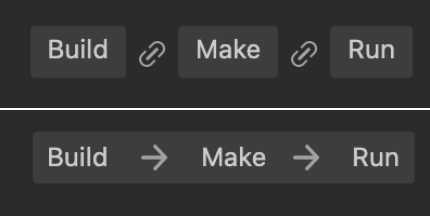

# 打包发布到原生平台

点击菜单栏的 **项目 -> 构建发布**，打开构建发布面板。

目前可以选择的原生平台包括 Android、iOS、HarmonyOS、Mac 和 Windows 四个。iOS、Mac 只在 macOS 电脑上才能选择，Windows 只在 Windows 电脑上才能选择。

## 原生平台通用构建选项

### 加密脚本

该项用于加密发布后的脚本。会在构建后的 `assets` 目录下生成 jsc 文件，这个文件是加密过的。而 js 文件会备份在 `script-backup` 目录下以便调试，打包时不会进入 APP 中。

**脚本加密密钥**：在 Native 平台上会使用这个值作为加密 js 文件的密钥。项目新建时会随机生成。

**Zip 压缩**：勾选上的话可以减小脚本体积。

### 原生引擎

该项用于展示当前使用的是内置引擎还是定制引擎，点击后面的编辑按钮即可前往 **偏好设置 -> [引擎管理器](../preferences/index.md#%E5%BC%95%E6%93%8E%E7%AE%A1%E7%90%86%E5%99%A8)** 面板进行设置。

### 任务调度系统

该项是目前引擎内部功能模块使用的功能，用户暂不需要关注该项。如果确实对任务调度系统有需求，应当注意以下两点：

1. TBB 与 TaskFlow 会因项目情况和环境不同而产生表现差异，应根据实际项目情况做出选择。
2. TBB 或 TaskFlow 在原生平台上的应用会有版本限制，具体请查看下文 **版本支持** 部分的内容。

TaskFlow 依赖特定的 C++ 版本和操作系统版本，请往 [特性与系统版本](./../../advanced-topics/supported-versions.md) 查看详情。

### 自动执行下一步

构建面板右下方，有 **构建**，**生成**，**运行** 三个按钮，默认情况下，需要点击对应的按钮，才会执行相应的动作。

可以点击两个按钮之间的 **链接** 按钮，按钮会变为 **箭头**，意味着箭头指向的下一步会在上一步操作完成后自动执行。 再次点击箭头，可恢复为之前的状态。

## 其他构建选项

发布到原生平台需要安装配置一些必要的环境，详情请参考 [安装配置原生开发环境](setup-native-development.md)。

如需查看所有平台通用的选项，请参考请参考 [通用构建选项](build-options.md)。

如需查看某个原生平台专有的构建选项，请参考：
- [Android 平台构建选项](./android/build-options-android.md)
- [iOS 平台构建选项](./ios/build-options-ios.md)
- [Windows 平台构建选项](./windows/build-options-windows.md)
- [Mac 平台构建选项](./mac/build-options-mac.md)

## 构建

构建选项设置完成后，就可以开始构建了，点击 **构建发布** 面板右下角的 **构建** 按钮，开始构建流程。

编译脚本和打包资源时会在 **构建发布** 面板的 **构建任务** 页面显示蓝色的进度条，构建成功的话进度条到达 100% 并显示为绿色：

### 原生工程目录结构

Cocos Creator 构建的原生工程，包含 原生公共目录，原生平台目录和原生项目目录，详情请参考 [原生平台二次开发指南](../../advanced-topics/native-secondary-development.md)。

## 编译和运行

在 Cocos Creator 中，可以通过构建面板上的按钮，编译和运行项目，也可以通过各平台对应的 IDE（如 Xcode、Android Studio、Visual Studio）打开项目，执行进一步的编译、运行、调试和发布。

### 通过编辑器

构建完成后，继续点击旁边的 **生成** 按钮，成功后会提示：

`make package YourProjectBuildPath success!`

> **注意**：首次编译 Android 项目或者有版本升级时，需要通过 Android Studio 打开工程，检查是否有缺失的工具和错误，确认无误后方可使用构建面板按钮生成和运行。

**生成** 过程完成后，继续点击旁边的 **运行** 按钮，可能还会继续进行一部分编译工作，请耐心等待或通过日志文件查看进展。各平台的运行结果为：

- Mac/Windows 平台会直接在桌面运行预览
- Android 平台必须通过 USB 连接真机，并且在真机上开启 USB 调试后才可以运行预览
- iOS 平台会调用模拟器运行预览，但建议通过 Xcode 连接真机执行 **生成** 和 **运行**，可参考下文介绍。

### 通过 IDE

点击 **构建任务** 左下角的 **文件夹图标** 按钮，就会在操作系统的文件管理器中打开构建发布路径，这个路径中 `build` 目录下的 `proj` 里就包含了当前构建的原生平台工程。

接下来使用原生平台对应的 IDE（如 Xcode、Android Studio、Visual Studio）打开这些工程，就可以进一步地编译和发布预览了。

- **Android**

  

- **iOS** 和 **Mac**

  

- **Windows**

如果要对生成的原生项目做修改，请参考[原生项目二次开发](../../advanced-topics/native-secondary-development.md)。

关于原生平台 IDE 的使用请搜索相关信息，这里就不再赘述了。若要了解如何在原生平台上调试，请参考 [原生平台 JavaScript 调试](debug-jsb.md)。

## 注意事项

1. 在 MIUI 10 系统上运行 debug 模式构建的工程可能会弹出 “Detected problems with API compatibility” 的提示框，这是 MIUI 10 系统自身引入的问题，使用 release 模式构建即可。

2. 打包 iOS 平台时，如果开发者在项目中未使用到 WebView 相关功能，请确保在 **项目 -> 项目设置 -> 功能裁剪** 中剔除 WebView 模块，以提高 iOS 的 App Store 机审成功率。如果开发者确实需要使用 WebView（或者添加的第三方 SDK 自带了 WebView），并因此 iOS 的 App Store 机审不通过，仍可尝试通过邮件进行申诉。

3. Android 平台通过编辑器和 Android Studio 编译后的结果有些区别：

    - 通过编辑器执行 **生成** 步骤后，会在发布路径下生成 `build` 目录，`.apk` 生成在 `build` 目录的 `app\build\outputs\apk` 目录下。

    - 通过 Android Studio 编译后，`.apk` 则生成在 `proj\app\build\outputs\apk` 目录下。

4. 在 Cocos Creator 3.0 中，Android 与 Android Instant 使用同一个构建模板，构建生成的工程都是在 `build\android\proj` 目录中。针对该目录请注意：

    - 如果是 Android 平台单独使用的代码请放入 `app\src` 目录，单独使用的第三方库请放入 `app\libs` 目录（若没有这两个目录可自行创建）。

    - 如果是 Android Instant 单独使用的代码和第三方库请分别放入 `instantapp\src` 和 `instantapp\libs` 目录（若没有这两个目录可自行创建）。

    - 如果是 Android 和 Android Instant 共用的代码和第三方库，请分别放入 `src` 和 `libs` 目录（若没有这两个目录可自行创建）。

    通过在 **构建发布** 面板点击 **生成** 按钮来编译 Android 时，会默认执行 `assembleRelease/Debug`，编译 Android Instant 时会默认执行 `instantapp:assembleRelease/Debug`。
