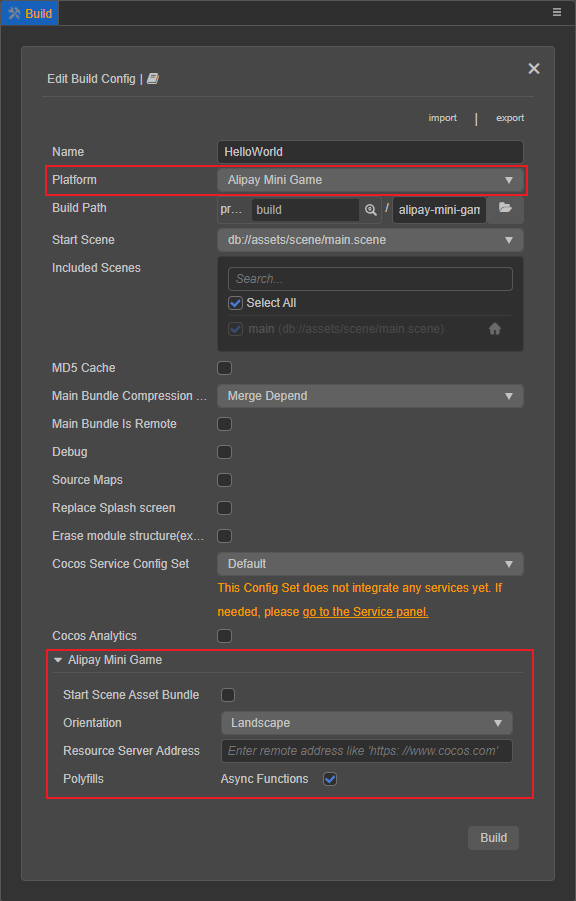
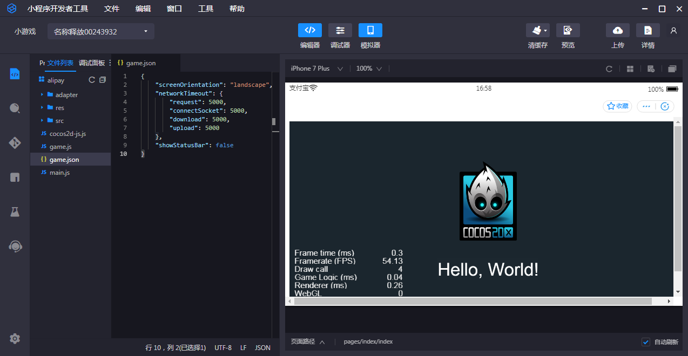

# 发布到支付宝小游戏

## 参数选项说明

| 参数名 | 可选 | 默认值 | 说明 |
| - | - | - | - |
| polyfills | 选填 | { asyncFunctions: true } | 构建支持一些新特性的 polyfills，主要是在打包脚本时会做对应处理，开发者可以根据实际需求选择需要的 polyfills，这组选项暂时只有 **异步函数**，后续将会开放更多功能。|
| remoteUrl | 选填 | ' ' | 服务器地址，指定了服务器地址后，资源将会从服务器上下载，具体加载规则可以参考微信小程序端
deviceOrientation | 必填 | 'auto' | 设备方向，可选值为`'landscape' | 'portrait'`。|

## 环境配置

- 桌面端下载 [支付宝小程序开发者工具](https://render.alipay.com/p/f/fd-jwq8nu2a/pages/home/index.html) 并安装。

- 下载 [支付宝](https://mobile.alipay.com/index.htm)，并安装到手机设备上。

- 支付宝客户端在 Android 上支持的最低版本为 10.1.75，在 iOS 为 10.1.78。

## 发布流程

一、使用 Cocos Creator 打开需要发布的项目工程，在 **构建发布** 面板的 **发布平台** 中选择 **Alipay Mini Game**。然后点击 **构建**。

二、构建完成后点击 **发布路径** 后的 **打开** 按钮，可以看到在发布包 **build** 目录下生成了支付宝小游戏工程文件夹 **alipay**，其中已经包含了支付宝小游戏环境的配置文件 `game.json`。

三、使用 **支付宝开发者工具** 打开构建生成的 **alipay** 文件夹，即可打开支付宝小游戏项目以及预览调试游戏内容。

## 支付宝小游戏环境的资源管理

支付宝小游戏与微信小游戏类似，都存在着包体限制，超过 **4MB** 的额外资源，必须通过网络请求下载。

我们建议用户只保存脚本文件在小游戏包内，其他资源都从远程服务器下载。Cocos Creator 已经帮用户做好了远程资源的下载、缓存和版本管理。具体的实现逻辑和微信小游戏类似，详情可参考 [微信小游戏资源管理](./publish-wechatgame.md#小游戏环境的资源管理)。

具体来说，开发者需要做的是：

1. 构建时，设置 **远程服务器地址**，然后点击 **构建**。
2. 构建完成后将支付宝小游戏发布包目录下的 res 文件夹完整的上传到服务器。
3. 删除本地发布包目录下的 res 文件夹。

## 支付宝小游戏已知问题：

我们对支付宝小游戏的适配工作还未完全结束，目前已知在低端机上文本渲染效果可能不太理想。并且仍不支持以下模块：

- WebView
- VideoPlayer
- 分包加载
- 自定义字体

以上功能预计在以后的更新中会逐步支持，我们也将持续与支付宝小游戏的工程师们紧密沟通，不断优化适配效果。

## 文档相关

由于支付宝小游戏相关的文档目前只对内开放，开发者如果有需要的话可直接联系：

| 联系人  | Email |
| ---- | ---- |
| 李智 | lz98684@alibaba-inc.com      |
| 黄娇 | huangjiao.hj@alibaba-inc.com |
