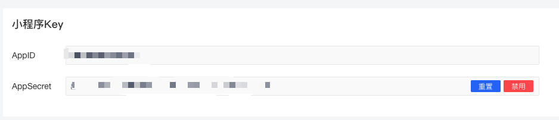
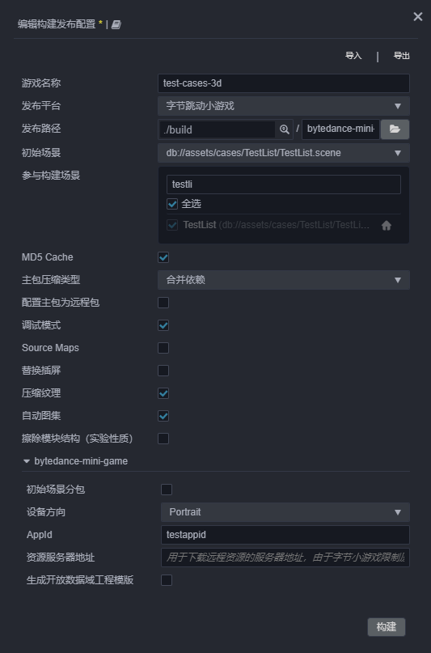
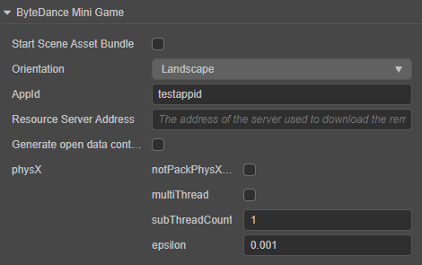
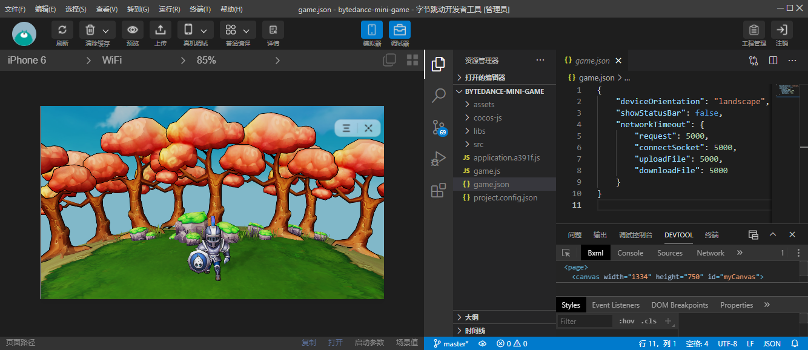

# 发布到字节跳动小游戏

字节小游戏是基于字节跳动全产品矩阵开发，不需用户下载，点开即玩的全新游戏类型。

小游戏的游戏提交，审核和发布流程等，需要遵守字节官方团队的要求和标准流程，具体信息可以参考 [字节跳动小游戏接入指南](https://microapp.bytedance.com/docs/zh-CN/mini-game/introduction/plugin-reference/sign/)。

## 准备工作

1. 下载 [字节跳动开发者工具](https://microapp.bytedance.com/docs/zh-CN/mini-game/develop/developer-instrument/developer-instrument-update-and-download) 并安装。

2. 参考 [字节跳动小游戏接入指南](https://microapp.bytedance.com/docs/zh-CN/mini-game/introduction/plugin-reference/sign/)，在 [字节跳动开发者平台](https://microapp.bytedance.com/) 完成账号注册、登录以及申请小游戏。

3. 小游戏申请通过后，在开发者平台的 **开发管理 -> 开发设置** 中找到 **AppID**。

    

## 发布流程

1. 使用 Cocos Creator 打开需要发布的项目工程，从 **菜单栏 -> 项目** 中打开 **构建发布** 面板。在 **构建发布** 面板的 **发布平台** 中选择 **字节跳动小游戏**。

    

    通用构建选项的设置请参考 [通用构建选项](build-options.md)，字节跳动小游戏特有的构建选项如下，具体说明请参考下文 **构建选项** 部分的内容。

    

2. **构建发布** 面板的构建选项设置完成后，点击 **构建**。 
    构建完成后点击 **构建任务** 左下角的文件夹图标按钮打开项目发布包，可以看到在默认发布路径 `build` 目录下生成了 `bytedance-mini-game`（以具体的构建任务名为准）文件夹，其中已经包含了字节跳动小游戏环境的配置文件 `game.json` 和 `project.config.json`。

    

3. 使用 **字节跳动开发者工具** 打开构建生成的 `bytedance-mini-game` 文件夹，即可打开字节跳动小游戏项目及预览调试游戏内容。开发者工具的具体使用方式请参考 [字节跳动开发者工具介绍](https://microapp.bytedance.com/docs/zh-CN/mini-game/develop/developer-instrument/development-assistance/mini-app-developer-instrument)。

    

### 构建选项

| 构建选项 | 说明 | 字段名（用于命令行发布） |
| :---- | :-- | :-- |
| 初始场景分包 | 勾选后，首场景及其相关的依赖资源会被构建到发布包目录 `assets` 下的内置 Asset Bundle — [start-scene](../../asset/bundle.md#%E5%86%85%E7%BD%AE-asset-bundle) 中，提高初始场景的资源加载速度。 | `startSceneAssetBundle` |
| 设备方向 | 可选值包括 **Portrait** 和 **Landscape**。构建时会写入到发布包目录下的 `game.json` 文件中。 | `orientation` |
| AppID | 必填项，字节跳动小游戏的 AppID，构建时会写入到发布包目录下的 `project.config.json` 文件中。 | `appid` |
| 资源服务器地址 | 用于填写资源存放在远程服务器上的地址。开发者需要在构建后手动将发布包目录下的 `remote` 文件夹上传到所填写的资源服务器地址上。详情请参考 [上传资源到远程服务器](../../asset/cache-manager.md) | `remoteServerAddress` |
| 生成开放数据域工程模板 | 用于接入开放数据域，详情请参考 [开放数据域](./build-open-data-context.md)。 | `buildOpenDataContextTemplate` |
| PhysX | 该项用于配置原生物理相关，具体说明请查看下文 **原生物理** 部分的内容。 | - |

## 原生物理

字节跳动平台一直致力于为开发者提供更强大的性能和基础能力，抖音将在 v16.3 及之后的版本为小游戏提供 PhysX 原生物理接口。而 Creator 与字节跳动平台进行了深度合作，在 **v3.2** 中以实验性功能支持在字节跳动小游戏中使用平台提供的 PhysX 物理能力，优化物理运算性能，对比使用 Bullet 物理有近 100% 的性能提升：

使用原生物理的前提是需要在主菜单栏的 **项目 -> 项目设置 -> 功能裁剪** 中将 **物理系统** 设置为 **PhysX 物理**。然后打开 **构建发布** 面板，**发布平台** 选择 **字节跳动小游戏**，可以看到原生物理相关的配置选项如下：

| 构建选项 | 说明 | 字段名（用于命令行发布） |
| :---- | :-- | :-- |
| PhysX - notPackPhysXLibs | 若勾选该项，则构建时不会打包内置的 PhysX 库文件，有助于减小包体，但 PhysX 便无法在部分字节跳动的应用平台运行，例如抖音（iOS 版本）及开发者工具。 若不勾选该项，则 Creator 支持 PhysX 运行在字节跳动的全应用平台。 | `physX.notPackPhysXLibs` |
| PhysX - multiThread | 是否启用多线程模式。 | `physX.multiThread` |
| PhysX - subThreadCount | 启用多线程模式时子线程的个数。 | `physX.subThreadCount` |
| PhysX - epsilon | 容忍误差。若启用该项，则使用多线程模式时的精度会比单线程的低。 | `physX.epsilon` |

## 分包加载

分包加载，即把游戏内容按一定规则拆分在几个包里，在首次启动的时候只下载必要的包，这个必要的包称为 **主包**，开发者可以在主包内触发下载其他子包，这样可以有效降低首次启动的消耗时间。若要使用该功能需要在 Creator 中设置 [小游戏分包](subpackage.md)，设置完成后在构建时就会自动分包。

字节跳动小游戏需要特定的版本才能支持分包功能，字节产品的版本要求如下：

| 产品     | Android    | iOS        |
| :--     | :---       | :---       |
| 抖音     | v13.6.0    | v13.7.0    |
| 头条     | v7.9.9     | v7.9.8     |

字节开发者工具使用的版本请大于等于 **2.0.6**，小于 **3.0.0**。调试基础库则要求在 1.88.0 及以上。

> **注意**：若产品的版本不支持分包加载，则引擎会将分包作为一个普通的 Asset Bundle 加载。

目前小游戏分包大小有以下限制：
- 整个小游戏的所有分包大小不超过 **16 M**
- 单个分包/主包的大小不能超过 **4 M**

具体可参考 [字节跳动小游戏分包加载官方文档](https://microapp.bytedance.com/docs/zh-CN/mini-game/develop/framework/subpackages/introduction)

## 小游戏环境的资源管理

字节跳动小游戏与微信小游戏类似，都存在着包体限制，超过 4MB 的额外资源，必须通过网络请求下载。 当包体过大时，可在 **构建发布** 面板配置 **资源服务器地址** 选项，将资源上传到远程服务器，详情请参考 [上传资源到远程服务器](../../asset/cache-manager.md)。

我们建议用户只保存脚本文件在小游戏包内，其他资源都从远程服务器下载。Cocos Creator 已经帮用户做好了远程资源的下载、缓存和版本管理，详情可参考 [缓存管理器](../../asset/cache-manager.md)。

## 参考链接

- [字节跳动小游戏开发接入指南](https://microapp.bytedance.com/docs/zh-CN/mini-game/introduction/plugin-reference/sign/)
- [字节跳动开发者平台](https://microapp.bytedance.com/)
- [字节跳动小游戏 API 文档](https://microapp.bytedance.com/docs/zh-CN/mini-game/develop/api/mini-game/bytedance-mini-game)
- [字节跳动开发者工具下载](https://microapp.bytedance.com/docs/zh-CN/mini-game/develop/developer-instrument/developer-instrument-update-and-download)
- [字节跳动开发者工具文档](https://microapp.bytedance.com/docs/zh-CN/mini-game/develop/developer-instrument/development-assistance/mini-app-developer-instrument)
