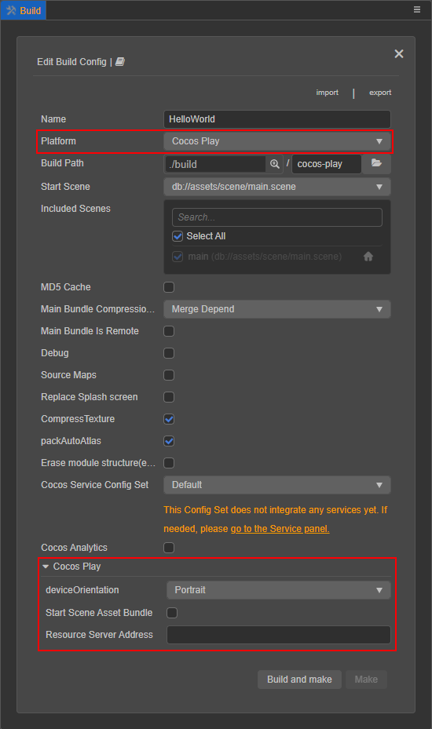
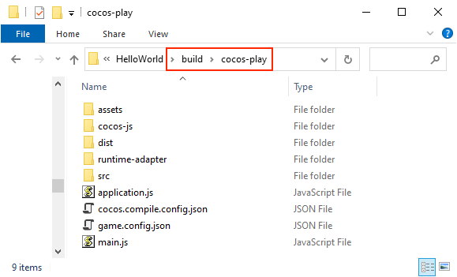

# 发布到 Cocos Play

> 从 v2.2.2 开始，**即刻玩** 更名为 **Cocos Play**。

## 环境配置

下载 [游戏自测工具](https://gamebox.gitbook.io/project/you-xi-jie-ru-wen-dang/zi-yuan-xia-zai/zi-ce-gong-ju) 并安装到 Android 设备（建议 Android Phone 6.0 或以上版本）。

## 发布流程

使用 Cocos Creator 打开需要发布的项目工程，从 **菜单栏 -> 项目** 中打开 **构建发布** 面板。在 **构建发布** 面板的 **发布平台** 中选择 **Cocos Play**。

通用构建选项的设置请参考请参考 [通用构建选项](build-options.md)，Cocos Play 特有的构建选项如下：

| 构建选项 | 说明 | 字段名（用于命令行发布） |
| :----- | :-- | :-- |
| 设备方向 | 可选值包括 `landscape` 和 `portrait`。构建时将会写入到发布包目录下的 `game.config.json` 中。| `deviceOrientation` |
| 初始场景分包 | 若勾选该项，首场景及其相关的依赖资源会被构建到发布包目录 `assets` 下的内置 Asset Bundle — [start-scene](../../asset/bundle.md#%E5%86%85%E7%BD%AE-asset-bundle) 中，提高初始场景的资源加载速度。 | `startSceneAssetBundle` |
| 资源服务器地址 | 该项用于填写资源存放在服务器上的地址。 若 **不填写** 该项，则发布包目录下的 `remote` 文件夹将会被打包到构建后生成的 cpk 包中。 若 **填写**，则不会打包进 cpk。开发者需要在构建后手动将发布包目录下的 `remote` 文件夹上传到所填写的资源服务器地址上，详情请参考 [上传资源到远程服务器](../../asset/cache-manager.md)。 服务器地址会在构建时写入到发布包目录下的 `application.js` 中。 | `tinyPackageServer` |

### 构建

**构建发布** 面板的构建选项设置完成后，点击 **构建并生成** 按钮。 
构建完成后点击 **构建任务** 左下角的文件夹图标按钮打开项目发布包，可以看到在默认发布路径 `build` 目录下生成了 `cocos-play`（以具体的构建任务名为准）文件夹，该文件夹就是导出的 Cocos Play 工程目录和 cpk，cpk 包在 `build/cocos-play/dist` 目录下。

若需要修改生成的 cpk 包，在修改完成后点击 **构建任务** 右下角的 **生成** 按钮，即可在不重新构建的情况下重新生成 cpk 包。

### 接入测试

开发者必须使用自测工具测试接入没有问题之后，才可以打包提交到平台审核。自测工具可以启动游戏并提供游戏登录、支付等功能。通过读取游戏配置参数，确定启动的游戏类型，以及游戏启动方式。自测时没有要求包的大小，但如果是要提交审核的话，包的大小不能超过 10M。具体可参考 [自测工具](https://gamebox.gitbook.io/project/you-xi-jie-ru-wen-dang/ji-shu-dui-jie/zi-ce-gong-ju)。

打开之前已经安装完成的游戏自测工具，然后点击自测工具左上方的 **配置游戏** 按钮进入游戏配置页面。根据需求配置参数并保存。

#### 参数配置

| 属性             | 功能说明             |
| :-------------- |  :-----------        |
| gameId          | 游戏 ID，可由后台获取           |
| gameKey         | 游戏 Key，可由后台获取          |
| gameSecret      | 游戏密钥，可由后台获取         |
| gameType        | 游戏类型，可根据开发者的需求选择 **对战** 或者 **非对战**  |
| gameMode        | 游戏模式，选择 **Runtime**      |
| lodeType        | 游戏加载类型，即游戏启动方式。包括 **File** 和 **Url** 两种。具体使用方式可查看下方 **启动游戏** 部分的介绍    |
| path            | 游戏加载地址，配合 lodeType 使用。具体使用方式可查看下方 **启动游戏** 部分的介绍   |

### 启动游戏

游戏自测工具可以通过以下两种方法启动游戏。

**方法一**：以文件方式从指定位置加载游戏包（游戏加载类型为 **File**）

- 将构建生成的小游戏 cpk 文件（位于 `build/cocos-play/dist` 目录下）拷贝到手机目录下。如果是拷贝到手机 sdcard 目录下，则需要在 sdcard 目录中新建一个文件夹（命名为 `cocosplay`），然后将 cpk 文件拷贝到 `cocosplay` 文件夹中。
- 游戏自测工具参数配置页面中的 **lodeType** 选择 **File**。
- **path** 填写刚才拷贝 cpk 文件放置的新建文件夹，如：**cocosplay/game.cpk**。
- 配置完成后点击 **保存**，然后点击 **启动游戏**，即可打开游戏。

**方法二**：以网页方式从指定网址打开游戏（游戏加载类型为 **Url**）

- 将 cpk 文件上传到服务器。
- 游戏自测工具参数配置页面中的 **lodeType** 选择 **Url**。
- 填写 **path**，如：<http://192.168.0.1:8080/game.cpk>。
- 配置完成后点击 **保存**，然后点击 **启动游戏**，即可打开游戏。

## 小游戏环境的资源管理

Cocos Play 与微信小游戏类似，都存在着包体限制，不过 Cocos Play 的主包包体限制是 **10MB**，超出的部分必须通过网络请求下载。 当包体过大时，可在 **构建发布** 面板配置 **资源服务器地址** 选项，将资源上传到远程服务器，详情请参考 [上传资源到远程服务器](../../asset/cache-manager.md)。

我们建议用户只保存脚本文件在小游戏包内，其他资源都从远程服务器下载。Cocos Creator 已经帮用户做好了远程资源的下载、缓存和版本管理，详情请参考 [缓存管理器](../../asset/cache-manager.md)。

## 相关参考链接

- [Cocos Play 中心](https://gamebox.cocos.com/)
- [Cocos Play 文档中心](https://gamebox.gitbook.io/project/)
- [Cocos Play API 文档](https://gamebox.gitbook.io/project/you-xi-jie-ru-wen-dang/ji-shu-dui-jie/ji-chu-neng-li)
- [Cocos Play 自测工具](https://gamebox.gitbook.io/project/you-xi-jie-ru-wen-dang/ji-shu-dui-jie/zi-ce-gong-ju)
- [Cocos Play 自测工具下载](https://gamebox.gitbook.io/project/you-xi-jie-ru-wen-dang/zi-yuan-xia-zai/zi-ce-gong-ju)
