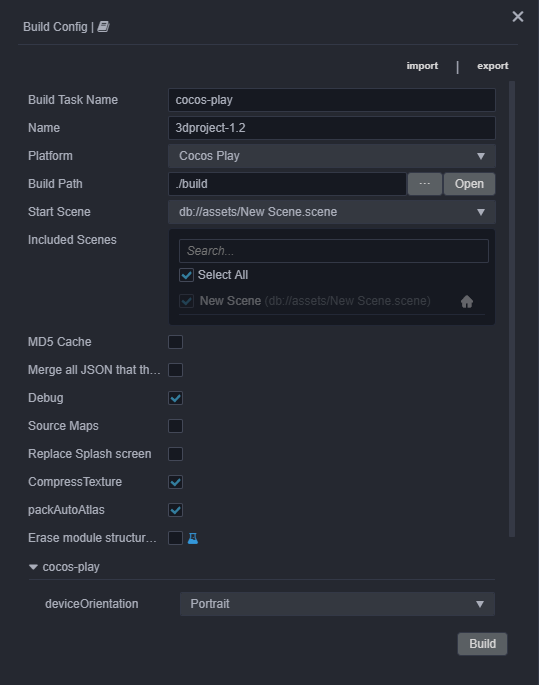
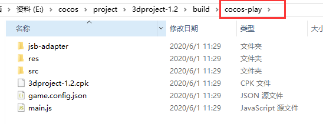

# 发布到 Cocos Play（即刻玩）

## 发布流程

### 准备工作

下载 [游戏自测工具](https://gamebox.gitbook.io/project/you-xi-jie-ru-wen-dang/zi-yuan-xia-zai/zi-ce-gong-ju) 并安装到 Android 设备（建议 Android Phone 6.0 或以上版本）。

### 构建

一、使用 Cocos Creator 打开需要发布的项目工程，在 **构建发布** 面板的 **发布平台** 中选择 **Cocos Play**，然后点击 **构建**。



参数配置具体的填写规则如下：

- 小包模式

  该项为选填项。游戏的包内体积包含代码和资源不能超过 10M，资源可以通过网络请求加载。**小包模式** 就是帮助开发者将脚本文件保留在游戏包内，其他资源则上传到远程服务器，根据需要从远程服务器下载。而远程资源的下载、缓存和版本管理，Creator 已经帮开发者做好了。开发者需要做的是以下步骤：

  1. 构建之前，填写 **小包模式服务器路径**。然后点击 **构建**。

  2. **首屏游戏资源打包到游戏包**，该选项为选填项。
  
      在小包模式下，由于首屏资源过多，下载和加载资源时间比较久，可能会导致首次进入游戏时出现短暂黑屏。如果在构建时勾选了 **首屏游戏资源打包到游戏包**，可以缩短首次进入游戏黑屏的时间。不过需要注意的是：res/import 资源暂不支持分割资源下载，整个 import 目录也会打包到首包。
  
      开发者可以根据自己的需要选择是否勾选该项。然后点击 **构建**。

  3. 构建完成后，点击 **发布路径** 后面的 **打开** 按钮，将发布路径下的 `res` 目录上传到服务器。例如：默认发布路径是 `build`，构建任务名是 `cocos-play`，则需要上传 `build/cocos-play/res` 目录。

  此时，构建出来的 cpk 将不再包含 res 目录，res 目录里的资源将通过网络请求从填写的 **小包模式服务器地址** 上下载。

  命令行构建参数：

  ```js
  tinyPackageMode: false,
  tinyPackageServer: '',
  packFirstScreenRes: false,
  ```

二、**构建发布** 面板的相关参数设置完成后，点击 **构建**。构建完成后点击对应构建任务下方的 **文件图标** 按钮来打开构建发布包。如果构建任务名是 `cocos-play`，可以看到在默认发布路径 `build` 目录下生成了 `cocos-play` 文件夹，该文件夹就是导出的 Cocos Play 游戏工程和 cpk，cpk 包在 `build/cocos-play` 目录下。



### 接入测试

开发者必须使用自测工具测试接入没有问题之后，才可以打包提交到平台审核。自测时没有要求包的大小，但如果是要提交审核的话，包的大小不能超过 10M。自测工具可以启动游戏并提供游戏登录、支付等功能。通过读取游戏配置参数，确定启动的游戏类型，以及游戏启动方式。具体可参考 [自测工具](https://gamebox.gitbook.io/project/you-xi-jie-ru-wen-dang/ji-shu-dui-jie/zi-ce-gong-ju)。

打开之前已经安装完成的游戏自测工具，然后点击自测工具左上方的 **配置游戏** 按钮进入游戏配置页面。根据需求配置参数并保存。


#### 参数配置

| 属性             | 功能说明             |
| --------------  |  -----------        |
| gameId          | 游戏 ID，可由后台获取           |
| gameKey         | 游戏 Key，可由后台获取          |
| gameSecret      | 游戏密钥，可由后台获取         |
| gameType        | 游戏类型，可根据开发者的需求选择 **对战** 或者 **非对战**  |
| gameMode        | 游戏模式，选择 **Runtime**      |
| lodeType        | 游戏加载类型，即游戏启动方式。包括 **File** 和 **Url** 两种。具体使用方式可查看下方 **启动游戏** 部分的介绍    |
| path            | 游戏加载地址，配合 lodeType 使用。具体使用方式可查看下方 **启动游戏** 部分的介绍   |

## 启动游戏

游戏自测工具可以通过以下两种方法启动游戏。

**方法一**：以文件方式从指定位置加载游戏包（游戏加载类型为 **File**）

  - 将构建生成的小游戏 cpk 文件（位于 `build/cocos-play` 目录下）拷贝到手机目录下。如果是拷贝到手机 sdcard 目录下，则需要在 sdcard 目录中新建一个文件夹（命名为 cocosplay），然后将 cpk 文件拷贝到 cocosplay 文件夹中。
  - 游戏自测工具参数配置页面中的 **lodeType** 选择 **File**。
  - **path** 填写刚才拷贝 cpk 文件放置的新建文件夹，如：**/cocosplay/game.cpk**。
  - 配置完成后点击 **保存**，然后点击 **启动游戏**，即可打开游戏。

**方法二**：以网页方式从指定网址打开游戏（游戏加载类型为 **Url**）

  - 将 cpk 文件上传到服务器。
  - 游戏自测工具参数配置页面中的 **lodeType** 选择 **Url**。
  - 填写 **path**，如：<http://192.168.0.1:8080/game.cpk>。
  - 配置完成后点击 **保存**，然后点击 **启动游戏**，即可打开游戏。

## 相关参考链接

- [Cocos Play 中心](https://gamebox.cocos.com/)
- [Cocos Play 文档中心](https://gamebox.gitbook.io/project/)
- [Cocos Play API 文档](https://gamebox.gitbook.io/project/you-xi-jie-ru-wen-dang/ji-shu-dui-jie/ji-chu-neng-li)
- [Cocos Play 自测工具](https://gamebox.gitbook.io/project/you-xi-jie-ru-wen-dang/ji-shu-dui-jie/zi-ce-gong-ju)
- [Cocos Play 自测工具下载](https://gamebox.gitbook.io/project/you-xi-jie-ru-wen-dang/zi-yuan-xia-zai/zi-ce-gong-ju)
