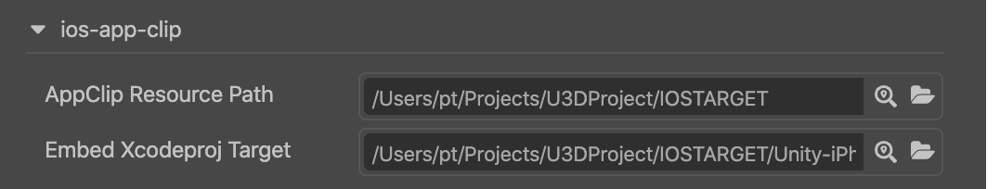

# 发布到 iOS App Clip (轻 App)

从 v1.2.1 版本开始，通过 iOS 平台构建出的 Xcode 工程已经包含了 App Clip 编译目标。通过本流程构建出资源就可以运行/发布 App Clip 应用。

Cocos Creator 还支持以 App Clip 的方式将游戏嵌入到其他的 Xcode 工程中。比如：在使用 其他游戏引擎 **生成** iOS 工程文件后，通过此构建过程就可以把 Cocos Creator 项目中嵌入其中。 方便玩家通过 App Clip 轻松体验应用。 

## 环境要求

- Xcode 12+
- iOS 14+

## 发布流程

使用 Cocos Creator 打开需要发布的项目工程。从 **菜单栏** -> **项目** 中打开 **构建发布** 面板，**发布平台** 选择 **iOS App Clip**。

## 参数项配置

除了下列的两个参数之外，其他的参数可以参考 原生 iOS 构建的参数说明．

- **App Clip Resources Path**

  设置 App Clip 资源存放的路径．
      
- **Embed Xcodeproj Target** （可选）
  
  指定需要嵌入 App Clip 的 `.xcodeproj` 路径．编辑器会为其中的 iOS 目标配置 App Clip。

> 由于 App Clip 有 `10M` 的包体限制，开发者可以适当选取场景，调整最终包体大小．

### 为 Cocos Creator 工程构建 App Clip 资源

*在构建 App Clip 之前，需要先完成原生 iOS 平台的构建，* 以生成 Xcode 主工程。

将 **App Clip Resources Path** 设置为 **iOS 主工程的构建目录**。生成的资源文件会被存放到子目录　`ios-app-clip/` 中。

此时 **Embed Xcodeproj Target**　路径不需设置，留空即可。

### 嵌入 App Clip 到其他 iOS 工程中

如果想要在其他 iOS 工程中嵌入 Cocos Creator 目标，就需要同时指定上面的两个路径。

其中 **App Clip Resources Path** 可以指定为 **Embed Xcodeproj Target** 的同级目录或者子目录, 方便资源文件的管理。

> 为了防止文件意外损坏, 目标 Xcode 工程会被备份到同级别的目录的子目录中，方便恢复。

## 构建

**构建** 后，通过设置 `Bundle ID` 等几个步骤，便可以在 Xcode 中运行/调试 App Clip。

## 后续步骤

参考 [Apple 官方文档](https://developer.apple.com/documentation/app_clips?language=objc) 对 App Clip 的打包/测试/发布 进行必要的设置。

