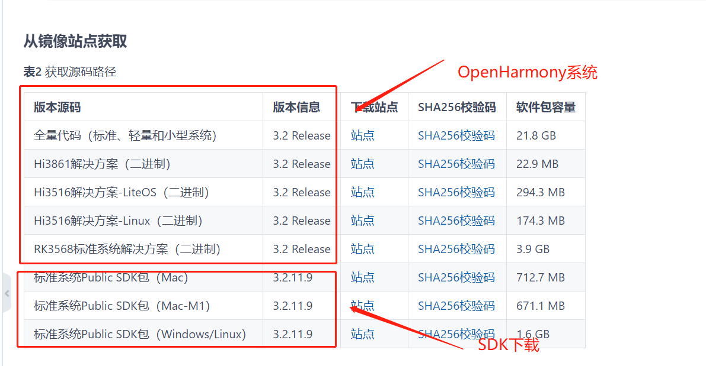
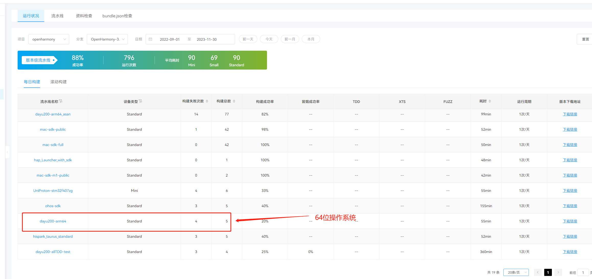
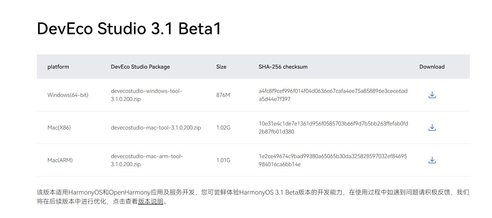
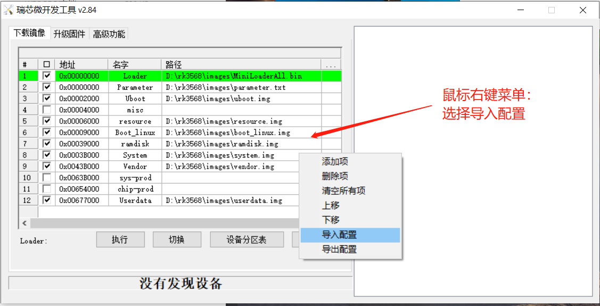
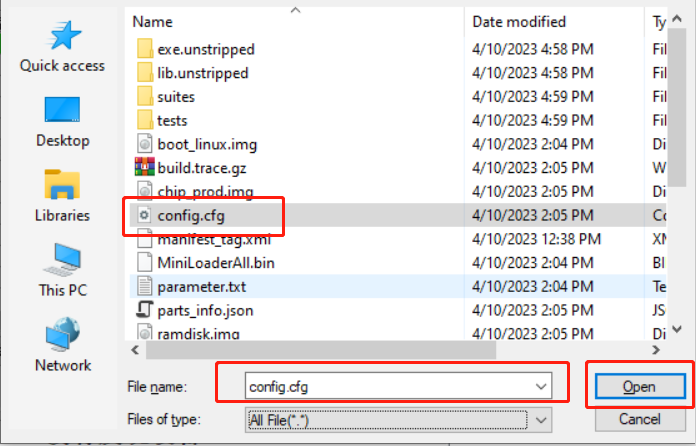
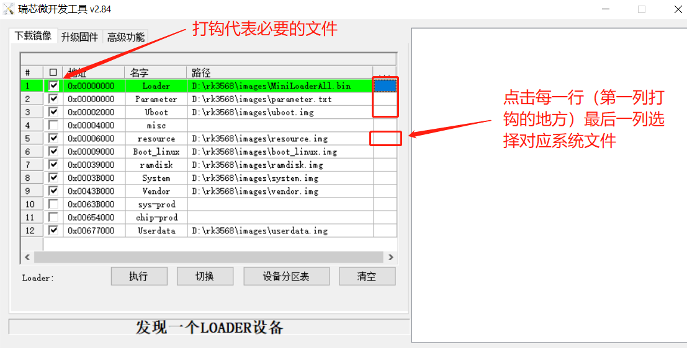
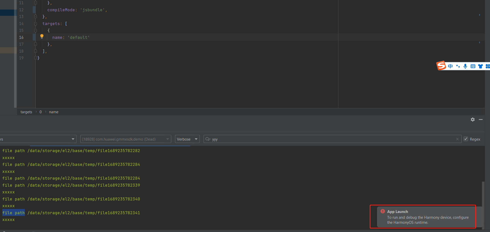
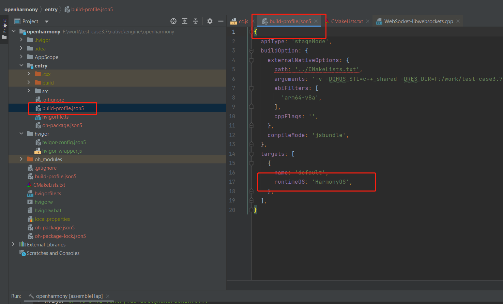
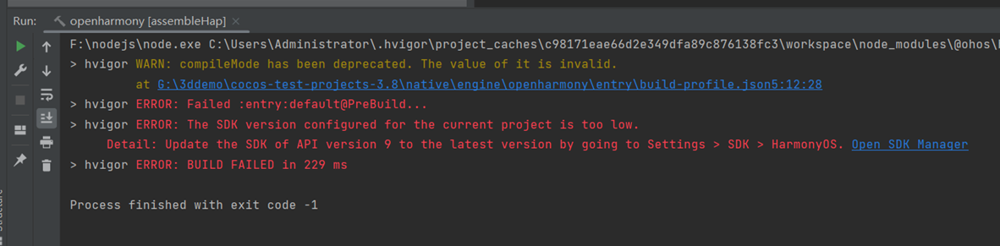

# 发布到 OpenHarmony

自 Cocos Creator v3.8 起，支持发布到 OpenHarmony 平台。

## 支持情况

| 引擎版本 | OpenHarmony 版本 | 说明 |
| :-- | :-- | :-- |
| v3.6.1 ~ v3.7.3 | OpenHarmony 3.2 beta | 实验性质 |
| v3.8 | OpenHarmony 3.2，OpenHarmony 4.0 | 正式版 |

如果您使用的引擎版本低于 v3.8，我们建议您升级到 v3.8 方便发布正式版。

## 前言

我们在 Cocos Creator v3.8.0 的基础上成功适配了在 2023 年 4 月 9 日发布的 [OpenHarmony 3.2 Release](https://gitee.com/openharmony/docs/blob/master/zh-cn/release-notes/OpenHarmony-v3.2-release.md) 分支。

鹰击长空：[GitHub - cocos/cocos-tutorial-airplane: video tutorial airplane](https://github.com/cocos/cocos-tutorial-airplane)

游戏视频：

<video src="./publish-openharmony/video.mp4"></video>

如无法观看视频，请点击 [下载地址](./publish-openharmony/video.mp4) 下载后观看。

## 准备工作

1. Cocos Creator 下载传送门（版本>=3.8.0）：[Cocos Creator](https://www.cocos.com/creator-download)
2. OpenHarmany 系统与 SDK 下载传送门：[OpenHarmony-3.2-release](https://gitee.com/openharmony/docs/blob/master/zh-cn/release-notes/OpenHarmony-v3.2-release.md#%E4%BB%8E%E9%95%9C%E5%83%8F%E7%AB%99%E7%82%B9%E8%8E%B7%E5%8F%96)

    

OpenHarmony 发布的系统是 **32位** 的，**64位** 下载传送门：

```
http://ci.openharmony.cn/workbench/cicd/dailybuild/dailylist
```



3. 下载最新的 IDE（版本\>=3.1.1）：[DevEco Studio](https://developer.harmonyos.com/cn/develop/deveco-studio#download)

    

4. 系统烧录工具：[RKDevTool](https://gitee.com/hihope_iot/docs/tree/master/HiHope_DAYU200/%E7%83%A7%E5%86%99%E5%B7%A5%E5%85%B7%E5%8F%8A%E6%8C%87%E5%8D%97/windows) 烧录工具与 [使用文档](https://gitee.com/hihope_iot/docs/tree/master/HiHope_DAYU200/%E7%83%A7%E5%86%99%E5%B7%A5%E5%85%B7%E5%8F%8A%E6%8C%87%E5%8D%97#https://gitee.com/hihope_iot/docs/tree/master/HiHope_DAYU200/%E7%83%A7%E5%86%99%E5%B7%A5%E5%85%B7%E5%8F%8A%E6%8C%87%E5%8D%97/windows)

5. 开发套件：[HH-SCDAYU200](https://gitee.com/hihope_iot/docs/tree/master/HiHope_DAYU200)

## 发布步骤

### 系统烧录

1. 下载 [windows平台工具](https://gitee.com/hihope_iot/docs/tree/master/HiHope_DAYU200/%E7%83%A7%E5%86%99%E5%B7%A5%E5%85%B7%E5%8F%8A%E6%8C%87%E5%8D%97/windows)，解压后，如下图：

    

2. 解压 DriverAssitant_v5.1.1，解压后，如下图：

    

3. 双击 DriverInstall.exe 安装 USB 驱动，如下图

    

4. 点击驱动安装，如下图：

    

5. 连接设备，设备连接图，如下图：

    

6. 切换根目录，双击 RKDevTool.exe，双击运行，如下图：

    

7. 如果连上设备，默认就是\'发现一个MASKROM设备\'（必须安装 USB 驱动之后且连接设备后才会显示），如下图：

    

8. 按着 recover（一直按着），然后按一下 reset 按钮（按一次，松开），过一会放开 recover，就会在 RKDevTool 工具里提示\'发现一个loader设备\'，如下图: 

9. 显示'发现一个LOADER设备'才能烧写系统，如下图：

    

10. 出现这个状态之后，解压下载的 [OpenHarmony系统](http://download.ci.openharmony.cn/version/Master_Version/OpenHarmony_3.2.5.5/20220926_081431/version-Master_Version-OpenHarmony_3.2.5.5-20220926_081431-dayu200.tar.gz)。解压后，如下图：

    

12. 鼠标右键，选择导入配置，如下图：

    

13. 选择解压后的系统文件中的config.cfg分区配置文件，如下图：

    

14. 在 RKDevTool软件中，把打勾的部分，选择解压的系统对应的文件，如下图：

    

    

16. 点击执行，等待日志显示'下载完成'即可。执行成功后，设备会自动进行重启，出现软件 OpenHarmony 界面欢迎页面，然后进入到桌面，即表示烧录成功，如下图：


### 安装 DevEco Studio

1. 下载最新的 IDE，下载对应平台的 IDE，点击右边的下载按钮，如下图：

    

2. 解压目录，双击 deveco-studio-3.0.0.993.exe 进行安装，点击 next，如下图：

    

3. 选择安装路径，点 next，如下图：

    

4. 根据需求配置，点击 next，如下图:

    

5. 点击安装，如下图：

    

6. 等待安装，如下图：

    

7. 安装完成，如下图：

    

8. 启动DevEco Studio，如下图:

    

9. 首次会提示设置源，默认应该就可以，如下图:

    

10. 首次安装需要安装 Node.js，如果之前安装有 Node.js，选择本地的 Node.js 即可，但是有版本要求，Node.js 的版本必须大于 v14.19.1和小于 v15.0.0。npm 的版本要求大于 6.14.16 和小于 7.0.0。如下图：

    

11. 这里选择下载新的 Node.js 为例，如下图:

    

12. 等待下载完成，然后点击 Finish 按钮，如下图：

    

13. 接下来会提示安装 SDK，点击下一步，注意是 OpenHarmonySDK，如下图

    

14. 确认版本信息，点击 next，如下图：

    

15. 选择 Accept 之后，选择 Next，如下图：

    

16. 等待下载完成，之后点击 Finish 即可，如下图：

    

### OpenHarmonySDK 更换

由于 SDK 随着 IDE的升级不断的升级，可能会导致部分兼容性的问题，为了能让工程正常运行，建议是替换 IDE 内置的 SDK。操作方法如下：

1. 更新 NDK

- 备份原来的SDK目录, native_backup是备份原来为native目录，如下图：

    

- 解压SDK，找到ohos-sdk\\windows里的native-windows-x64-3.2.11.9-Release.zip，解压至OHOS_SDK/9目录，如下图：

    

2. 更换ets

- 备份原来的ets文件，把SDK目录下的9/ets改成ets_backup，如下图：

    

- 解压文件ets-windows-x64-3.2.11.9-Release.zip至OHOS-SDK/9目录：


- 打开命令行进入目录OHOS_SDK\\9\\ets\\build-tools\\ets-loader，并执行npm
install，如下图（注意目录要匹配）：


    > **注意**：如果 `npm install` 报错，检查下是否配置了华为的源，配置方法如下：
    > ` npm config set registry https://repo.huaweicloud.com/repository/npm/ `

- 在 deveco 里，clear project 之后，重新 build 即可。clear project 操作如下图：

    

1. 其他
js-windows-x64-3.2.11.9-Release.zip
previewer-windows-x64-3.2.11.9-Release.zip
toolchains-windows-x64-3.2.11.9-Release.zip
这三个文件参考上诉步骤替换，总结步骤入下：
- 备份SDK目录（OHOS_SDK/9）里的文件；
- 解压至OHOS_SDK/9至对应的文件；
***（注意‘9’是API版本，未来升级就对应升级之后的API版本）***
    目录对应关系，如下图：

    

### Cocos Creator 构建 OpenHarmony 工程

1. 设置 OpenHarmony SDK 的路径，如下图：

    

    可以使用 DevEco 查看 SDK 的路径。

2. 打开 DevEco，点击标题栏里的，File-\>Settings\...，如下图：

    

3. 查看 OpenHarmony SDK 的配置，如下图：

    

    > **注意**：API Version 9 的版本要为已安装的状态，如果未安装，需要手动安装，如上图所示。

4. 打开 Cocos Creator，打开存在的项目，如下图：

    > 

5. 选择工程的目录，以下以 [cocos-test-projects](https://github.com/cocos/cocos-test-projects/tree/v3.8) 为例，如下图：

    

6. 登录开发者账号，如下图：

    

7. 根据创建游戏，增加游戏逻辑等

8. 制作完成之后，选择构建，选择标题栏中的 Project-\>Build，也可以使用 Ctrl+Shift+B 的快捷键，如下图：

    

9. 点击新建任务，如下图：

    

10. 选择 Openharmony

    

11. 配置工程名称、配置开始场景与包含的其他场景，配置Debug/Release, 配置32位cocos应用或64位cocos应用（对应OpenHarmony32位系统与64位系统），点击 build，如下图：

    
    

12. 点击 make（目前会提示失败，但是会生成无签名的 hap 包），之后点击 run（需要设备，由于没有签名，目前 run 会失败）即可（由于目前 make 和 run 都会失败，因此可以不操作）。

    

### 烧录 Hap 包到 RK 板

1. 构建工程成功后，如下状态即可，make 与 run 可以不需要点击，如下图：

    

2. 使用[DevEcoStudio](https://developer.harmonyos.com/cn/develop/deveco-studio#download)，打开工程，如下图：

    

3. 找到工程目录（native/engine/openharmony）并点击打开，如下图（下图是以[cocos-test-projects](https://github.com/cocos/cocos-test-projects)为例）：

    

4. 配置签名，如下图：

    

5. 插入设备，点击运行，如下图：

    

执行成功之后，就能看到效果了。

## 几个注意事项

目前 Cocos Creator 支持在 OpenHarmony 32位 与 64位 系统运行，且系统暂不支持 JIT，但是引擎目前支持AOT优化。

另外，因为 OpenHarmony 还在不断完善当中，因此有些已知问题。这些问题都会在后续的版本解决。
1. 目前已知问题是：
    - restart 目前还未有方案；
    - editbox显示时，会把这个游戏页面往上推
    - RK3568不支持陀螺仪，线性加速度
    - 部分测试例，背景会显示桌面，驱动问题，非系统和引擎问题
    - 编译失败时，可能是内存不足导致，退出部分应用，重新 build 试试；
        >>
        >> 
    - App Launch提示错误信息，在targets中，添加对应的运行环境：
        >> 
        >> 解决方法，如下图：
        >> 
    - 更新IDE，编译报错,如下图：
       >> 
       >> 把Harmonyos与openharmony的SDK更新到最新；
    - [同时勾选左横屏与右横屏，会出现分辨率不正确的现象。只选择左横屏或者右横屏即可解决](https://github.com/cocos/cocos-engine/pull/15785)。
