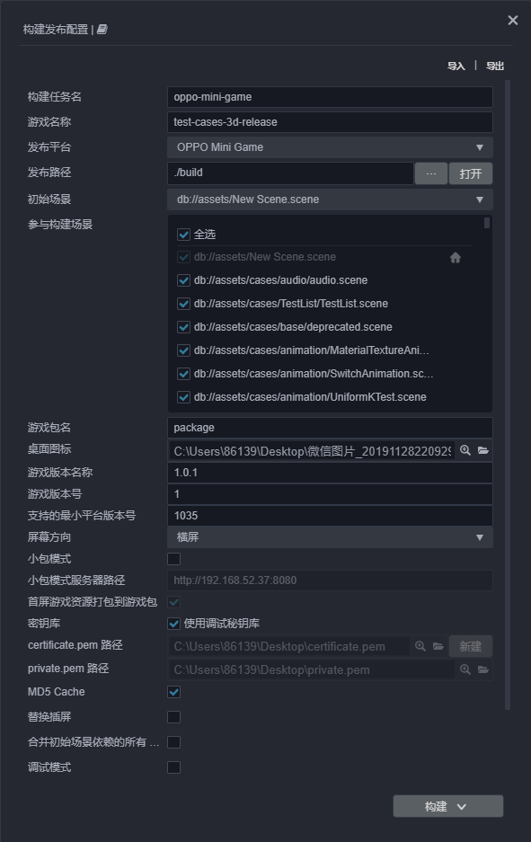
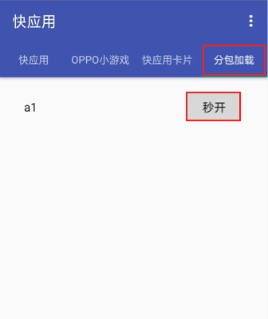

# 发布到 OPPO 小游戏

## 环境配置

- 下载 [OPPO 小游戏调试器](https://cdofs.oppomobile.com/cdo-activity/static/201810/26/quickgame/documentation/#/games/use)，并安装到 Android 设备上（建议 Android Phone 6.0 或以上版本）

- 全局安装 [nodejs-8.1.4](https://nodejs.org/zh-cn/download/) 或以上版本

- 根据用户自己的开发需求判断是否需要安装 [调试工具](https://cdofs.oppomobile.com/cdo-activity/static/201810/26/quickgame/documentation/games/use.html)。

## 发布流程

一、使用 Cocos Creator 打开需要发布的项目工程，在 **构建发布** 面板的 **发布平台** 中选择 **OPPO Mini Game**。



**必填参数项**：根据用户的需求及参数输入框的提示信息进行填写，包括：**游戏包名**、**游戏名称**、**桌面图标**、**游戏版本名称**、**游戏版本号**、**支持的最小平台版本号**。

**选填参数项**：包括 **小包模式**、**小包模式服务器路径**

**密钥库** 以及两个签名文件（**certificate.pem 路径** 和 **private.pem 路径**），需要根据用户需求选择勾选 **密钥库** 或者填写两个路径。

相关参数配置具体的填写规则如下：

- **游戏包名**

  该项为必填项，根据用户的需求进行填写。

- **游戏名称**

  该项为必填项。是 OPPO 小游戏的名称。

- **桌面图标**

  **桌面图标** 为必填项。点击输入框后面的 **...** 按钮选择所需的图标。构建时，图标将会被构建到 OPPO 小游戏的工程中。桌面图标建议使用 **png** 图片。

- **游戏版本名称**

  该项为必填项，根据用户的需求进行填写。

- **游戏版本号**

  该项为必填项，根据用户的需求进行填写。

- **支持的最小平台版本号**

  该项为必填项。根据 OPPO 的要求目前这个值必须大于或等于 **1031**。

- **小包模式和小包模式服务器路径**

  该项为选填项。小游戏的包内体积包含代码和资源不能超过 10M，资源可以通过网络请求加载。**小包模式** 就是帮助用户将脚本文件保留在小游戏包内，其他资源则上传到远程服务器，根据需要从远程服务器下载。而远程资源的下载、缓存和版本管理，Creator 已经帮用户做好了。用户需要做的是以下两个步骤：

  1. 构建时，勾选 **小包模式**，填写 **小包模式服务器路径**。然后点击 **构建**。

  2. 构建完成后，点击 **发布路径** 后面的 **打开** 按钮，将发布路径下的 **res** 目录上传到小包模式服务器。例如：默认发布路径是 build，构建任务名为 oppo-mini-game，则需要上传 `/build/oppo-mini-game/res` 目录。

  此时，构建出来的 rpk 将不再包含 res 目录，res 目录里的资源将通过网络请求从填写的 **小包模式服务器地址** 上下载。

- **分包**

  该功能默认开启，详情请查看本文档末尾的 **分包** 介绍。

- **密钥库**

  勾选 **密钥库** 时，表示默认用的是 Creator 自带的证书构建 rpk 包，仅用于 **调试** 时使用。<br>
  > **注意**：若 rpk 包要用于提交审核，则构建时不要勾选该项。

  如果不勾选 **密钥库**，则需要配置签名文件 **certificate.pem 路径** 和 **private.pem 路径**，此时构建出的是可以 **直接发布** 的 rpk 包。用户可通过输入框右边的 **...** 按钮来配置两个签名文件。<br>
  用户可以通过以下两种方式生成签名文件，如下：
    - 通过 **构建发布** 面板 **certificate.pem 路径** 后的 **新建** 按钮生成。

    - 通过命令行生成 release 签名。

      用户需要通过 openssl 命令等工具生成签名文件 private.pem、certificate.pem。

      ```bash
      # 通过 openssl 命令工具生成签名文件
      openssl req -newkey rsa:2048 -nodes -keyout private.pem -x509 -days 3650 -out certificate.pem
      ```

      > **注意**：openssl 工具在 linux 或 Mac 环境下可在终端直接打开。而在 Windows 环境下则需要安装 openssl 工具并且配置系统环境变量，配置完成后需重启 Creator。

二、**构建发布** 面板的相关参数设置完成后，点击 **构建**。构建完成后点击对应构建任务上的 **在文件夹中显示** 打开构建发布包位置，可以看到在默认发布路径 build 目录下生成了与构建任务名称相同的目录，该目录就是导出的 OPPO 小游戏工程目录和 rpk，rpk 包在对应目录的 dist 文件夹下。


三、将构建出来的 rpk 运行到手机上。

将构建生成的小游戏 rpk 包（ dist 目录中）拷贝到手机 SD 卡的 **/sdcard/games/** 目录。然后在 Android 设备上打开之前已经安装完成的 **OPPO 小游戏调试器**，点击 **OPPO 小游戏** 栏目，然后找到填写游戏名相对应的图标即可，如没有发现，可点击右上角的更多按钮-刷新按钮进行刷新。

  **注意：OPPO 小游戏调试器为 V3.2.0 及以上的需要将准备好的 rpk 拷贝到手机 sdcard 的 Android/data/com.nearme.instant.platform/files/games 中，无 games 目录则需新建**


四、分包 rpk

分包加载，即把游戏内容按一定规则拆分成几个包，在首次启动的时候只下载必要的包，这个必要的包称为 **主包**，开发者可以在主包内触发下载其他子包，这样可以有效降低首次启动的消耗时间。若要使用该功能需要在 Creator 中设置 [分包配置](../../asset/subpackage.md)，设置完成后构建时就会自动分包。

构建完成后，分包的目录在 dist 目录下。<br>
这时需要在 Android 设备的 **sdcard** 目录下，新建一个 **subPkg** 目录，然后把 dist 目录下的 **.rpk** 文件拷贝到 subPkg 目录中。<br>
然后切换到 **OPPO 小游戏调试器** 的 **分包加载** 栏目，点击右上方的刷新即可看到分包的游戏名称，点击 **秒开** 即可跟正常打包的 rpk 一样使用。



**注意**：分包 rpk 需要拷贝到 Android 设备的 **/sdcard/subPkg/** 目录，未分包的 rpk 需要拷贝到 Android 设备的 **/sdcard/games/** 目录，两者不可混用。

**注意：OPPO 小游戏调试器为 V3.2.0 及以上的需要将准备好的 rpk 拷贝到手机 sdcard 的 Android/data/com.nearme.instant.platform/files/subPkg 中，无 subPkg 目录则需新建**

## 相关参考链接

- [OPPO 小游戏调试说明](https://cdofs.oppomobile.com/cdo-activity/static/201810/26/quickgame/documentation/games/debug.html)
- [OPPO 小游戏教程](https://cdofs.oppomobile.com/cdo-activity/static/201810/26/quickgame/documentation/games/quickgame.html)
- [OPPO 小游戏 API 文档](https://cdofs.oppomobile.com/cdo-activity/static/201810/26/quickgame/documentation/feature/account.html)
- [OPPO 小游戏工具下载](https://cdofs.oppomobile.com/cdo-activity/static/201810/26/quickgame/documentation/games/use.html)
