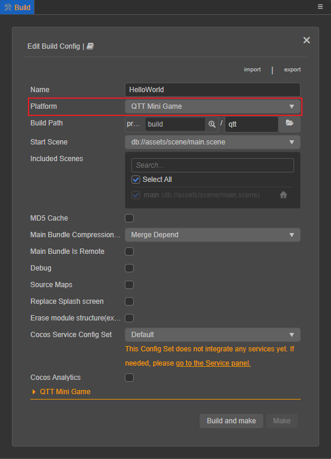
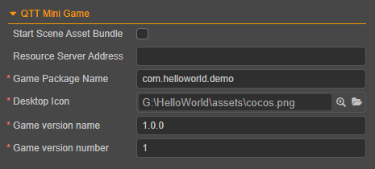
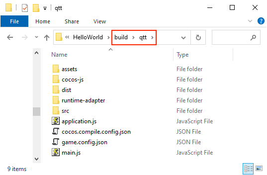
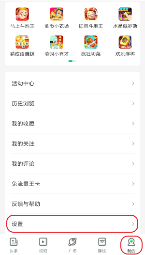
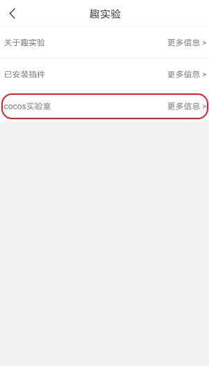

# 发布到趣头条小游戏

## 环境配置

下载 [趣头条 APP](https://game.qutoutiao.net/doc/index.html#/doc/debug_in_app) 并安装到 Android 设备（建议 Android Phone 6.0 或以上版本）。

## 发布流程

使用 Cocos Creator 打开需要发布的项目工程，从 **菜单栏 -> 项目** 中打开 **构建发布** 面板。在 **构建发布** 面板的 **发布平台** 中选择 **趣头条小游戏**。

通用构建选项的设置请参考 [通用构建选项](build-options.md)，趣头条小游戏特有的构建选项如下：

| 构建选项 | 可选 | 说明 | 字段名（用于命令行发布）|
| :----- | :--- | :--- | :--- |
| 初始场景分包 | 可选项 | 勾选后，首场景及其相关的依赖资源会被构建到发布包目录 `assets` 下的内置 Asset Bundle — [start-scene](../../asset/bundle.md#%E5%86%85%E7%BD%AE-asset-bundle) 中，提高初始场景的资源加载速度。 | `startSceneAssetBundle` |
| 资源服务器地址 | 可选项 | 该项用于填写资源存放在服务器上的地址。 若 **不填写** 该项，则发布包目录下的 `remote` 文件夹将会被打包到构建后生成的 cpk 包中。 若 **填写**，则不会打包进 cpk。开发者需要在构建后手动将发布包目录下的 `remote` 文件夹上传到所填写的资源服务器地址上，详情请参考 [上传资源到远程服务器](../../asset/cache-manager.md) 。 服务器地址会在构建时写入到发布包目录下的 `application.js` 中。 | `tinyPackageServer` |
| 游戏包名 | 必填项 | 确保与原生应用的包名不一致，由 **数字**、**字母** 和 **.** 组成。必须以字母开头，以数字或字母结尾，同时必须包含 **.**，长度不能超过 255 字节。例如 `com.example.demo` | `package` |
| 桌面图标 | 必填项 | 点击输入框后面的放大镜图标按钮选择所需的图标。构建时，图标将会被构建到趣头条小游戏的 cpk 中。桌面图标建议使用 png 图片。 | `icon` |
| 游戏版本名称 | 必填项 | 游戏版本名称是真实的版本，如：1.0.0 | `versionName` |
| 游戏版本号 | 必填项 | **游戏版本号** 与 **游戏版本名称** 不同，**游戏版本号** 主要用于区别版本更新。每次提交审核时游戏版本号都要比上次提交审核的值至少 +1，一定不能等于或者小于上次提交审核的值，建议每次提交审核时游戏版本号递归 +1 **注意**：**游戏版本号** 必须为正整数。 | `versionCode` |

### 构建

**构建发布** 面板的构建选项设置完成后，点击 **构建并生成** 按钮。 
完成后点击 **构建任务** 左下角的文件夹图标按钮打开项目发布包，可以看到在默认发布路径 `build` 目录下生成了 `qtt`（以具体的构建任务名为准）文件夹，该文件夹就是导出的趣头条小游戏工程目录和 cpk，cpk 包在 `build/qtt/dist` 目录下。

若需要修改生成的 cpk 包，在修改完成后点击 **构建任务** 右下角的 **生成** 按钮，即可在不重新构建的情况下重新生成 cpk 包。

### 将构建出来的 cpk 运行到手机上

- 在 Android 设备上打开之前已经安装完成的趣头条 APP，点击底部导航栏右侧的 **我的**。然后下拉页面到最底部，点击进入 **设置** 页面。

  

- 在 **设置** 页导航栏的 **右侧空白区域** 连续点击 **6** 次，进入 **趣实验** 页面。

  

- 在 **趣实验** 页面找到 **Cocos 实验室**，点击进入。

  

- 在 **Cocos 实验室** 页面中打开 **game 包本地化开关**，可以看到在其下方显示了一个文件路径。然后将构建生成的 cpk 包重命名为 `game_debug.cpk`，并放置到 Android 设备该文件路径下。**debug 开关** 和 **vconsole 开关** 可根据需要选择是否打开。

  

- 填写申请好的 **appid** 和 **game 版本号**

    - **appid** 是申请到的游戏 ID，在调试环境下允许任意填写。

    - **game 版本号** 是游戏包的版本特征值，正常是由平台生成的。这里作为调试使用，通常是由字母和数字组成的任意字符串。**注意**：每更换一次包就要重新输入一个新的值。

- 设置完成后，点击下方的 **打开游戏** 按钮即可。

    > **注意**：如果要再次 **打开游戏**，则需要重新把 cpk 包放置到上述所述目录下。

## 趣头条小游戏环境的资源管理

趣头条小游戏与微信小游戏类似，都存在着包体限制。趣头条小游戏的主包包体限制是 **4MB**，超出的部分必须通过网络请求下载。 当包体过大时，可在 **构建发布** 面板配置 **资源服务器地址** 选项，将资源上传到远程服务器，详情请参考 [上传资源到远程服务器](../../asset/cache-manager.md)。

我们建议用户只保存脚本文件在小游戏包内，其他资源都从远程服务器下载。Cocos Creator 已经帮用户做好了远程资源的下载、缓存和版本管理，详情请参考 [缓存管理器](../../asset/cache-manager.md)。

## 相关参考链接

- [趣头条游戏中心官网](http://game.qutoutiao.net/official/home/prod/index.html)
- [趣头条小游戏官方文档](https://game.qutoutiao.net/doc/index.html#/)
- [趣头条小游戏调试文档](https://game.qutoutiao.net/doc/index.html#/doc/debug_in_app)
- [趣头条小游戏 API 文档](https://game.qutoutiao.net/doc/index.html#/doc/sdk)
