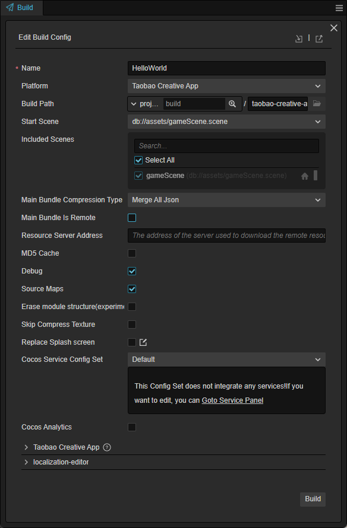
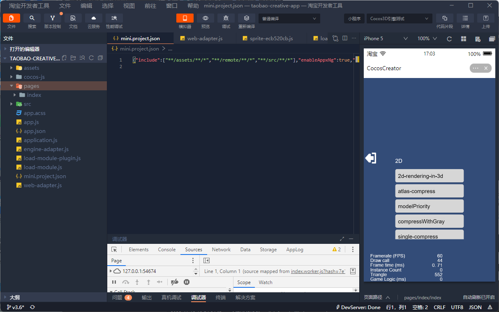

# 发布到淘宝小程序创意互动

## 准备工作

- 参考 [淘宝小程序创意互动接入指南](https://miniapp.open.taobao.com/doc.htm?docId=119114&docType=1&tag=dev)，在淘宝开放平台完成开发者入驻流程和应用创建。

- 桌面端下载 [淘宝开发者工具](https://developer.taobao.com/?spm=a219a.15212435.0.0.11ef669aIQNlnI) 并安装。

- 下载 [淘宝](https://market.m.taobao.com/app/fdilab/download-page/main/index.html)，并安装到手机设备上。

## 发布流程

1. 使用 Cocos Creator 打开需要发布的项目工程，从 **菜单栏 -> 项目** 中打开 **构建发布** 面板。在 **构建发布** 面板的 **发布平台** 中选择 **淘宝小程序创意互动**。

    

    通用构建选项的设置请参考 [通用构建选项](build-options.md)，淘宝小程序创意互动特有的构建选项如下，具体说明请参考下文 **构建选项** 部分的内容。

    

2. **构建发布** 面板的构建选项设置完成后，点击 **构建**。 
    构建完成后点击 **构建任务** 左下角的文件夹图标按钮打开项目发布包，可以看到在默认发布路径 `build` 目录下生成了 `taobao-creative-app`（以具体的构建任务名为准）文件夹，其中已经包含了淘宝小程序创意互动环境的配置文件 `app.json` 和 `mini.project.json`。

    

3. 使用 **淘宝开发者工具** 打开构建生成的 `taobao-creative-app` 文件夹，即可打开淘宝小程序创意互动项目及预览调试游戏内容。开发者工具的具体使用方式请参考 [淘宝开发者工具介绍](https://miniapp.open.taobao.com/doc.htm?docId=119189&docType=1&tag=dev)。

    

### 构建选项

| 构建选项 | 说明 | 字段名（用于命令行发布） |
| :-- | :-- | :-- |
| 初始场景分包 | 勾选后，首场景及其相关的依赖资源会被构建到发布包目录 `assets` 下的内置 Asset Bundle — [start-scene](../../asset/bundle.md#%E5%86%85%E7%BD%AE-asset-bundle) 中，提高初始场景的资源加载速度。 | `startSceneAssetBundle` |
| 全局变量 | 淘宝平台访问全局变量时，global 对象不能缺省，请在这里标记项目里依赖的全局变量，以便游戏运行时能正常使用全局变量。填写形式如：foo, bar。| `globalVariable` |

## 淘宝小程序创意互动环境的资源管理

淘宝小程序创意互动与微信小游戏类似，都存在着包体限制，超过 2MB 的额外资源，必须通过网络请求下载。在包体优化方面，建议剔除掉没使用到的引擎模块。

Cocos Creator 已经帮开发者做好了远程资源的下载、缓存和版本管理。具体的实现逻辑和操作步骤都与微信小游戏类似，请参考 [微信小游戏资源管理](./publish-wechatgame.md#%E5%BE%AE%E4%BF%A1%E5%B0%8F%E6%B8%B8%E6%88%8F%E7%9A%84%E8%B5%84%E6%BA%90%E7%AE%A1%E7%90%86)。

## 淘宝小程序创意互动的限制

淘宝小程序创意互动暂时不支持以下功能模块：

- VideoPlayer
- WebView
- 自定义字体
- 暂不支持资源分包（替代方案是资源包放 CDN）

以上功能预计在以后的更新中会逐步支持，我们也将持续与淘宝小程序创意互动的工程师们紧密沟通，不断优化适配效果。

## 参考链接

- [淘宝开放平台开发指南](https://miniapp.open.taobao.com/docV3.htm?docId=119114&docType=1&tag=dev)
- [淘宝开发者入驻文档](https://miniapp.open.taobao.com/doc.htm?spm=a219a.15212435.0.0.4f44669ay8X5vm&docId=119111&docType=1&)
- [淘宝小程序创意互动介绍](https://miniapp.open.taobao.com/doc.htm?docId=119177&docType=1&tag=dev)
- [淘宝小程序创意互动 API 文档](https://miniapp.open.taobao.com/doc.htm?docId=119062&docType=1&tag=dev)
- [淘宝开发者工具下载](https://developer.taobao.com/?spm=a219a.15212435.0.0.7892669alqxNjY)
- [淘宝开发者工具介绍](https://miniapp.open.taobao.com/doc.htm?docId=119189&docType=1&tag=dev)
- [淘宝开发者工具真机调试](https://miniapp.open.taobao.com/doc.htm?docId=119194&docType=1&tag=dev)
