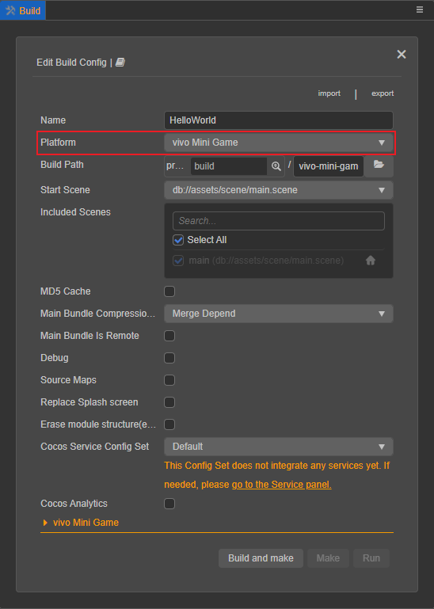

# 发布到 vivo 小游戏

## 环境配置

- 下载 [快应用 & vivo 小游戏调试器](https://minigame.vivo.com.cn/documents/#/lesson/base/environment?id=%E5%AE%89%E8%A3%85vivo%E5%B0%8F%E6%B8%B8%E6%88%8F%E8%B0%83%E8%AF%95%E5%99%A8) 和 [vivo 小游戏引擎](https://minigame.vivo.com.cn/documents/#/lesson/base/environment?id=%E5%AE%89%E8%A3%85vivo%E5%B0%8F%E6%B8%B8%E6%88%8F%E5%BC%95%E6%93%8E)，并安装到 Android 设备上（建议 Android Phone 6.0 或以上版本）

- 全局安装 [nodejs-8.9.0](https://nodejs.org/zh-cn/download/) 或以上版本

    > **注意**：安装 nodejs 后，需要注意 npm 源地址是否为 <https://registry.npmjs.org/>

    ```bash
    # 查看当前 npm 源地址
    npm config get registry
    # 若不是，重新设置 npm 源地址
    npm config set registry https://registry.npmjs.org/
    ```

- 全局安装 `vivo-minigame/cli`。确定 npm 源地址后，安装 `vivo-minigame/cli`：

    ```bash
    npm install -g @vivo-minigame/cli
    ```

    若 `vivo-minigame/cli` 安装失败，可能是因为 nodejs 版本过低导致的，请检查 node 版本并升级。

## 发布流程

使用 Cocos Creator 打开需要发布的项目工程，从 **菜单栏 -> 项目** 中打开 **构建发布** 面板，**发布平台** 选择 **vivo 小游戏**。



通用构建选项的设置请参考 [通用构建选项](build-options.md)，vivo 小游戏特有的构建选项如下：


| 构建选项 | 可选 | 说明 | 字段名（用于命令行发布） |
| :------ | :--- | :--- | :--- |
| 初始场景分包 | 可选项 | 勾选后，首场景及其相关的依赖资源会被构建到发布包目录 `assets` 下的内置 Asset Bundle — [start-scene](../../asset/bundle.md#%E5%86%85%E7%BD%AE-asset-bundle) 中，提高初始场景的资源加载速度。 | `startSceneAssetBundle` |
| 资源服务器地址 | 可选项 | 该项用于填写资源存放在服务器上的地址。<br>若 **不填写** 该项，则发布包目录下的 `remote` 文件夹会被打包到构建出来的 rpk 包中。<br>若 **填写** 该项，则不会打包到 rpk 包中，开发者需要在构建后手动将发布包目录下的 `remote` 文件夹上传到所填写的资源服务器地址上。详情请参考 [上传资源到远程服务器](../../asset/cache-manager.md)。 | `remoteServerAddress` |
| 游戏包名 | 必填项 | 游戏包名，根据开发者的需求进行填写，例如 `com.example.demo`。| `package` |
| 桌面图标 | 必填项 | 点击输入框后面的放大镜图标按钮选择所需的图标。构建时，图标将会被构建到 vivo 小游戏的工程中。桌面图标建议使用 **png** 图片。 | `icon` |
| 游戏版本名称 | 必填项 | 游戏版本名称是真实的版本，如：1.0.0 | `versionName` |
| 游戏版本号 | 必填项 | **游戏版本号** 与 **游戏版本名称** 不同，**游戏版本号** 主要用于区别版本更新。每次提交审核时游戏版本号都要比上次提交审核的值至少 +1，一定不能等于或者小于上次提交审核的值，建议每次提交审核时游戏版本号递归 +1。<br>**注意**：**游戏版本号** 必须为正整数。 | `versionCode` |
| 支持的最小平台版本号 | 必填项 | 用于兼容性检查，避免上线后在低版本平台运行导致不兼容。具体填写的值可通过点击 [更新记录](https://minigame.vivo.com.cn/documents/#/download/engine?id=%E6%9B%B4%E6%96%B0%E8%AE%B0%E5%BD%95%EF%BC%9A) 来查看最新的 vivo 引擎版本号。 | `minPlatformVersion` |
| 屏幕方向 | 必填项 | 设备方向，可选值包括 `landscape` 和 `portrait`。构建时会写入到发布包目录下的 `manifest.json` 中。| `deviceOrientation` |
| 允许分离引擎 | 选填项 | vivo 从平台版本号 **1063** 开始新增了 **游戏引擎扩展** 功能。此扩展内置了 Cocos Creator 引擎的官方版本，若玩家首次体验的游戏中启用了此扩展，则所有同样启用此扩展的游戏，都无需再次下载 Cocos Creator 引擎，只需直接使用公共扩展库中的相同版本引擎，或者增量更新引擎即可。<br>使用时勾选 **允许分离引擎**，然后正常构建发布即可，无需其它人工操作。详情请参考 [启用微信小游戏引擎扩展](./wechatgame-plugin.md) | `separateEngine` |
| 使用调试密钥库 | - | 若勾选该项，表示构建 rpk 包时默认使用的是 Creator 自带的证书，仅用于 **调试** 时使用。若 rpk 包要用于提交审核，则构建时不要勾选该项。<br> 若不勾选该项，则需要手动配置签名证书。| `useDebugKey` |
| **certificate.pem 路径**<br>**private.pem 路径** | - | 如果不勾选 **密钥库**，则需要配置签名文件 **certificate.pem 路径** 和 **private.pem 路径**，此时构建后生成的是可以 **直接发布** 的 rpk 包。开发者可通过输入框右边的放大镜图标按钮来配置两个签名文件，或者也可以参考下方的 **生成签名文件**。 | `privatePemPath`、`certificatePemPath` |

- 生成签名文件

    有以下两种方式可以生成签名文件：

    - 通过 **构建发布** 面板 **certificate.pem 路径** 后的 **新建** 按钮生成

    - 通过命令行生成 release 签名

        用户需要通过 openssl 命令等工具生成签名文件 private.pem、certificate.pem。

        ```bash
        # 通过 openssl 命令工具生成签名文件
        openssl req -newkey rsa:2048 -nodes -keyout private.pem -x509 -days 3650 -out certificate.pem
        ```

        > **注意**：openssl 工具在 linux 或 Mac 环境下可在终端直接打开。而在 Windows 环境下则需要安装 openssl 工具并且配置系统环境变量，配置完成后需重启 Creator。

### 构建

**构建发布** 面板的构建选项设置完成后，点击 **构建并生成** 按钮。<br>
完成后点击 **构建任务** 左下角的文件夹图标按钮打开项目发布包，可以看到在默认发布路径 `build` 目录下生成了 `vivo-mini-game`（以具体的构建任务名为准）文件夹，该文件夹就是导出的 vivo 快游戏工程目录和 rpk，rpk 包在 `build/vivo-mini-game/dist` 目录下。


若需要修改生成的 rpk 包，在修改完成后点击 **构建任务** 右下角的 **生成** 按钮，即可在不重新构建的情况下重新生成 rpk 包。

## 运行 rpk

有以下三种方式可将 rpk 运行到手机上：

- **方法一**：

    在 **构建发布** 面板点击 **运行** 按钮，等待二维码界面生成

    

    然后在 Android 设备上打开之前已经安装完成的 **快应用 & vivo 小游戏调试器**，点击 **扫码安装** 按钮直接扫描二维码即可打开 rpk。

    

- **方法二**：

    将构建生成的小游戏 rpk 文件（位于打包出的小游戏工程目录下的 dist 目录中）拷贝到手机的内部存储目录下。

    在 Android 设备上打开之前已经安装完成的 **快应用 & vivo 小游戏调试器**，点击 **本地安装**，然后从手机内部存储目录中找到 rpk 文件，选择打开即可。

    

- **方法三**：

    利用 vivo 小游戏打包工具命令生成网址和二维码：

    ```bash
    # 先把命令行指定到编辑器安装目录下的 resources/tools/vivo-pack-tools 目录下
    cd ${CocosCreator}/resources/tools/vivo-pack-tools
    # 生成网址和二维码
    npm run server
    ```

    然后在 Android 设备上打开之前已经安装完成的 **快应用 & vivo 小游戏调试器**。

    最后点击 **扫码安装** 按钮，将第一步中生成的网址拷贝到浏览器，然后直接扫描网页上的二维码即可打开 rpk。

## 分包加载

vivo 小游戏的分包加载，详情请参考 [小游戏分包](subpackage.md)。

## vivo 小游戏环境的资源管理

vivo 小游戏与微信小游戏类似，都存在着包体限制。vivo 小游戏的主包包体限制是 **4MB**，超过的部分必须通过网络请求下载。<br>当包体过大时，可在 **构建发布** 面板配置 **资源服务器地址** 选项，将资源上传到远程服务器，详情请参考 [上传资源到远程服务器](../../asset/cache-manager.md)。

我们建议用户只保存脚本文件在小游戏包内，其他资源都从远程服务器下载。Cocos Creator 已经帮用户做好了远程资源的下载、缓存和版本管理，详情请参考 [缓存管理器](../../asset/cache-manager.md)。

## 参考链接

- [vivo 小游戏开发文档](https://minigame.vivo.com.cn/documents/#/lesson/base/start)
- [vivo 小游戏 API 文档](https://minigame.vivo.com.cn/documents/#/api/system/life-cycle)
- [快应用 & vivo 小游戏调试器下载](https://minigame.vivo.com.cn/documents/#/download/debugger)
