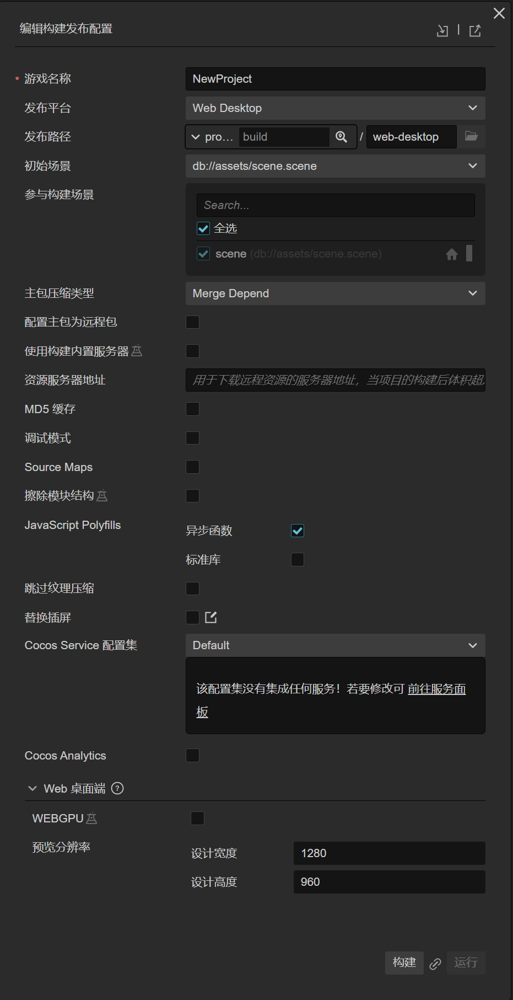
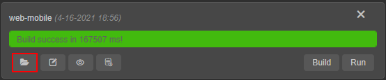

# 发布到 Web 平台

打开主菜单的 **项目 -> 构建发布**，打开 [构建发布](build-panel.md) 面板。

Cocos Creator 提供了两种 Web 平台的页面模板，可以通过 **发布平台** 的下拉菜单选择 **Web Mobile** 或 **Web Desktop**，它们的区别主要在于：
- **Web Mobile** 会默认将游戏视图撑满整个浏览器窗口。
- **Web Desktop** 允许在发布时指定一个游戏视图的分辨率，而且之后游戏视图也不会随着浏览器窗口大小变化而变化。

## 构建选项介绍

各平台通用的构建选项，详情请参考 [通用构建参数介绍](build-options.md)。接下来我们来看一下 Web 平台特有的构建选项。

### Web Desktop

| 构建选项 | 说明 | 字段名（用于命令行发布） |
| :--- | :--- | :--- |
| 资源服务器地址 | 用于下载远程资源的服务器地址，详情请参考下文 **资源服务器地址** 部分的内容。 | `remoteServerAddress` |
| 预览分辨率 | 游戏视图分辨率，默认为 **(1280, 960)** | `resolution` |
| Polyfills | 构建支持一些脚本新特性的 polyfills，在打包脚本时会做对应处理，开发者可以根据实际需求选择需要的 polyfills。暂时只支持 **异步函数**，后续将会开放更多功能。| `polyfills` |

### Web Mobile

| 构建选项 | 说明 | 字段名（用于命令行发布） |
| :--- | :--- | :--- |
| 资源服务器地址 | 用于下载远程资源的服务器地址，详情请参考下文 **资源服务器地址** 部分的内容。 | `remoteServerAddress` |
| 设备方向 | 可选值包括 **Auto**、**Landscape**、**Portrait** | `orientation` |
| Polyfills | 构建支持一些脚本新特性的 polyfills，在打包脚本时会做对应处理，目前包括 **async Functions** 和 **coreJs** 两种，开发者可以根据实际需求选择需要的 polyfills。 | `polyfills` |
| vConsole | 插入 vConsole 调试插件，vConsole 类似 DevTools 的迷你版，用于辅助调试。 | `embedWebDebugger` |
| 预览二维码 | 用于扫描预览，详情可见下方介绍 | - |
| 预览 URL | 用于预览的链接，详情可见下方介绍 | - |

- **资源服务器地址**

  该项为可选项，用于填写资源存放在服务器上的地址。

    - 若 **不填写** 该项，则发布包目录下的 `remote` 文件夹会被打包到构建出来的游戏包中。
    - 若 **填写** 该项，则不会打包到游戏包中，开发者需要在构建后手动将发布包目录下的 `remote` 文件夹上传到所填写的资源服务器地址上。详情请参考 [上传资源到远程服务器](../../asset/cache-manager.md)。

- **预览 URL**

  构建支持同时预览多个 Web 项目，因而构建的预览 URL 不再是统一的而是每个构建任务都会有一个单独的预览 URL，互不干扰。点击 URL 即可自动打开浏览器进行预览，具体的预览 URL 拼接规则为 **${偏好设置中的预览 IP 地址}:${编辑器预览端口号}/${构建平台}/${构建任务名}/index.html**。

  

## 构建和预览

配置好构建选项后，点击 **构建** 按钮，开始 Web 平台版本构建。面板上会出现一个进度条，当进度条显示“Build success”时，构建就完成了。

接下来可以点击 **运行** 按钮，在浏览器中打开构建后的游戏版本进行预览和调试。

上图所示就是 Web Mobile 平台的预览，可以看到游戏视图占满了整个浏览器窗口，而 Web Desktop 的游戏视图则是固定分辨率的，不会撑满屏幕。

### 浏览器兼容性

Cocos Creator 开发过程中测试的桌面浏览器包括：**Chrome**、**Firefox（火狐）** 和 **QQ 浏览器**，其他浏览器只要内核版本够高也可以正常使用，对部分浏览器来说请勿开启 IE 兼容模式。

移动设备上测试的浏览器包括：**Safari（iOS）**、**Chrome（Android）**、**QQ 浏览器（Android）** 和 **UC 浏览器（Android）**。

## Retina 设置

可以在脚本中通过 `view.enableRetina(true)` 设置是否使用高分辨率，构建到 Web 平台时默认会开启 Retina 显示。详情可参考 API [enableRetina](__APIDOC__/zh/#/docs/3.3/zh/core/Class/View?id=enableretina)。

## 发布到 Web 服务器

如果要在互联网上发布或分享游戏，只要点击 **构建任务** 左下方的 **文件夹图标** 按钮，打开发布路径之后，按照当前构建任务名称，将构建出的对应文件夹里的内容整个复制到 Web 服务器上，就可以通过相应的地址访问了。

关于 Web 服务器的架设，可以自行搜索 Apache、Nginx、IIS、Express 等相关解决方案。
