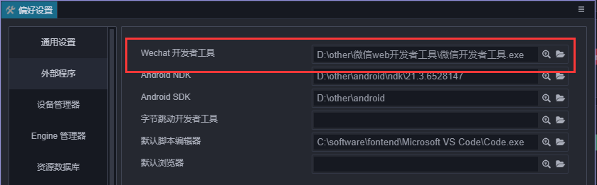
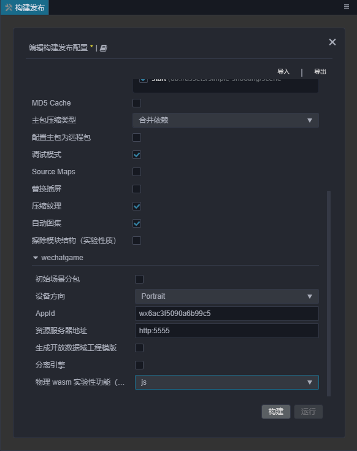
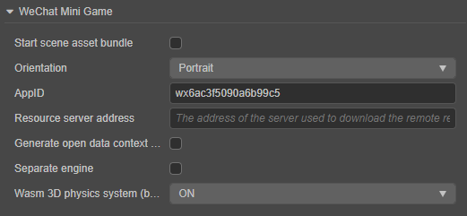

# 发布到微信小游戏

微信小游戏的运行环境是微信小程序环境的扩展，在小程序环境的基础上提供了 WebGL 接口的封装，使得渲染能力和性能有了大幅度提升。不过由于这些接口都是微信团队通过自研的原生实现封装的，所以并不可以等同为浏览器环境。

作为引擎方，为了尽可能简化开发者的工作量，我们为用户完成的主要工作包括：

- 引擎框架适配微信小游戏 API，纯游戏逻辑层面，用户不需要任何额外的修改
- Cocos Creator 编辑器提供了快捷的打包流程，直接发布为微信小游戏，并自动唤起小游戏的开发者工具
- 自动加载远程资源，缓存资源以及缓存资源版本控制

除此之外，小游戏的游戏提交、审核以及发布流程，和小程序是没有区别的，都需要遵守微信团队的要求和标准流程，具体信息可以参考 [微信小游戏开发文档](https://developers.weixin.qq.com/minigame/dev/guide/)。

## 环境配置

1. 在 [微信官方文档](https://mp.weixin.qq.com/debug/wxagame/dev/devtools/download.html) 下载微信开发者工具。

2. 在编辑器主菜单的 **Cocos Creator -> 偏好设置 -> [外部程序](../../editor/preferences/index.md#%E5%8E%9F%E7%94%9F%E5%BC%80%E5%8F%91%E7%8E%AF%E5%A2%83)** 中设置微信开发者工具路径。

    

3. 登录微信公众平台，找到 AppID。

    

## 发布流程

1. 使用 Cocos Creator 打开需要发布的项目工程，从 **菜单栏 -> 项目** 中打开 **构建发布** 面板。在 **构建发布** 面板的 **发布平台** 中选择 **微信小游戏**。

    

    通用构建选项的设置请参考 [通用构建选项](build-options.md)，微信小游戏特有的构建选项如下，具体说明请参考下文 **构建选项** 部分的内容。

    

2. **构建发布** 面板的构建选项设置完成后，点击 **构建**。<br>
    构建完成后点击 **构建任务** 左下角的文件夹图标按钮打开项目发布包，可以看到在默认发布路径 `build` 目录下生成了 `wechatgame`（以具体的构建任务名为准）文件夹，其中已经包含了微信小游戏环境的配置文件：`game.json` 和 `project.config.json`。

    

3. 然后点击微信小游戏 **构建任务** 右下角的 **运行** 按钮，打开微信开发者工具。

    

    > **注意**：如果之前没有运行过微信开发者工具，可能会出现：`Please ensure that the IDE has been properly installed` 的报错，需要手动打开一次微信开发者工具，然后才能在 Cocos Creator 里直接点击 **运行** 调用。

### 构建选项

| 构建选项 | 说明 | 字段名（用于命令行发布） |
| :--- | :--- | :--- |
| 初始场景分包 | 勾选后，首场景及其相关的依赖资源会被构建到发布包目录 `assets` 下的内置 Asset Bundle — [start-scene](../../asset/bundle.md#%E5%86%85%E7%BD%AE-asset-bundle) 中，提高初始场景的资源加载速度。 | `startSceneAssetBundle` |
| 设备方向 | 可选值包括 **Portrait** 和 **Landscape**。构建时会写入到发布包目录下的 `game.json` 文件中。| `orientation` |
| AppID | 微信小游戏的 AppID，必填项，面板中默认的 `wx6ac3f5090a6b99c5` 仅用于测试。构建时会写入到发布包目录下的 `project.config.json` 文件中。| `appid` |
| 资源服务器地址 | 用于填写资源存放在远程服务器上的地址。开发者需要在构建后手动将发布包目录下的 `remote` 文件夹上传到所填写的资源服务器地址上。详情可参考 [上传资源到远程服务器](../../asset/cache-manager.md) | `remoteServerAddress` |
| 生成开放数据域工程模板 | 用于接入开放数据域，详情请参考 [开放数据域](./build-open-data-context.md) | `buildOpenDataContextTemplate` |
| 分离引擎 | 是否使用微信小游戏引擎插件，详情请参考 [启用微信小游戏引擎插件](./wechatgame-plugin.md) | `separateEngine`
| 物理 wasm 实验性功能 | 用于选择 bullet（ammo.js）物理的使用模式，目前包括 `js`、`fallback`、`wasm` 三种，详情请参考下文 **WebAssembly 支持** 部分的内容。 | - |

## 微信小游戏的资源管理

在微信小游戏环境中，资源管理是最特殊的部分，它和浏览器的不同包括以下几点：

- 小游戏的主包体积不能超过 4MB，包含所有代码和资源，额外的资源必须通过网络请求下载。<br>当包体过大时，可在 **构建发布** 面板配置 **资源服务器地址** 选项，将资源上传到远程服务器，详情请参考 [上传资源到远程服务器](../../asset/cache-manager.md)。
- 对于小游戏包内资源，小游戏环境内并不是按需加载的，而是一次性加载所有包内资源，然后再启动页面。
- 不可以从远程服务器下载脚本文件。

这里引出了两个关键的问题：

1. 远程资源的下载、缓存及版本管理，这部分内容 Creator 已经帮开发者做好了，详情请参考 [缓存管理器](../../asset/cache-manager.md)。

2. 首场景的加载速度。当主包资源放到远程服务器上时，如果要提高初始场景的加载速度，可以在构建时勾选 **构建发布** 面板中的 **初始场景分包** 选项。<br>
构建完成后，初始场景及其相关的依赖资源会被构建到发布包目录下的 `assets/start-scene` bundle 中。这个 bundle 不会放到远程服务器上，而是放在本地，引擎在启动阶段时就会自动从本地包内加载这个 bundle，从而加快初始场景的加载速度。

## 分包加载

微信小游戏的分包加载请参考 [小游戏分包](subpackage.md)

## 平台 SDK 接入

除了纯游戏内容以外，其实微信小游戏环境还提供了非常强大的原生 SDK 接口，其中最重要的就是用户、社交、支付等，这些接口都是仅存在于微信小游戏环境中的，等同于其他平台的第三方 SDK 接口。这类 SDK 接口的移植工作在现阶段还是需要开发者自己处理。下面列举一些微信小游戏所提供的强大 SDK 能力：

1. 用户接口：登陆，授权，用户信息等
2. 微信支付
3. 转发以及获得转发信息
4. 文件上传下载
5. 媒体：图片、录音、相机等
6. 其他：位置、设备信息、扫码、NFC、等等

## WebAssembly 支持

从 Cocos Creator 3.0 开始，微信小游戏的构建选项中新增了 **物理 wasm 实验性功能** 选项，当编辑器主菜单的 **项目 -> 项目设置 -> 功能裁剪 -> 3D -> 物理系统** 设置为 **bullet（ammo.js）** 时生效。目前包括以下几种使用模式：

- `js`：使用 `js` 模式，此模式与以往版本一致。
- `fallback`：自动回退模式，在支持 `wasm` 的环境中使用 `wasm`，否则回退到 `js`。
- `wasm`：使用 `wasm` 模式。

使用 `fallback` 模式时，编辑器会打包 `wasm` 和 `js` 模式的代码，两个模式对应的代码包体分别为 **1.2MB** 和 **0.7MB**，总共接近 **2MB**，这对主包 **4MB** 的限制影响很大。解决办法是通过配置子包来减轻主包的压力，这里以 `ammo-82499473.js` 文件为例，操作步骤如下：

1. 修改 `game.json`，增加子包配置。

    ```ts
    {
        //*,
        "subpackages": [{
            "name": "ammo",
            "root": "cocos-js/ammo-82499473.js"
        }]
    }
    ```

2. 修改 `game.js` 的 `init` 方法，提前加载子包。

    ```ts
    // 大致在第 55 行左右
    window.__globalAdapter.init(function() {
        fsUtils.loadSubpackage('ammo', null, (err) => {
            System.import('./cocos-js/ammo-82499473.js').then(() => {
                return System.import('./application.js').then(({ createApplication }) => {
                    return createApplication({
                        loadJsListFile: (url) => require(url),
                        loadAmmoJsWasmBinary,
                    });
                }).then((application) => {
                    return onApplicationCreated(application);
                }).catch((err) => {
                    console.error(err);
                });
            })
        });
    });
    ```

> **注意**：
> 1. 微信小游戏引擎插件目前仅支持 `js` 模式。
> 2. 微信 WebAssembly 要求微信版本为 v7.0.17 及以上。
> 3. 微信 WebAssembly 要求微信开发者工具的调试基础库为 v2.12.0 及以上。
> 4. 推荐使用 fallback 模式以得到更全面的设备支持。

## 微信小游戏的限制

微信小游戏不支持 WebView。

## 参考链接

- [微信小游戏开发文档](https://developers.weixin.qq.com/minigame/dev/guide/)
- [微信公众平台](https://mp.weixin.qq.com/)
- [小游戏 API 文档](https://developers.weixin.qq.com/minigame/dev/api/)
- [微信开发者工具下载](https://developers.weixin.qq.com/miniprogram/dev/devtools/download.html)
- [微信开发者工具文档](https://developers.weixin.qq.com/miniprogram/dev/devtools/devtools.html)
