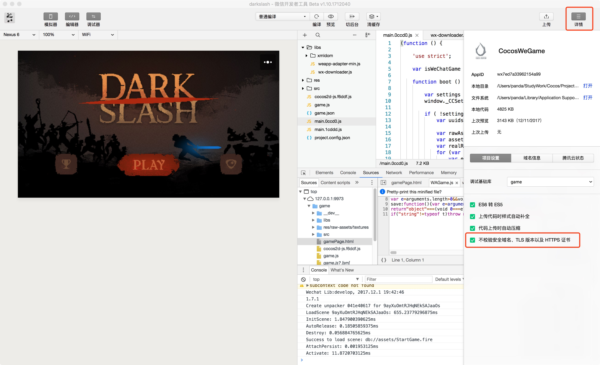

# 发布到微信小游戏

微信小游戏的运行环境是微信小程序环境的扩展，在小程序环境的基础上提供了 WebGL 接口的封装，使得渲染能力和性能有了大幅度提升。不过由于这些接口都是微信团队通过自研的原生实现封装的，所以并不可以等同为浏览器环境。

作为引擎方，为了尽可能简化开发者的工作量，我们为用户完成的主要工作包括：

- 引擎框架适配微信小游戏 API，纯游戏逻辑层面，用户不需要任何额外的修改
- Cocos Creator 编辑器提供了快捷的打包流程，直接发布为微信小游戏，并自动唤起小游戏的开发者工具
- 自动加载远程资源，缓存资源以及缓存资源版本控制

除此之外，小游戏的游戏提交，审核和发布流程和小程序是没有区别的，都需要遵守微信团队的要求和标准流程，具体信息可以参考文末的链接。

## 使用 Cocos Creator 发布微信小游戏

1. 在 [微信官方文档](https://mp.weixin.qq.com/debug/wxagame/dev/devtools/download.html) 下载微信开发者工具

2. 在编辑器菜单栏的 **Cocos Creator -> 偏好设置 -> [原生开发环境](../../editor/preferences/index.md#%E5%8E%9F%E7%94%9F%E5%BC%80%E5%8F%91%E7%8E%AF%E5%A2%83)** 中设置微信开发者工具路径

    

3. 登陆微信公众平台，找到 appid

    

4. 在 **构建发布** 面板的 **发布平台** 中选择 **微信小游戏**，填入小游戏 appid，然后点击 **构建**

    

5. 点击 **运行** 打开微信开发者工具

    

    **注意**：微信开发者工具，如果之前在点击上没运行过，会出现：`Please ensure that the IDE has been properly installed` 的报错。需要手动打开一次微信开发者工具，然后才能在 Cocos Creator 里直接点击 **运行** 调用。

6. 预览部署

    按照这样的流程，项目的 build 目录下就会生成一个微信小游戏的发布包 **wechatgame** 文件夹(具体构建任务名为准），其中已经包含了微信小游戏环境的配置文件：`game.json` 和 `project.config.json`

    

## 构建选项介绍

选项名 | 可选 | 默认值 | 说明
- | - | - | -
分包 | 可选 | true | 设是否开启分包功能
appid | 必填 | 'wx6ac3f5090a6b99c5' | 微信小游戏 appid，填写后将会写入在 `project.config.json` 内。
远程服务器地址 | 选填 | 空 | 远程服务器地址，之后将会从该地址获取资源
开放数据域代码目录 | 选填 | 空 | 如果存在开放数据域的话，通过这个字段来指定开放数据域文件夹在构建目录中的相对路径，这样在构建过程中就不会覆盖或修改该目录
设备方向 | 必填 | landscape | 设备方向，填写后将会写入在 `game.json` 内。

## 小游戏环境的资源管理

在小游戏环境中，资源管理是最特殊的部分，它和浏览器的不同在于下面四点：

1. 小游戏的包内体积不能够超过 4MB，包含所有代码和资源，额外的资源必须通过网络请求下载。
2. 对于从远程服务器下载的文件，小游戏环境没有浏览器的缓存以及过期更新机制。
3. 对于小游戏包内资源，小游戏环境内并不是按需加载的，而是一次性加载所有包内资源，然后再启动页面。
4. 不可以从远程服务器下载脚本文件。

这里引出了两个关键的问题，首页面加载速度和远程资源缓存及版本管理。对于首页面加载速度，我们建议用户只保存脚本文件在小游戏包内，其他资源都从远程服务器下载。而远程资源的下载、缓存和版本管理，其实在 Cocos Creator 中，已经帮用户做好了。下面我就来解释一下这部分的逻辑。

在小游戏环境中，我们提供了一个 wxDownloader 对象，给它设置了 `REMOTE_SERVER_ROOT` 属性后，引擎下载资源的逻辑就变成：

1. 检查资源是否在小游戏包内
2. 不存在则查询本地缓存资源
3. 如果没有缓存就从远程服务器下载
4. 下载后保存到小游戏应用缓存内供再次访问时使用
5. 缓存空间有大小限制，如果超出限制则会保存失败，此时打印提示信息并使用资源下载时的临时文件作为资源

**注意**：需要额外注意的是，一旦缓存空间占满之后，所有需要下载的资源都无法进行保存，只能使用下载保存的临时文件，而微信会在小游戏退出之后自动清理所有临时文件，所以下次再次运行小游戏时，这些资源又会再度下载，然后一直循环往复此过程。另外，缓存空间超出限制导致文件保存失败的问题不会在微信开发者工具上出现，因为微信开发者工具没有限制缓存大小，所以测试缓存时需要真实微信环境进行测试。

同时，当开启引擎的 md5Cache 功能后，文件的 url 会随着文件内容的改变而改变，这样当游戏发布新版本后，旧版本的资源在缓存中就自然失效了，只能从服务器请求新的资源，也就达到了版本控制的效果。

具体来说，开发者需要做的是：

1. 构建时，在 **构建发布配置** 面板中勾选 md5Cache 功能。
2. 设置 **远程服务器地址**，然后点击 **构建**。
3. 构建完成后将微信小游戏发布包目录下的 res 文件夹完整的上传到服务器。
4. 删除本地发布包目录下的 res 文件夹。
5. 对于测试阶段来说，可能用户无法部署到正式服务器上，需要用本地服务器来测试，那么请在微信开发者工具中打开 **详情** 页面，勾选项目设置中的 **不检验安全域名、TLS 版本以及 HTTPS 证书** 选项。

**注意**：如果缓存资源超过微信环境限制，用户需要手动清除资源，可以在微信小游戏下使用 `wx.downloader.cleanAllAssets()` 和 `wx.downloader.cleanOldAssets()` 接口来清除缓存。前者会清除缓存目录下的所有缓存资源，请慎重使用；而后者会清除缓存目录下目前应用中未使用到的缓存资源。

## 微信小游戏分包加载

请参考 [分包加载](../../asset/subpackage.md)。

## 平台 SDK 接入

除了纯游戏内容以外，其实微信小游戏环境还提供了非常强大的原生 SDK 接口，其中最重要的就是用户、社交、支付等，这些接口都是仅存在于微信小游戏环境中的，等同于其他平台的第三方 SDK 接口。这类 SDK 接口的移植工作在现阶段还是需要开发者自己处理。下面列举一些微信小游戏所提供的强大 SDK 能力：

1. 用户接口：登陆，授权，用户信息等
2. 微信支付
3. 转发以及获得转发信息
4. 文件上传下载
5. 媒体：图片、录音、相机等
6. 其他：位置、设备信息、扫码、NFC、等等

## 微信小游戏已知问题：

我们对微信小游戏的适配工作还未完全结束，目前仍不支持以下组件：

- VideoPlayer
- WebView

用户如果有需要，目前可以先自己直接调用微信的 API 来使用。

## 参考链接

- [微信小游戏开发文档](https://developers.weixin.qq.com/minigame/dev/guide/)
- [微信公众平台](https://mp.weixin.qq.com/)
- [小游戏 API 文档](https://developers.weixin.qq.com/minigame/dev/api/)
- [微信开发者工具下载](https://developers.weixin.qq.com/miniprogram/dev/devtools/download.html)
- [微信开发者工具文档](https://developers.weixin.qq.com/miniprogram/dev/devtools/devtools.html)
- [微信缓存空间溢出测试案例](https://github.com/cocos-creator/WeChatMiniGameTest)
