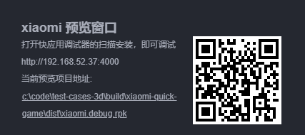

# 发布到小米快游戏

## 环境配置

- 桌面端全局安装 [Node.js](https://nodejs.org/zh-cn/download/) 8.1.4 或以上版本。
- 确保 Node.js 所带的 npm 版本最低是 **5.2.0**。升级 npm 命令如下：

  ```bash
  # 查看 npm 版本
  npm -v
  # 若 npm 版本在 5.2.0 以下，可使用以下升级命令升级 npm
  npm install npm@latest -g
  ```

- 下载 [小米快游戏调试器和小米快游戏运行环境](https://forum.cocos.org/t/topic/81887)，并安装到小米手机上（MIUI 8.5.0 或以上版本）。

## 构建参数介绍

一些通用的构建通用参数介绍，请参考 [通用构建参数介绍](build-options.md)。

| 选项名 | 可选 | 默认值 | 说明 | 字段名 |
| :-- | :-- | :-- | :-- | :-- |
| 初始场景分包 | - | false | 勾选后，首场景及其相关的依赖资源会被构建到发布包目录 assets 下的内置 Asset Bundle — [start-scene](../../asset/bundle.md#%E5%86%85%E7%BD%AE-asset-bundle) 中，提高初始场景的资源加载速度。 | startSceneAssetBundle |
| 资源服务器地址 | - | - | 若 **不填写** 该项，则发布包目录下的 `remote` 文件夹将会被打包到构建出来的 rpk 包中。填写则不会打包进 rpk,开发者需要在构建后手动将发布包目录下的 `remote` 文件夹上传到所填写的资源服务器地址上。具体的资源管理细节，请参考资源管理部分。 | remoteServerAddress |
| 游戏包名 | 必填 | (项目名称) | 游戏包名，例如 com.example.demo | package |
| 桌面图标 | 必填 | (Cocos Logo) | 桌面图标路径 | icon |
| 应用版本名称 | 必填 | (Cocos 版本号) | 应用版本名称 是真实的版本，如：1.0.0 | versionName |
| 应用版本号 | 必填 | 1201 | 纯数字，应用版本号，从 1 自增，每次重新上传包时务必 versionCode+1，否则将影响上架版本的更新。例如原版本为11，更新版本的 versionCode 需要为12。 | versionCode |
| 支持的最小平台版本号 | 必填 | 1035 | 支持的最小平台版本号，原理同Android API Level。用于兼容性检查，避免上线后在低版本平台运行导致不兼容。游戏设定值必须大于等于 1035。 | minPlatformVersion |
| 屏幕方向 | - | landscape | 设备方向，填写后将会写入在 `manifest.json` 内。| deviceOrientation |
| 使用调试密钥库 | - | true |  勾选 **使用调试密钥库** 时，表示默认使用的是 Creator 自带的证书构建 rpk 包，仅用于 **调试** 时使用，用于提交审核时则构建时不要勾选该项。| useDebugKey |
| 密钥证书路径 | - | - | 密钥库证书，上架华为应用市场的快游戏，必须使用 release 版本的证书做签名，同时在华为开发者联盟后台配置证书指纹。具体可以参考下面的 [生成签名文件](###生成签名文件) | privatePemPath、certificatePemPath |

### 生成签名文件

有以下两种方式可以生成签名文件：

- 通过 **构建发布** 面板 **certificate.pem 路径** 后的 **新建** 按钮生成

- 通过命令行生成 release 签名

    用户需要通过 openssl 命令等工具生成签名文件 private.pem、certificate.pem。

    ```bash
    # 通过 openssl 命令工具生成签名文件
    openssl req -newkey rsa:2048 -nodes -keyout private.pem -x509 -days 3650 -out certificate.pem
    ```

    > **注意**：openssl 工具在 linux 或 Mac 环境下可在终端直接打开。而在 Windows 环境下则需要安装 openssl 工具并且配置系统环境变量，配置完成后需重启 Creator。

## 启动游戏

启动游戏，有以下两种方式：

- **方法一**：

  - 在 **构建发布** 面板点击右下角的 **运行** 按钮，等待二维码界面生成。

    

  - 然后在小米手机上打开之前已经安装完成的 **快应用调试器**，点击 **扫码安装** 按钮，直接扫描二维码即可打开 rpk。

    

- **方法二**：

  - 首先在小米手机上打开 **设置-> 更多设置-> 开发者选项**，开启开发者选项以及 USB 调试。
  - 使用 USB 数据线将桌面端电脑与手机相连。
  - 将构建生成的快游戏 rpk 文件（位于发布包 **build/xiaomi/dist** 目录下）拷贝到小米手机 sdcard 目录中。
  - 在小米手机上打开之前已经安装完成的 **快应用调试器**，点击 **本地安装**，然后从手机 sdcard 目录中找到 rpk 文件，选择打开即可。

    

## 调试

调试必须基于真机进行调试，并且必须严格按照先运行游戏再启动调试功能的先后顺序。启动游戏后，让小米手机处于打开游戏运行的界面。然后使用 USB 数据线将桌面端电脑与小米手机相连，并且小米手机需要开启开发者选项以及 USB 调试。

目前可以通过命令行来启动调试：

- 指定到编辑器安装目录 **resources/tools/xiaomi-pack-tools** 目录下，执行命令：`npm run debug`，就会在 Chrome 浏览器中 **自动** 启动调试界面。
- 如果想要 **手动** 打开调试界面，那么执行命令：`npm run debug -- --print-only`，然后将运行后生成的 URL 地址拷贝到 Chrome 浏览器中打开即可启动调试界⾯。

    ```bash
    # 指定到编辑器安装目录下的 resources/tools/xiaomi-pack-tools 目录下
    cd ${CocosCreator}/tools/xiaomi-pack-tools
    # 自动在 Chrome 上打开调试界面
    npm run debug
    # 手动在 Chrome 上打开调试页面
    npm run debug -- --print-only
    ```

## 分包 rpk

分包 rpk 是根据开发者的需求选择是否使用。分包加载，即把游戏内容按一定规则拆分在几个包里，在首次启动的时候只下载必要的包，这个必要的包称为 **主包**，开发者可以在主包内触发下载其他子包，这样可以有效降低首次启动的消耗时间。

若要使用该功能需要在 Creator 编辑器中配置 [小游戏分包](subpackage.md)，设置完成后在构建时就会自动分包。构建完成后，会在 `build/xiaomi-quick-game/dist` 目录下生成 **.rpk** 文件。

分包或者主包的包体大小限制，具体可参考 [小米快游戏分包规则](https://forum.cocos.org/t/topic/81887)。

## 小米快游戏环境的资源管理

小米快游戏超过包体大小限制的部分必须通过网络请求下载，Cocos Creator 已经帮开发者做好了远程资源的下载、缓存和版本管理，详情请参考 [资源管理](../../asset/cache-manager.md#资源下载流程)。

## 相关参考链接

- [小米快游戏相关参考链接](https://forum.cocos.org/t/topic/81887)
