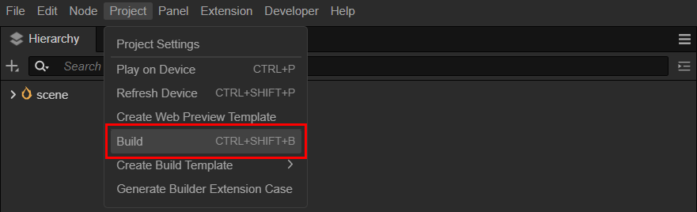
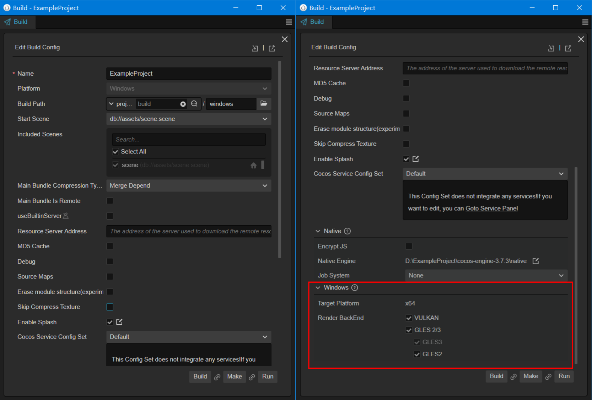
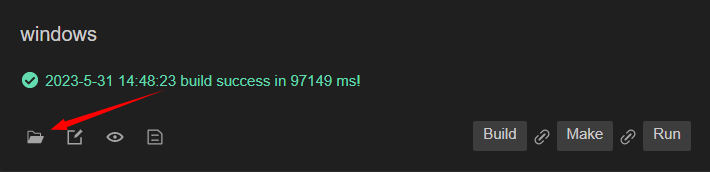
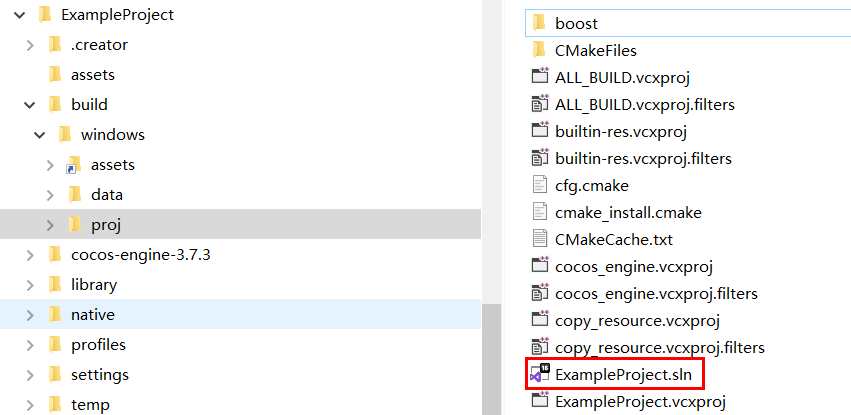
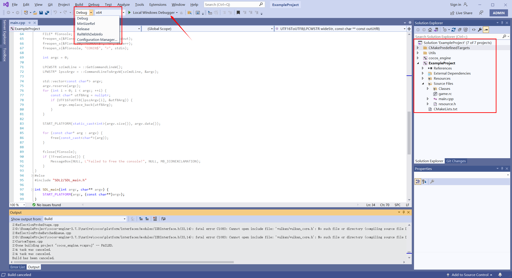
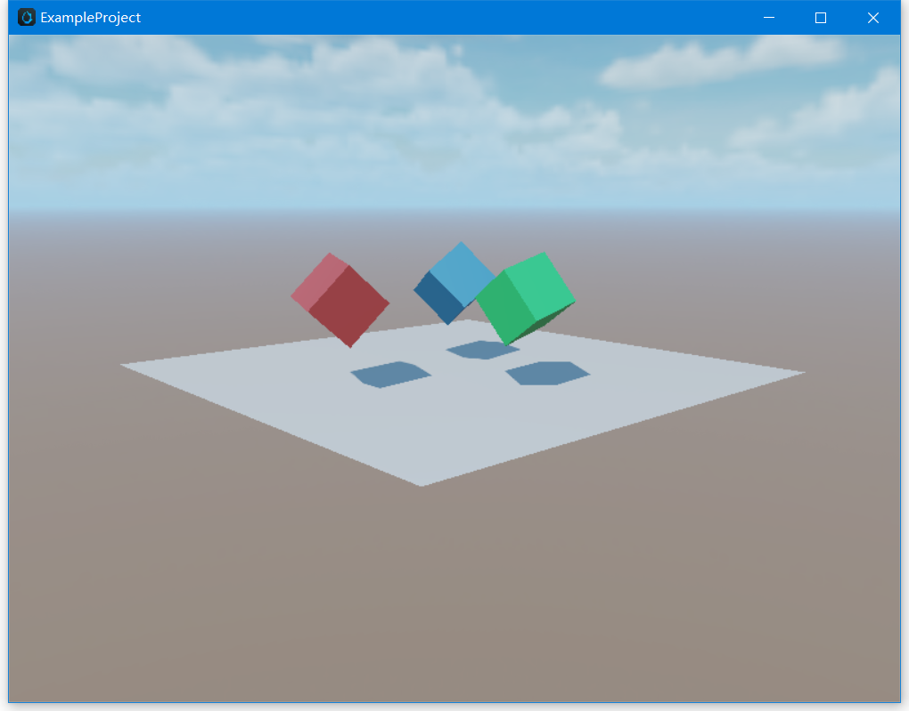
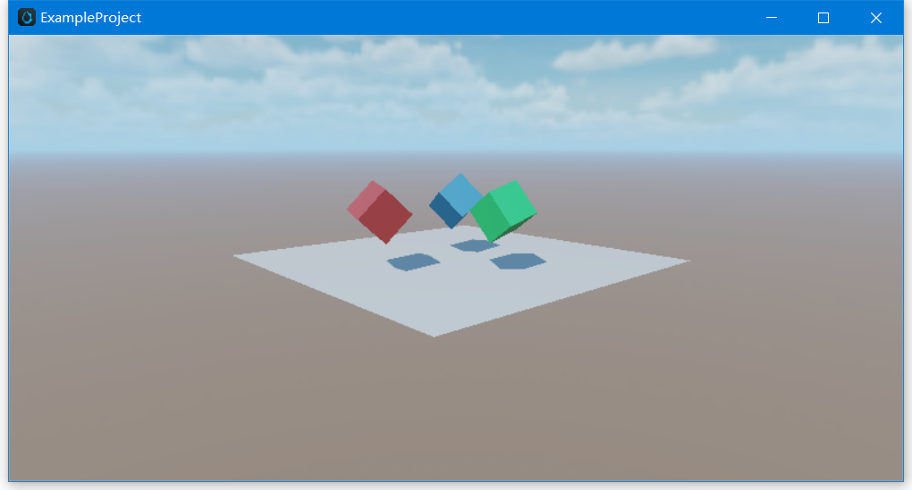

# Windows 构建示例

本文将演示将 Cocos Creator 开发的项目发布为 Windows 应用程序，需要以下准备工作：
- 一台 Windows 电脑
- C++ 开发环境

## 安装 C++ 编译环境

Windows 下需要安装 [Visual Studio 2017/2019 社区版](https://www.visualstudio.com/downloads/download-visual-studio-vs)。

在安装 Visual Studio 时，请勾选 **使用 C++ 的桌面开发** 和 **使用 C++ 的游戏开发** 两个模块。

> **注意**：在 **使用 C++ 的游戏开发** 模块中有一个 **Cocos** 选项，请勿勾选。

## 发布流程

### 准备测试项目

打开一个已有的项目，或者新建一个测试项目

### 构建



如上图所示，在 Cocos Creator 顶部菜单中选择 **项目(Project)** -> **构建(Build)**，可打开下面的构建面板。



#### 配置通用选项

上图中，左边部分为 Cocos Creator 支持的所有平台都需要配置的公共参数，可以前往[通用发布配置](./../build-options.md)查看详情。

#### 配置 Windows 专有选项

在面板上向下滑动，可以看到如右图所示的原生（Native）平台和 Windows 平台特有的配置，详情请查看[原生平台通用构建选项](./../native-options.md) 和 [Windows 发布选项](./build-options-windows.md)。

#### 执行构建

配置完成后，点击 **构建（Build）** 按钮，即可生成 Visual Studio 的 `*.sln` 项目。

构建成功后，可以点击如下所示的打开文件按钮，打开生成的项目路径。


如果未更改过生成路径，可在同目录下找到 build/windows/proj 目录，内容如下所示：


### 在 Visual Studio 中编译运行

双击 `build/windows/proj/项目名称.sln`，即可用相关 `Visual Studio` 打开项目。



选择如图所示的 项目中包含了 `cocos-engine` 库以及项目代码，点击编译并运行按钮，即可启动项目。



> `*.sln` 为 `Visual Studio` 项目解决方案文件，推荐使用 `Visual Studio` 打开。也可以使用 [Rider](https://www.jetbrains.com/rider/) 等支持 `*.sln` 的 IDE 打开。

### 修改分辨率

可以通过 `native/engine/common/classes/Game.cpp` 中的 `_windowInfo` 进行修改：

默认分辨率为 800 x 600，我们以把分辨率改为 800 x 400 为例。

```C++
int Game::init() {
  _windowInfo.title = GAME_NAME;
  // configure window size
  _windowInfo.width  = 800;
  _windowInfo.height = 400;
}
```

修改完成后，在 Visual Studio 中再次编译运行，效果如下图所示：



## 进阶

### 脚本与原生通信

有时候，我们会调用一些 Windows 的系统功能，或者，当我们集成了某个第三方的 SDK 库后，调要通过脚本代码调用，此时就需要用到脚本层与原生层的通信机制。

通信机制请参考：[JSB 使用指南](../../../advanced-topics/JSB2.0-learning.md)

### 在原生环境调试代码

有一些问题，只有在特定设备上才会出现，如果能够在对应设备上调试代码，就能快速定位问题，找到解决方案。

Cocos Creator 提供了原生调试机制，可以很方便地在设备上调试游戏代码，请参考：[原生平台 JavaScript 调试](./../debug-jsb.md)。
