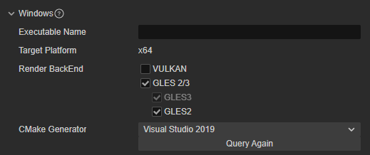

# Windows 平台构建选项

Windows 平台的构建选项包括 **渲染后端** 和 **生成平台**。

## 渲染后端（Render BackEnd）

在 Windows 平台上， Cocos Creator 目前支持 **VULKAN**、**GLES3** 和 **GLES2** 三种**渲染后端**。默认勾选 **GLES3**，在同时勾选多个的情况下，运行时将会根据设备实际支持情况来选择使用的渲染后端。

## 目标平台

设置编译架构，目前仅支持 **x64**，只能在 **x64** 系统上运行。
