# 多层次细节

多层次细节（Level Of Details 以下简称 LOD）是大场景开发中常用的一种优化方式。LOD 的核心在于对于远处或者不重要的物体，降低其显示细节，以达到提升渲染效率的目的。

通常的 LOD 的做法是对于某些离屏幕较远或者不重要的物体，使用低模进行代替。

在引擎中，如果要启用 LOD，可以在 **属性检查器** 内选择 **添加组件** 按钮并选择 **LOD Group** 组件。

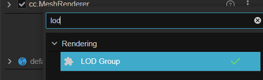

添加后，场景中会显示 **剔除（`Culled`）** 或者 **LOD** 字样。

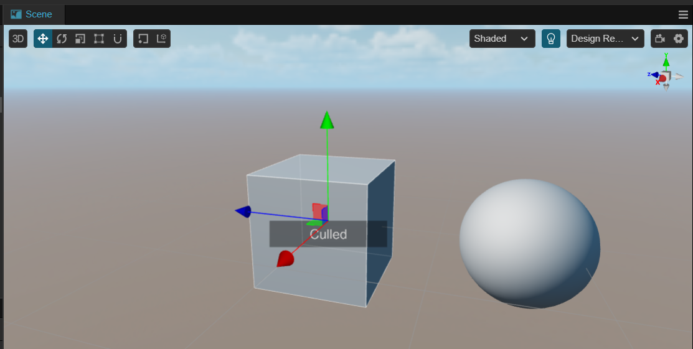

## 属性

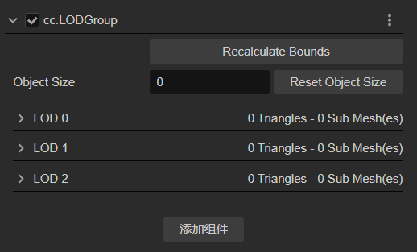

LOD Group 组件的属性描述如下：

| 属性 | 说明 |
| :-- | :-- |
| **Recalculate Bounds** | 重新计算包围盒 <br> 点击该按钮后，整个组的模型包围盒会重新计算 <br> 该按钮会调用 `recalculateBounds` 接口对包围盒进行重新计算，同时会修改 **Object Size** 属性 |
| **Object Size** | 物理包围盒大小 <br> 计算物体的包围盒并取 X、Y、Z 中值最大的轴 <br> 点击右侧的 **Reset Object Size** 按钮会将此属性重设为 1 |
| **LOD(0 ~ 3)** | 多层次配置，点击左侧的 **>** 符号可以展开进行配置，展开后的内容请参考下图。<br> LOD0 表示最丰富的显示细节 <br> LOD2 显示低模 <br> 当物体在屏幕中的屏占比小于 LOD2 的 **Screen Ratio** 值时，物体将被剔除 |

点击属性检查器上任意 **> LOD(0 ~ 3)** 展开后会显示如下图示：

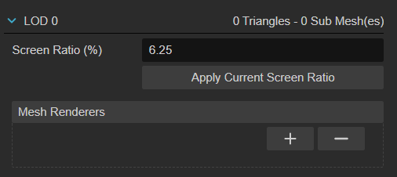

其属性及描述如下：

| 属性 | 说明 |
| :-- | :-- |
| **Screen Ratio(%)** | 最小屏占比，取值范围 [0, 1]。<br> 开发者可以在后方的输入框内输入自定义的屏占比，也可以通过 **Apply Current Screen Ratio** 自动计算屏占比 <br> 当屏占比低于当前配置的值时，LOD 会自动向下个层次切换；如没有更多层次，则物体会被剔除 |
| **Apply Current Screen Ratio** | 应用当前屏占比 <br> 按下后，LOD Group 组件会将当前显示状态的屏占比作为 **Screen Ratio（%）** 的值 |
| **Mesh Renderers** | 网格渲染器 <br> 请参考下方文档以获取更详细的信息 |
| **0 Triangle - 0 Sub Mesh(es)** | 该属性显示了当前层次所配置的三角面的数量以及其子网格的数量 |

### 网格渲染器属性

网格渲染器可以通过点击下方的 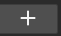 以及 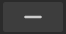 按钮进行添加或者删除操作。

添加后可以通过拖拽层次管理器内带有网格渲染器的节点进行配置：

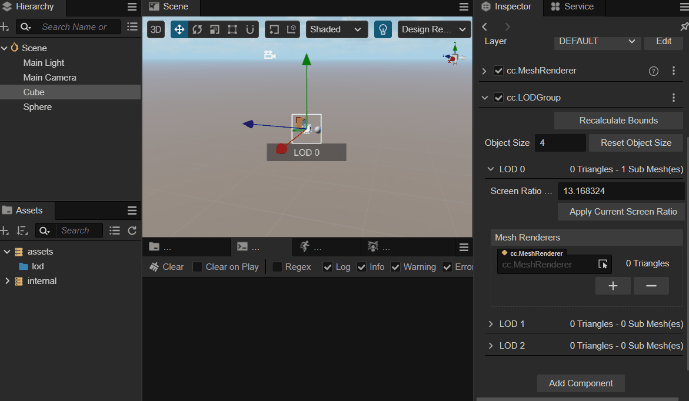

## LOD

将鼠标放在 LOD 的右侧显示网格信息处可以显示添加或删除层次按钮。

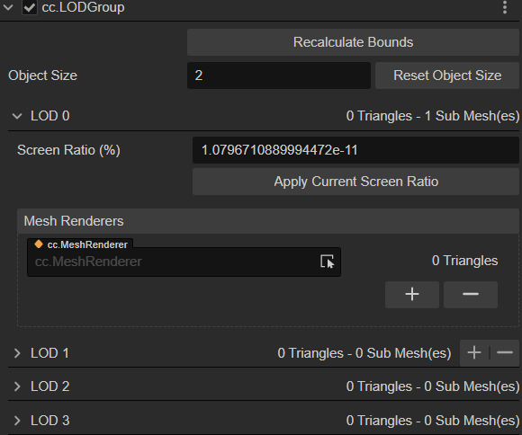

点击  时会在数组尾部添加一个新的 LOD。

点击  时删除当前鼠标所指的 LOD。删除后，后续的 LOD 会自动向前位移。

## 预览

配置好 LOD 后，在场景管理器内通过鼠标滚轮即可以预览不同的层次。

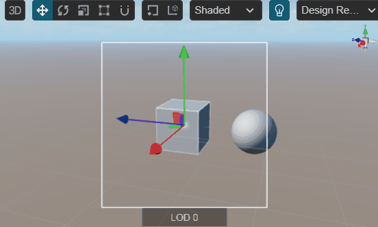

随着鼠标滚动的变化，场景相机逐渐拉远，此时 LOD 的层次会变化，如当前物体的屏占比低于 LOD2 所配置的屏占比时，场景管理系统会将其剔除（Culled）。屏幕中会显示当前该 LOD Group 的层次状态 LOD(0~3) 或 剔除。

## 脚本的使用

开发者可以通过 `getComponent` 方法获取到该组件：

```ts
import { _decorator, Component, Node, LODGroup } from 'cc';
const { ccclass, property, requireComponent } = _decorator;

@ccclass('LOD')
@requireComponent(LODGroup)
export class LOD extends Component {

    lodGroup : LODGroup | null = null;

    start() {
        this.lodGroup = this.node.getComponent(LODGroup);        
    }

    update(deltaTime: number) {
        
    }
}
```

更多 API 可参考 [LOD Group API](__APIDOC__/zh/class/LODGroup)

## 美术工作流

在实际项目开发中，美术工作者可在 DCC 软件（Maya、3D Max、Blender）中进行减面操作，并将模型导出。

通常可以导出多个不同层次的模型或者在同一模型中增加不同的子网格来代表不同的 LOD 层次。

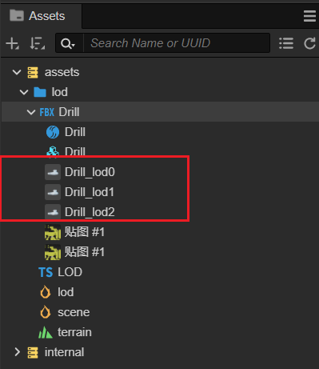

### 自动匹配

通过 DCC 软件导出的模型如果其子节点拥有多个以 **_lod + 数字** 作为结尾时，LOD Group 组件会自动匹配这些子网格或网格渲染器。

#### 自动匹配示例

请确保已按照上述的规则导出相应的模型。

将准备好的 FBX 或者 glTF 文件导入到引擎的 **资源管理器** 内：

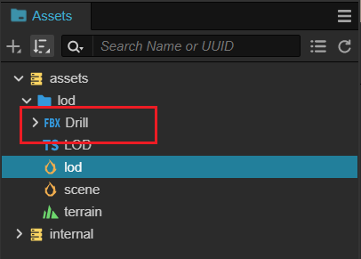

此时资源导入系统会自动识别这些节点并启用 LOD Group 进行自动匹配：

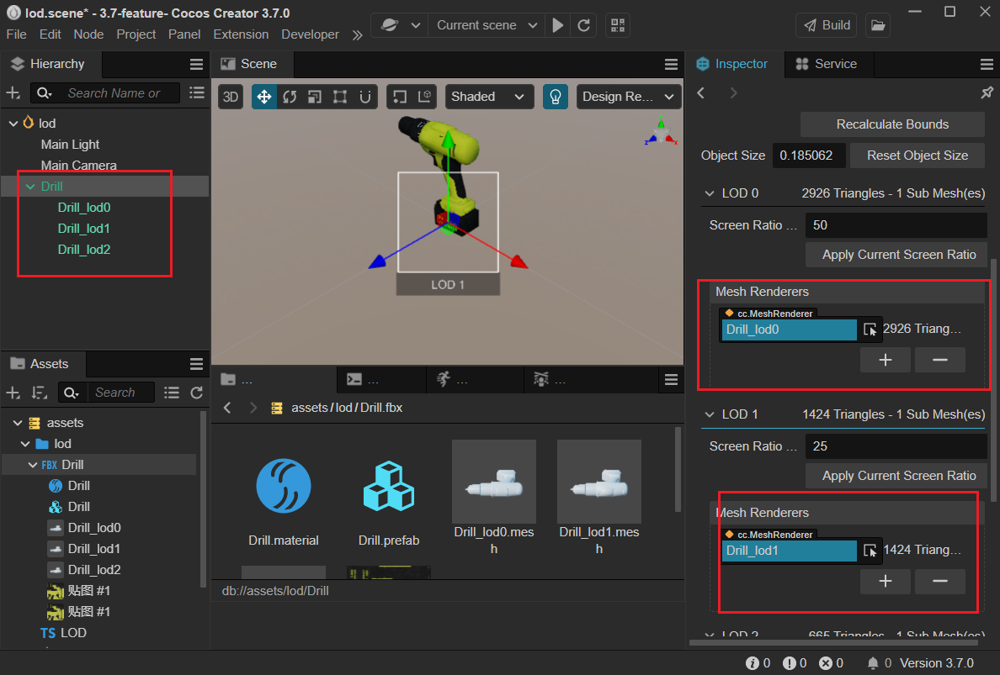

#### 自动 LOD

自 v3.8 起，我们优化了模型导入时的 LOD 功能，如模型未带有 LOD 信息，可以在网格的 **属性检查器** 上的 Model 分页，找到并编辑模型的 LOD，勾选 LOD 的单选框则可以启用自动 LOD。

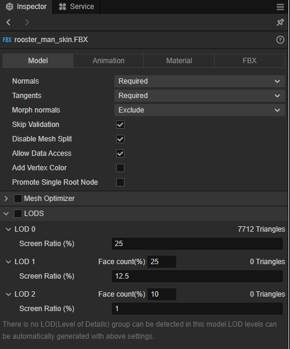

鼠标移动到层级上可以点击 / 来增加和减少层级。

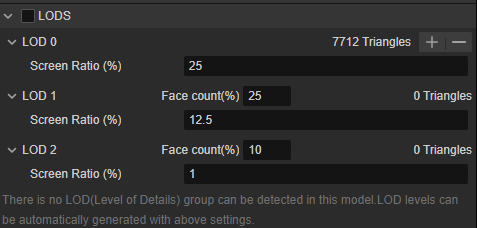

- Face count(%)：面数比例，优化后的网格的三角面数量除以原始网格面数得到的比例。如 25% 则会优化掉原始模型的 75% 的面数。
- Screen Ratio：最小屏占比，和 LOD 组件的 Screen Ratio 属性一致，请查看上文。

每个层级和 LOD 组件的设置类似，可以修改不同层级的面数占比。

## Q&A

- 我是否可以添加多个 LOD Group

  可以。他们之间会工作良好。

- 我能否在 2D 场景内使用 LOD

    由于 LOD Group 组件只会识别 MeshRenderer 而 2D 或者 UI 组件通常没有 MeshRenderer，因此这样做并没有什么意义。
