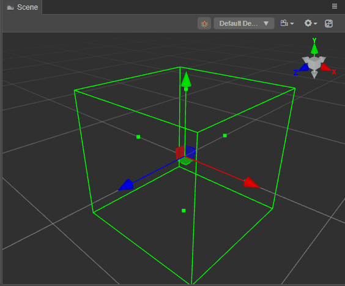

# 碰撞器 Gizmo

有关 Cocos Creator 的碰撞器信息可以查看：[碰撞组件与基础属性](../../physics/physics-collider.md)

碰撞器的 Gizmo 用于在编辑器内展示碰撞器的位置和大小，在 **层级管理器** 内选中任意带有碰撞器组件的节点，可在场景窗口内观察到其 Gizmo：

对于所有碰撞器来说，通过鼠标选中并拖动这些方块，可以调整碰撞器的大小。下图以 **盒碰撞器 Gizmo** 为例，展示如何调整碰撞器：

