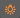
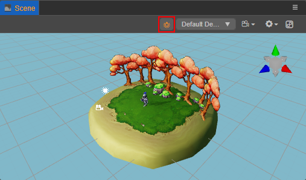
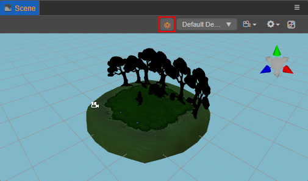

# 场景编辑器

**场景编辑器** 是内容创作的核心工作区域，用于选择和摆放场景图像、角色、特效、UI 等各类游戏元素。在这个工作区域内可以选中并通过 **变换工具** 修改节点的位置、旋转和缩放等属性，并可以获得所见即所得的场景效果预览。

## 视图介绍

**场景编辑器** 包括 **3D** 和 **2D** 两种视图，3D 视图用于 3D 场景编辑，2D 视图则主要用于 UI 节点等 2D 元素的编辑，可通过编辑器左上方工具栏中的 **3D/2D** 按钮切换场景视图。

### 3D 视图

在 3D 视图下，可以通过以下操作来移动和定位 **场景编辑器** 的视图：
- 鼠标左键 + Alt：以视图中心点为中心旋转。
- 鼠标中键：平移视图。
- 鼠标滚轮：以视图中心点为中心缩放视图。
- 鼠标右键 + WASD：摄像机漫游。
- **F** 快捷键：摄像机聚焦到当前选中节点。

### 2D 视图

在 2D 视图下，可以通过以下操作来移动和定位 **场景编辑器** 的视图：
- 鼠标中键：平移视图。
- 鼠标滚轮：以当前鼠标悬停位置为中心缩放视图。
- 鼠标右键：平移视图。
- **F** 快捷键：摄像机聚焦到当前选中节点。

## 坐标系和网格

场景中网格是我们摆放场景元素时位置的重要参考信息，关于坐标系和位置等节点属性的关系，请阅读 [坐标系和节点变换](../../concepts/scene/coord.md) 一节。

## 场景灯光设置

**场景编辑器** 上方的  按钮主要用于设置在进行场景编辑时是否使用场景灯光，默认使用。

若按钮显示为黄色，表示使用场景灯光，将使用场景中添加的灯光照亮场景，如下所示：

当场景中没有任何添加的灯光时，场景为全黑的状态，不方便进行编辑：

此时便可以将按钮切换为白色状态，表示不使用场景灯光，编辑器会自动创建一个与场景相机视角对齐的隐藏的平行光来照亮场景，如下图所示：

## 场景 Gizmo

场景 Gizmo 在场景视图的右上角，它显示了当前场景相机的观察方向，可以通过点击它来快速切换不同的观察角度。

- 点击 6 个方向轴，可以快速切换到上，下，左，右，前，后六个角度来观察场景。
- 点击中心的立方体，可以在正交视图和透视视图间切换。

### 选择节点

在场景视图中点击鼠标左键选择物体所在节点，选择节点是使用变换工具设置节点位置、旋转、缩放等操作的前提。

### Gizmo 操作简介

**场景编辑器** 的核心功能就是以所见即所得的方式编辑和布置场景中的可见元素，我们主要通过 **Gizmo** 工具来辅助完成场景的可视化编辑。

- [变换工具 Gizmo](./transform-gizmo.md)
- [摄像机 Gizmo](./camera-gizmo.md)
- [灯光 Gizmo](./light-gizmo.md)
- [碰撞器 Gizmo](./collider-gizmo.md)
- [粒子系统 Gizmo](./particle-system-gizmo.md)
