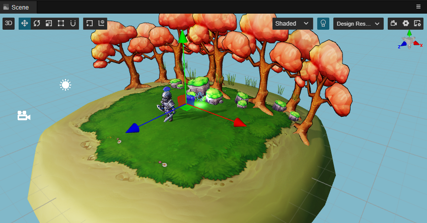
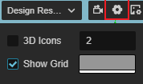
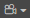
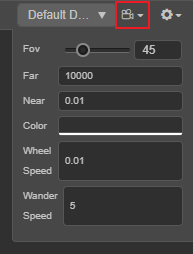
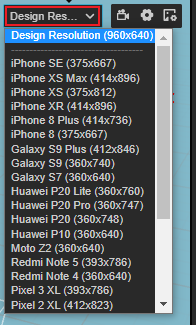
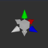

# 场景编辑器

**场景编辑器** 是内容创作的核心工作区域，用于选择和摆放场景图像、角色、特效、UI 等各类游戏元素。在这个工作区域内可以选中并通过 **变换工具** 修改节点的位置、旋转和缩放等属性，并可以获得所见即所得的场景效果预览。

## 视图介绍

**场景编辑器** 包括 **3D** 和 **2D** 两种视图，3D 视图用于 3D 场景编辑，2D 视图则主要用于 UI 节点等 2D 元素的编辑，可通过编辑器左上方工具栏中的 **3D/2D** 按钮切换场景视图。

### 3D 视图

在 3D 视图下，可以通过以下操作来移动和定位 **场景编辑器** 的视图：
- 鼠标左键 + Alt：以视图中心点为中心旋转。
- 鼠标中键：平移视图。
- 鼠标滚轮：以视图中心点为中心缩放视图。
- 鼠标右键 + WASD：摄像机漫游。
- **F** 快捷键：摄像机聚焦到当前选中节点。

### 2D 视图

在 2D 视图下，可以通过以下操作来移动和定位 **场景编辑器** 的视图：
- 鼠标中键：平移视图。
- 鼠标滚轮：以当前鼠标悬停位置为中心缩放视图。
- 鼠标右键：平移视图。
- **F** 快捷键：摄像机聚焦到当前选中节点。

## 场景设置

**场景编辑器** 右上角的选项可用于设置场景网格、场景相机参数等，详情请参考下文介绍。

### 网格设置

场景中的网格是我们摆放场景元素时位置的重要参考信息，可通过 **场景编辑器** 右上方的按钮设置：

| 选项 | 功能说明 |
| :-- | :-- |
| 3D 图标 | 场景是否启用 3D 图标，后面的输入框用于设置图标 Gizmo 的大小，取值范围为 0 ~ 8。 若勾选该项则表示启用 3D 图标，**场景编辑器** 中的图标 Gizmo 便会是一个 3D 面片，有近大远小的效果。 若不勾选该项，则图标 Gizmo 会显示为一个固定大小的图片。 |
| 显示网格 | 是否显示 **场景编辑器** 中的网格，后面的颜色设置框用于设置网格的颜色。 |

### 场景相机设置

点击 **场景编辑器** 右上角的  按钮即可设置场景相机（非用户创建的相机）的属性：

| 选项 | 功能说明 |
| :-- | :-- |
| Fov | 设置场景相机的视角大小 |
| Far | 设置场景相机的远裁剪面距离 |
| Near  | 设置场景相机的近裁剪面距离 |
| Color | 设置场景背景色 |
| Wheel Speed  | 设置当滚动鼠标滚轮时，场景相机前后移动的速度 |
| Wander Speed | 设置场景相机漫游时的移动速度 |

### 渲染输出目标分辨率设置（v3.0.1 新增）

**场景编辑器** 右上角可根据需要选择场景相机的渲染输出目标分辨率，会影响场景相机的可视范围，方便跟最终预览时选择的分辨率有相似的显示效果：

可在顶部菜单栏的 **偏好设置** 的 [设备管理器](../preferences/index.md#%E8%AE%BE%E5%A4%87%E7%AE%A1%E7%90%86%E5%99%A8) 中添加/修改/删除分辨率。

关于相机可视范围的说明可参考 [Camera 组件](../components/camera-component.md)。

## 场景 Gizmo

场景 Gizmo 在场景视图的右上角，它显示了当前场景相机的观察方向，可以通过点击它来快速切换不同的观察角度。

- 点击 6 个方向轴，可以快速切换到上，下，左，右，前，后六个角度来观察场景。
- 点击中心的立方体，可以在正交视图和透视视图间切换。

### 选择节点

在场景视图中点击鼠标左键选择物体所在节点，选择节点是使用变换工具设置节点位置、旋转、缩放等操作的前提。

### Gizmo 操作简介

**场景编辑器** 的核心功能就是以所见即所得的方式编辑和布置场景中的可见元素，我们主要通过 **Gizmo** 工具来辅助完成场景的可视化编辑。

- [变换工具 Gizmo](../toolbar/index.md)
- [摄像机 Gizmo](./camera-gizmo.md)
- [碰撞器 Gizmo](./collider-gizmo.md)
- [粒子系统 Gizmo](./particle-system-gizmo.md)
