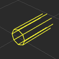
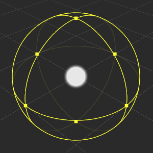

# 灯光 Gizmo

有关 Cocos Creator 的灯光信息可以查看 [光源介绍](../../concepts/scene/light.md)

## 方向光（Directional Light)

**方向光 Gizmo** 显示了当前方向光的方向

## 球面光（Sphere Light)

**球面光 Gizmo** 显示了光源的颜色以及光源范围，同时可以使用方块控制点来编辑光源的范围。

## 聚光（Spot Light）

**聚光 Gizmo** 显示了光源的颜色、光源范围以及聚光的角度，同时可以使用方块控制点来编辑光源的范围和角度。

