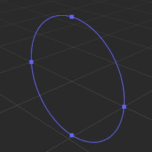
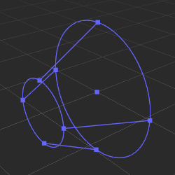

# 粒子系统 Gizmo

粒子系统的 Gizmo 主要用于可视化粒子系统的发射器 [ShapeModule](../../particle-system/emitter.md)。

## 盒子（Box）

**盒子 Gizmo** 显示了盒子的长宽高，同时可以使用方块控制点来编辑长宽高。

## 球（Sphere）

**球 Gizmo** 显示了球的大小，同时可以使用方块控制点来编辑球的半径。

## 半球（Hemisphere）

**半球 Gizmo** 显示了半球的大小，同时可以使用方块控制点来编辑半球的半径。

## 圆（Circle）

**圆 Gizmo** 显示了圆的大小，同时可以使用方块控制点来编辑圆的半径。

## 圆锥（Cone）

**圆锥 Gizmo** 显示了圆锥的形状，同时可以使用方块控制点来编辑圆锥的半径、角度、高度。

