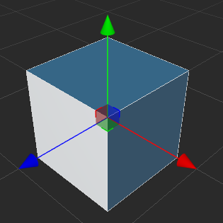
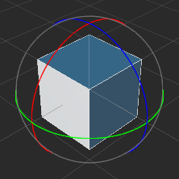
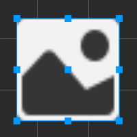
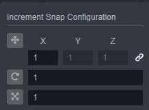

# 变换工具 Gizmo

我们主要通过主窗口工具栏左上角的一系列 **变换工具** 来将场景中的节点按我们希望的方式布置。

## 移动变换工具

**移动变换工具** 是打开编辑器时默认处于激活状态的变换工具，之后这个工具也可以通过点击位于主窗口左上角工具栏第一个按钮来激活，或者在使用场景编辑器时按下快捷键 **W**，即可激活 **移动变换工具**。

选中任何节点，就能看到节点中心（或锚点所在位置）上出现了由红绿蓝三个箭头和红绿蓝三个方块组成的移动控制手柄

**控制手柄** 是指场景编辑器中在特定编辑状态下显示出的可用鼠标进行交互操作的控制器。这些控制器只用来辅助编辑，不会在游戏运行时显示。

移动变换工具激活时：
- 按住红色、绿色、蓝色箭头拖拽鼠标，将分别在 x、y、z 轴方向上移动节点；
- 按住红色、绿色、蓝色方块拖拽鼠标，将分别在 y-z平面、x-z平面、x-y平面上移动节点；

## 旋转变换工具

点击主窗口左上角工具栏第二个按钮，或在使用场景编辑器时按下 **E** 快捷键，即可激活 **旋转变换工具**。

旋转变换工具的手柄主要是三个相互正交的圆组成（2D视图下由一个箭头和一个圆环组成）。拖拽圆环上任意一点就可以旋转节点，放开鼠标之前，可以在控制手柄上看到当前旋转的范围。

旋转变换工具激活时：
- 按住红色、绿色、蓝色圆圈拖拽鼠标，将分别在绕 x、y、z 轴旋转节点；

## 缩放变换工具

点击主窗口左上角工具栏第三个按钮，或在使用场景编辑器时按下 **R** 快捷键，即可激活 **缩放变换工具**。

缩放工具由三个头部是正方体的坐标轴以及一个中心正方体组成。

缩放变换工具激活时：
- 按住红色、绿色、蓝色方块拖拽鼠标，将分别在 x、y、z 轴方向上缩放节点；
- 按住灰色方块拖拽鼠标，将同时在 x、y、z 轴上缩放节点；

## 矩形变换工具

点击主窗口左上角工具栏第四个按钮，或在使用场景编辑器时按下 **T** 快捷键，即可激活 **矩形变换工具**。

矩形变换工具适用于 UI 节点，由四个顶点控制点、四个边控制点、一个中心控制点组成。

矩形变换工具激活时：
- 拖拽控制手柄的任一顶点控制点，可以在保持对角顶点位置不变的情况下，同时修改 UI 节点尺寸中的 width 和 height 属性。
- 拖拽控制手柄的任一边控制点，可以在保持对边位置不变的情况下，修改 UI 节点尺寸中的 width 或 height 属性。

在 UI 元素的排版中，经常会需要使用 **矩形变换工具** 直接精确控制节点四条边的位置和长度。而对于必须保持原始图片宽高比的图像元素，通常不会使用矩形变换工具来调整尺寸。

## 变换吸附

变换吸附功能可用于在 **场景编辑器** 中使用移动/旋转/缩放变换工具时按照 **设定的步长** 对节点进行操作。可通过以下两种方式触发变换吸附功能：

1. 在使用变换工具的同时按住 <kdb>Ctrl</kdb> 键即可触发变换吸附功能。
2. 在变换吸附配置面板通过按钮开启对应变换工具的自动吸附功能，详情请参考下文介绍。

点击编辑器主窗口左上角工具栏中的第五个 **变换吸附配置** 按钮：

即可打开变换吸附配置面板，用于设定相应的步长，以及开启自动吸附功能：

| 按钮 | 功能说明 |
| :-- | :-- |
|   | 用于设置是否在使用 **移动变换工具** 时开启自动吸附功能。X、Y、Z 分别用于设置 X、Y、Z 轴上的移动步长，默认 X、Y、Z 统一使用 X 的值，也可以点击  按钮分别设置各个轴的步长。   |
|   | 用于设置是否在使用 **旋转变换工具** 时开启自动吸附功能。右侧的方框用于设置旋转步长，默认为 1。 |
|         | 用于设置是否在使用 **缩放变换工具** 时开启自动吸附功能。右侧的方框用于设置缩放步长，默认为 1。 |

## 变换工具基准点设置

变换工具基准点设置用于设置变换工具的位置以及它操作的方向。

### 位置

点击 Pivot/Center 按钮，会在 Pivot 和 Center 两个选项中切换

- **Pivot**：变换工具使用节点的世界坐标
- **Center**：变换工具使用所有选择的物体的中心位置坐标

### 方向

点击 Local/Global 按钮，会在 Local 和 Global 两个选项中切换

- **Local**：变换工具使用节点的旋转方向
- **Global**：变换工具使用世界空间的方向
