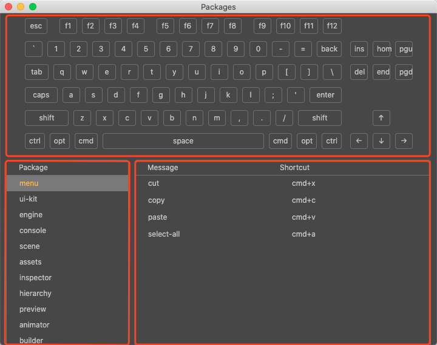
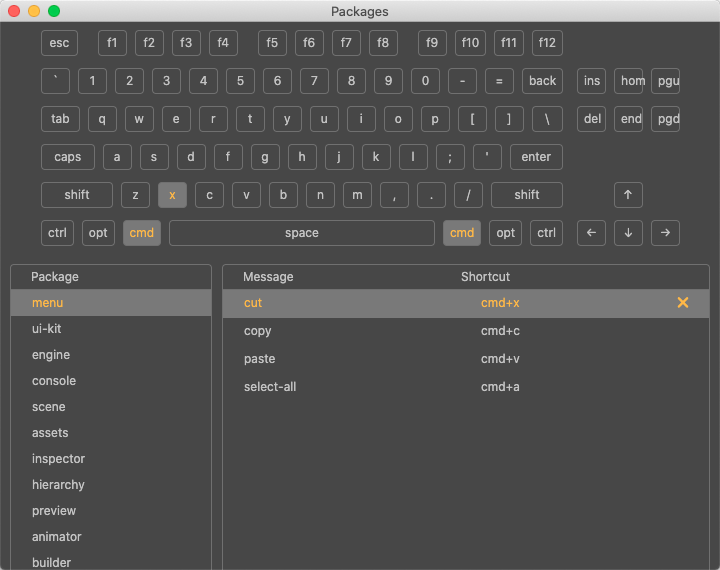
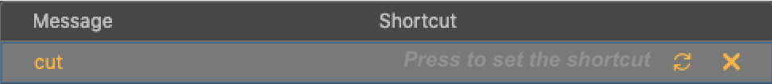

# 快捷键

**快捷键** 面板主要用于查看和管理键盘快捷键。可以通过点击编辑器主菜单中的 **Cocos Creator -> 快捷键** 开启快捷键面板。面板上主要包括 **键盘区**、**功能分类区** 和 **快捷键编辑区** 三个部分。

- **键盘区**：位于面板上半部分，用于查看快捷键的按键组合以及对按键进行替换。

- **功能分类区**：位于面板下半部分的左侧，可根据各个面板或功能点选择并查看所支持的所有快捷键。

- **快捷键编辑区**：位于面板下半部分的右侧，罗列出当前在 **功能分类区** 中所选的类别支持的所有快捷键方式，并可选中快捷键项的按键组合进行 **删/改/恢复默认** 操作。

## 修改快捷键

每一个快捷键项都由两个部分组成，分别是 **Message**（快捷键功能名）和 **Shortcut**（快捷键）。**快捷键功能名** 由编辑器提供，无法修改。**快捷键** 可由开发者自定义快捷键的按键组合。

当在 **快捷键编辑区** 选中一个快捷键项后，可以观察到 **键盘区** 的按键组合呈高亮状态，方便用户更加直观的看到当前选中的按键，同时在快捷键项的末尾会出现一个 **X** 按钮，可用于删除当前设置的快捷键组合。

若要修改快捷键组合，可以点击当前项的 **快捷键** 区域，可以看到界面内容出现如下变化：

- **Press to set the shortcut** 输入框：可通过键盘输入或者点击上方 **键盘区** 的按键自定义快捷键按键组合。
- 右侧重置按钮：用于将当前设置的快捷组合键恢复成默认的组合键。
- 右侧删除（X）按钮：用于删除当前设置的快捷键组合。

## 常用快捷键汇总

- 复制：Ctrl/Cmd + C
- 粘贴：Ctrl/Cmd + V
- 克隆：Ctrl/Cmd + D、Ctrl + 拖动资源｜拖动节点
- 删除：Delete
- 上下选择：上箭头，下箭头
- 上一层级：左箭头
- 下一层级：右箭头
- 多选：Ctrl/Cmd + 点击
- 连续多选：Shift + 点击
- 全选：Ctrl/Cmd + A
- 重命名：Enter/F2
- 取消输入：Esc
