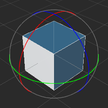

# 工具栏

**工具栏** 位于编辑器主窗口的正上方，包含了七组控制按钮或信息，用来为特定面板提供编辑功能或方便我们实施开发工作流。

## 选择变换工具

为 **场景编辑器** 提供编辑节点变换属性（移动、旋转、缩放、矩形变换）的功能，详情请阅读 [变换工具 Gizmo](../editor/scene/transform-gizmo.md)。

### 移动变换工具

**移动变换工具** 是打开编辑器时默认处于激活状态的变换工具，之后这个工具也可以通过点击位于主窗口左上角工具栏第一个按钮来激活，或者在使用场景编辑器时按下快捷键 **W**，即可切换使用 **移动变换工具**。

选中任意节点，便能在 **场景编辑器** 中看到节点中心出现了由红绿蓝三个箭头和红绿蓝三个方块组成的移动控制手柄。

**控制手柄** 是指场景编辑器中在特定编辑状态下显示出的可用鼠标进行交互操作的控制器。这些控制器只用来辅助编辑，不会在游戏运行时显示。

移动变换工具激活时：
- 按住红色、绿色、蓝色箭头拖拽鼠标，将分别在 x、y、z 轴方向上移动节点；
- 按住红色、绿色、蓝色方块拖拽鼠标，将分别在 y-z平面、x-z平面、x-y平面上移动节点；

### 旋转变换工具

点击主窗口左上角工具栏第二个按钮，或在使用场景编辑器时按下 **E** 快捷键，即可激活 **旋转变换工具**。

旋转变换工具的手柄主要是三个相互正交的圆组成（2D视图下由一个箭头和一个圆环组成）。拖拽圆环上任意一点就可以旋转节点，放开鼠标之前，可以在控制手柄上看到当前旋转的范围。

旋转变换工具激活时：
- 按住红色、绿色、蓝色圆圈拖拽鼠标，将分别在绕 x、y、z 轴旋转节点；

### 缩放变换工具

点击主窗口左上角工具栏第三个按钮，或在使用场景编辑器时按下 **R** 快捷键，即可激活 **缩放变换工具**。

缩放工具由三个头部是正方体的坐标轴以及一个中心正方体组成。

缩放变换工具激活时：
- 按住红色、绿色、蓝色方块拖拽鼠标，将分别在 x、y、z 轴方向上缩放节点；
- 按住灰色方块拖拽鼠标，将同时在 x、y、z 轴上缩放节点；

### 矩形变换工具

点击主窗口左上角工具栏第四个按钮，或在使用场景编辑器时按下 **T** 快捷键，即可激活 **矩形变换工具**。

矩形变换工具由四个顶点控制点、四个边控制点、一个中心控制点组成。

矩形变换工具激活时：
- 拖拽控制手柄的任一顶点控制点，可以在保持对角顶点位置不变的情况下，同时修改 UI 节点尺寸中的 width 和 height 属性。
- 拖拽控制手柄的任一边控制点，可以在保持对边位置不变的情况下，修改UI节点尺寸中的 width 或 height 属性。

在 UI 元素的排版中，经常会需要使用 **矩形变换工具** 直接精确控制节点四条边的位置和长度。而对于必须保持原始图片宽高比的图像元素，通常不会使用矩形变换工具来调整尺寸。

## Gizmo 坐标系工具

变换工具基准点设置用于设置变换工具的位置以及它操作的方向。

变换工具位置：

- Pivot：变换工具将显示在节点 **锚点（Anchor）** 所在位置
- Center：变换工具将显示在节点中心点所在位置（受约束框大小影响）

变换工具坐标系：

- Local：变换工具中手柄箭头的朝向表示相对于节点的方向
- Global：变换工具中手柄箭头的朝向以世界坐标系为准，不会考虑节点的旋转

## 切换编辑模式

通过点击下图按钮，可以切换 2D 编辑模式与 3D 编辑模式

## 运行预览游戏

该项用于预览项目的运行效果，详情请参考 [项目预览调试](../preview/index.md)。

## 预览地址

这里显示运行 Cocos Creator 的桌面电脑的局域网地址，连接同一局域网的移动设备可以访问这个地址来预览和调试游戏。将鼠标悬浮在局域网地址上，会浮现一个二维码，通过扫描二维码的方式也可以访问这个地址来预览和调试游戏。

## 打开项目文件夹

- **项目**：打开项目所在的文件夹
- **编辑器**：打开程序的安装路径

## Cocos 小秘书

点击 **场景编辑器** 右上角的  按钮，可以打开小秘书面板，对遇到的问题进行咨询，详情可查看 [Cocos 小秘书](https://www.cocos.com/assistant)。

>**注意**: Cocos小秘书目前仅支持中文版本，后续优化请关注版本公告。
