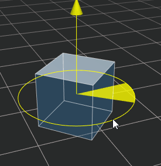
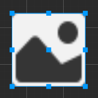

# 工具栏

**工具栏** 位于编辑器主窗口的正上方，包含了七组控制按钮或信息，用来为特定面板提供编辑功能或方便我们实施开发工作流。

## 使用变换工具布置节点

**场景编辑器** 的核心功能就是以所见即所得的方式编辑和布置场景中的可见元素，主要通过主窗口工具栏左上角的一系列 **变换工具** 将场景中的节点按我们希望的方式布置。

**变换工具** 主要包括 **移动**、**旋转**、**缩放**、**矩形变换** 和 **吸附变换**，将鼠标悬浮在任一变换工具上方时会显示相关的提示信息。

### 移动变换工具

**移动变换工具** 是打开编辑器时默认处于激活状态的变换工具，之后这个工具也可以通过点击位于主窗口左上角工具栏第一个按钮来激活，或者在编辑场景时按下快捷键 **W**，即可切换使用 **移动变换工具**。

选中任意节点，便能在 **场景编辑器** 中看到节点中心出现了由红绿蓝三个箭头和红绿蓝三个方块组成的移动控制手柄。

**控制手柄** 是指在特定编辑状态下，**场景编辑器** 中显示的可用鼠标进行交互操作的控制器。这些控制器只用来辅助编辑，不会在游戏运行时显示。

移动变换工具激活时：
- 按住红色/绿色/蓝色箭头拖拽鼠标，将分别在 X、Y、Z 轴方向上移动节点；
- 按住红色/绿色/蓝色方块拖拽鼠标，将分别在 Y-Z 平面、X-Z 平面、X-Y 平面上移动节点。

### 旋转变换工具

点击主窗口左上角工具栏第二个按钮，或在编辑场景时按下 **E** 快捷键，即可切换使用 **旋转变换工具**。

旋转变换工具的手柄由三个相互正交的红绿蓝圆环组成（2D 视图下由一个箭头和一个圆环组成）。按住红色/绿色/蓝色圆环任意一点拖拽鼠标时，节点将分别绕着 X、Y、Z 轴旋转。

当鼠标悬浮在任意圆环上时，圆环显示为黄色，点击即可选中圆环，同时还会显示一个黄色的箭头，表示当前节点是以哪个轴为中心进行旋转。拖拽圆环上任意一点即可旋转节点，放开鼠标之前，可以在控制手柄上看到旋转的角度大小。

### 缩放变换工具

点击主窗口左上角工具栏第三个按钮，或在编辑场景时按下 **R** 快捷键，即可切换使用 **缩放变换工具**。

缩放变换工具由三个头部是红绿蓝正方体的坐标轴以及中心一个灰色正方体组成。当鼠标悬浮在任一正方体上时，显示为黄色，点击即可选中并拖动：

- 按住红色/绿色/蓝色正方体拖拽鼠标，将分别在 X、Y、Z 轴方向上缩放节点；
- 按住灰色正方体拖拽鼠标，将同时在 X、Y、Z 轴方向上缩放节点。

### 矩形变换工具

点击主窗口左上角工具栏第四个按钮，或在编辑场景时按下 **T** 快捷键，即可切换使用 **矩形变换工具**。需要注意的是，矩形变换工具只适用于 UI 节点。

矩形变换工具由四个顶点控制点、四个边控制点、一个中心控制点组成。

矩形变换工具激活时：
- 拖拽控制手柄的任一顶点控制点，可以在保持对角顶点位置不变的情况下，同时修改 UI 节点的 `Position` 属性和 UITransform 组件中的 `ContentSize` 属性。
- 拖拽控制手柄的任一边控制点，可以在保持对边位置不变的情况下，修改 UI 节点的 `Position`（`X` 或 `Y` 属性）和 UITransform 组件中的 `ContentSize` 属性（`width` 或 `height` 属性）。
- 拖拽控制手柄的中心控制点，可以在 UI 节点的尺寸大小不变的情况下，同时修改 UI 节点的 `Position` 属性和 UITransform 组件中的 `AnchorPoint`（锚点）属性。

在 UI 元素的排版中，经常会需要使用 **矩形变换工具** 直接精确控制节点四条边的位置和长度。而对于必须保持原始图片宽高比的图像元素，通常不会使用矩形变换工具来调整尺寸。

### 变换吸附

变换吸附功能可用于在 **场景编辑器** 中使用移动/旋转/缩放变换工具时按照 **设定的步长** 对节点进行操作。可通过以下两种方式触发变换吸附功能：

1. 在使用变换工具的同时按住 <kdb>Ctrl</kdb> 键即可触发变换吸附功能。
2. 在变换吸附配置面板通过按钮开启对应变换工具的自动吸附功能，详情请参考下文介绍。

点击编辑器主窗口左上角工具栏中的第五个 **变换吸附配置** 按钮：

即可打开变换吸附配置面板，用于设定相应的步长，以及开启自动吸附功能：

| 按钮 | 功能说明 |
| :-- | :-- |
|   | 用于设置是否在使用 **移动变换工具** 时开启自动吸附功能。X、Y、Z 分别用于设置 X、Y、Z 轴上的移动步长，默认 X、Y、Z 统一使用 X 的值，也可以点击  按钮分别设置各个轴的步长。   |
|   | 用于设置是否在使用 **旋转变换工具** 时开启自动吸附功能。右侧的方框用于设置旋转步长，默认为 1。 |
|         | 用于设置是否在使用 **缩放变换工具** 时开启自动吸附功能。右侧的方框用于设置缩放步长，默认为 1。 |

## Gizmo 基准点设置

变换工具基准点用于设置变换工具的位置以及控制手柄的方向。

变换工具位置：

- Pivot：变换工具将显示在 2D 对象 **锚点**（`AnchorPoint`）所在位置或 3D 对象的 **世界坐标系** 中
- Center：变换工具将显示在节点的中心点位置。若同时选择多个节点，则显示在所有节点的中心位置

变换工具的控制手柄方向：

- Local：变换工具的控制手柄以节点的旋转方向为准，如下图：

  

- Global：变换工具中控制手柄的方向以世界坐标系为准，不受节点旋转的影响，如下图：

  

## 切换编辑模式

点击下图中的 3D/2D 按钮，即可将 **场景编辑器** 切换为 2D 编辑模式或 3D 编辑模式。详情请参考 [场景编辑器 - 视图介绍](../scene/index.md#%E8%A7%86%E5%9B%BE%E4%BB%8B%E7%BB%8D)。

## 运行预览游戏

该项用于预览项目的运行效果，详情请参考 [项目预览调试](../preview/index.md)。

## 手机端预览地址

这里显示运行 Cocos Creator 的桌面电脑的局域网地址，连接同一局域网的移动设备可以访问这个地址来预览和调试游戏。将鼠标悬浮在局域网地址上，会浮现一个二维码，通过扫描二维码的方式也可以访问这个地址来预览和调试游戏。

## 打开项目/编辑器目录

- **项目**：打开项目所在的文件夹
- **编辑器**：打开程序的安装路径

## Cocos 小秘书

点击工具栏最右侧的  按钮，即可打开 Cocos 小秘书面板，用户遇到任何问题，随时可以通过小秘书与官方技术人员发起交流探讨。详情可查看 [Cocos 小秘书](https://www.cocos.com/assistant)。

>**注意**：Cocos 小秘书目前仅支持中文版本，后续优化请关注版本公告。
