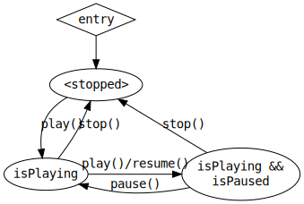

# 动画状态

动画剪辑仅描述某一类对象的动画数据，但并未绑定具体要进行动画的对象。在对象上播放动画时，对象与动画剪辑绑定，动画播放的状态称为动画状态。动画状态就像播放机一样，允许对动画进行暂停、调速等。

动画状态由 [类 `AnimationState`](__APIDOC__/zh/classes/animation.animationstate-1.html) 管理。

## 播放时间

动画状态记录了动画的 **累计播放时间**。初始时累计播放时间为 0。当动画自然播放时，时间会不断累计。例如，当动画循环播放时，刚好第二次循环完毕后，累计播放时间将为 **动画周期 * 2**。

任意时刻动画所处的播放位置称为 **进度时间**，因此进度时间总是在 `[0, 动画周期]` 范围内。

**累计播放时间** 和 **进度时间** 分别由 `AnimationState` 的 `time` 和 `current` 字段获取，但 **累计播放时间** 是可以显式设置的，**进度时间** 是 **只读** 的。

动画播放的循环模式与循环次数决定了累计播放至某一时间时动画的进度位置，不管 **累计播放时间** 因为时间的推移而增加还是因为直接设置而更改，**进度时间** 都会相应发生改变。

## 循环模式与循环次数

动画可以播放到结尾就停止，或者一直循环播放，或者也可以先播放到结尾再从结尾播放到开头如此循环，这些统称为循环模式，由枚举 [`AnimationClip.WrapMode`](__APIDOC__/zh/enums/animation.wrapmode.html) 表示：

| 循环模式 | 说明 |
| :--- | :--- |
| `AnimationClip.WrapMode.Normal`  | 从开头播放至结尾后停止。 |
| `AnimationClip.WrapMode.Loop`    | 不断地从开头播放至结尾。 |
| `AnimationClip.WrapMode.PingPong` | 从开头播放至结尾后，再从结尾反向播放至开头，如此循环往复。 |

除此之外，上表中的每种循环模式还存在对应的 **反向** 循环模式：

| 循环模式 | 说明 |
| :--- | :--- |
| `AnimationClip.WrapMode.Reverse`  | 从结尾播放至开头后停止。 |
| `AnimationClip.WrapMode.LoopReverse`    | 不断地从结尾播放至开头。 |
| `AnimationClip.WrapMode.PingPongReverse` | 从结尾播放至开头后，再从开头反向播放至结尾，如此循环往复。 |

动画状态的初始循环模式将从动画剪辑中读取。需要改变动画状态的循环模式时，简单地设置动画状态的 `wrapMode` 字段即可。

> **注意**：设置循环模式时会重置动画状态的累计播放时间。

除 `AnimationClip.WrapMode.Normal` 和其对应的 `AnimationClip.WrapMode.Reverse` 外（它们可以理解为单次循环），其余的循环模式都进行的是无限次循环，可以通过 `AnimationState` 的 `repeatCount` 字段来指定和获取循环的次数。

> **注意**：设置循环次数应该在设置循环模式后进行，因为重新设置循环模式时会重置循环次数。`AnimationClip.WrapMode.Normal` 和其对应的 `AnimationClip.WrapMode.Reverse` 会将循环次数重置为 1，其余的循环模式会将循环次数重置为 `Number.Infinity`（无限次）。

## 播放控制

动画状态提供了以下几种方法用于控制动画的播放、暂停、恢复和停止：

| 方法 | 说明 |
| :--- | :--- |
| `play()`  | 重置播放时间为 0 并开始播放动画。 |
| `pause()`    | 暂停动画。 |
| `resume()` | 从当前时间开始继续播放动画。 |
| `stop()` | 停止播放动画。 |

也可以通过以下字段查询动画的播放状态：

| 字段（只读） | 说明 |
| :--- | :--- |
| `isPlaying`  | 动画是否处于播放状态。 |
| `isPaused`    | 动画是否处于暂停状态。 |
| `isMotionless` | 动画是否处于暂停状态或者已被停止。 |

播放控制与播放状态之间的关系如下图所示：

