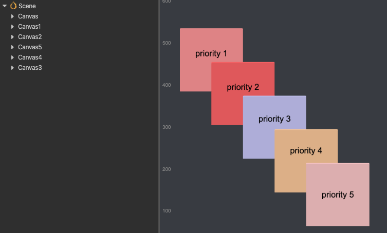
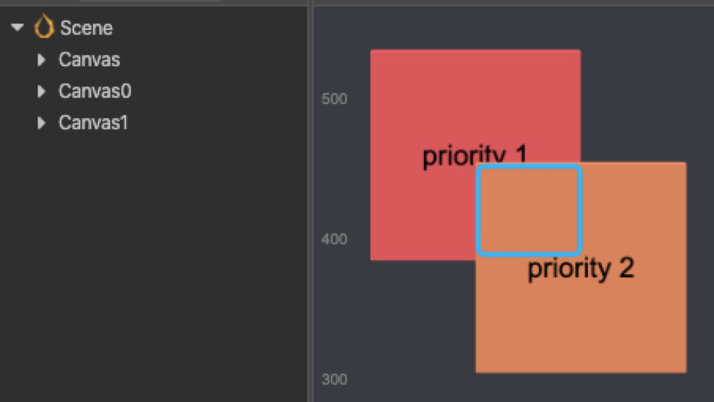

# 节点事件系统

如上一篇文档所述，`input` 对象支持了全局的 [输入事件系统](event-input.md)，而 `Node` 也实现了 `EventTarget` 的事件监听接口。在此基础上，我们提供了一些基础的节点相关的系统事件，这篇文档将介绍这些事件的使用方式。

Cocos Creator 支持的输入事件包含鼠标、触摸、键盘和重力传感四种，它们被称为 [全局输入事件](event-input.md)。本章节重点介绍与 UI 节点树相关联的鼠标和触摸事件，这些事件是被直接触发在 UI 相关节点上的，所以被称为节点事件，使用方式如下：

```ts
node.on(Node.EventType.MOUSE_DOWN, (event) => {
  console.log('Mouse down');
}, this);
```

> **注意**：我们已经不再推荐直接使用事件的名称字符串注册事件监听了。像上述例子，请不要使用 `node.on('mouse-down', callback, target)` 来注册事件监听。

节点上的触摸事件监听依赖于 `UITransform` 组件，只适用于 2D UI 节点。如果需要实现对 3D 物体的触摸检测，可以参考文档 [对 3D 物体的触摸检测](event-input.md#%E5%AF%B9%203D%20%E7%89%A9%E4%BD%93%E7%9A%84%E8%A7%A6%E6%91%B8%E6%A3%80%E6%B5%8B)

## 鼠标事件类型和事件对象

鼠标事件在桌面平台才会触发，系统提供的事件类型如下：

| 枚举对象定义                   | 事件触发的时机                             |
|:--------------------------------|:-------------------------------------|
| **Node.EventType.MOUSE_DOWN**  | 当鼠标在目标节点区域按下时触发一次。        |
| **Node.EventType.MOUSE_ENTER** | 当鼠标移入目标节点区域时，不论是否按下。     |
| **Node.EventType.MOUSE_MOVE**  | 当鼠标在目标节点区域中移动时，不论是否按下。 |
| **Node.EventType.MOUSE_LEAVE**     | 当鼠标移出目标节点区域时，不论是否按下。
| **Node.EventType.MOUSE_UP**        | 当鼠标从按下状态松开时触发一次。     |
| **Node.EventType.MOUSE_WHEEL**     | 当鼠标滚轮滚动时。                |

鼠标事件（Event.EventMouse）的重要 API 请参考 [鼠标事件 API](event-api.md#鼠标事件-API)（Event 标准事件 API 除外）。

## 触摸事件类型和事件对象

触摸事件在移动平台和桌面平台都会触发，开发者可以更好的在桌面平台调试，只需要监听触摸事件即可同时响应移动平台的触摸事件和桌面端的鼠标事件。系统提供的触摸事件类型如下：

| 枚举对象定义                    | 事件触发的时机                    |
|:--------------------------------|:---------------------------|
| **Node.EventType.TOUCH_START**  | 当手指触点落在目标节点区域内时。   |
| **Node.EventType.TOUCH_MOVE**   | 当手指在屏幕上移动时。             |
| **Node.EventType.TOUCH_END**    | 当手指在目标节点区域内离开屏幕时。 |
| **Node.EventType.TOUCH_CANCEL** | 当手指在目标节点区域外离开屏幕时。 |

触摸事件（Event.EventTouch）的重要 API 请参考 [触摸事件 API](./event-api.md#触摸事件-API)（Event 标准事件 API 除外）。

需要注意的是，触摸事件支持多点触摸，每个触点都会发送一次事件给事件监听器。

## 节点事件派发

我们在 `Node` 上支持了 `dispatchEvent` 接口，通过该接口派发的事件，会进入事件派发阶段。Cocos Creator 的事件派发系统是按照 [Web 的事件冒泡及捕获标准](https://developer.mozilla.org/zh-CN/docs/Learn/JavaScript/Building_blocks/Events#%E4%BA%8B%E4%BB%B6%E5%86%92%E6%B3%A1%E5%8F%8A%E6%8D%95%E8%8E%B7) 实现的，事件在派发之后，会经历下面三个阶段：
- **捕获**：事件从场景根节点，逐级向子节点传递，直到到达目标节点或者在某个节点的响应函数中中断事件传递
- **目标**：事件在目标节点上触发
- **冒泡**：事件由目标节点，逐级向父节点冒泡传递，直到到达根节点或者在某个节点的响应函数中中断事件传递

当我们调用 `node.dispatchEvent()` 的时候，意味着 `node` 就是上文提到的目标节点。在事件的传递过程中，我们可以通过调用 `event.propagationStopped = true` 来中断事件传递。

在 v3.0 中，我们移除了 `Event.EventCustom` 类，如果要派发自定义事件，需要先实现一个自定义的事件类，该类继承自 `Event` 类，例如：

```ts
// Event 由 cc 模块导入
import { Event } from 'cc';

class MyEvent extends Event {
    constructor(name: string, bubbles?: boolean, detail?: any) {
        super(name, bubbles);
        this.detail = detail;
    }
    public detail: any = null;  // 自定义的属性
}
```


以上图为例，这张图展示了事件在 **目标** 和 **冒泡** 阶段的传递顺序。当我们从节点 c 派发事件 `“foobar”`，倘若节点 a，b 均做了 `“foobar”` 事件的监听，则事件会经由 c 依次传递给 b，a 节点。如：

```ts
// 节点 c 的组件脚本中
this.node.dispatchEvent( new MyEvent('foobar', true, 'detail info') );
```

如果我们希望在 b 节点截获事件后就不再传递事件，我们可以通过调用 `event.propagationStopped = true` 函数来完成。具体方法如下：

```ts
// 节点 b 的组件脚本中
this.node.on('foobar', (event: MyEvent) => {
  event.propagationStopped = true;
});
```

> **注意**：在派发用户自定义事件的时候，请不要直接创建 `cc` 内的 `Event` 对象，因为它是一个抽象类。

如果希望将事件注册在捕获阶段，可以给 `on` 接口传递第四个参数，比如
```ts
// 节点 a 的组件脚本中
this.node.on('foobar', callback, target, true);
```

## 事件对象

在事件监听回调中，开发者会接收到一个 Event 类型的事件对象 event，`propagationStopped` 就是 Event 的标准 API，其它重要的 API 包含：

| API 名                 | 类型             | 意义             |
| :-------------             | :----------            |   :----------        |
| **type**           | String   | 事件的类型（事件名）。                      |
| **target**          | Node | 接收到事件的原始对象。                      |
| **currentTarget**          | Node | 接收到事件的当前对象，事件在冒泡阶段当前对象可能与原始对象不同。                      |
| **getType**      | Function   | 获取事件的类型。                      |
| **propagationStopped**   | Boolean   | 是否停止传递当前事件。                      |
| **propagationImmediateStopped**              | Boolean   | 是否立即停止当前事件的传递，事件甚至不会被分派到所连接的当前目标。                      |

## 触摸事件的传递

如上所述，注册在 `Node` 上的触摸事件，引擎内部就是通过 `dispatchEvent` 接口派发的。下面我们将介绍下触摸事件在 **目标** 和 **冒泡** 阶段的传递顺序。

### 触摸事件冒泡

触摸事件支持节点树的事件冒泡，以下图为例：


在图中的场景里，假设 A 节点拥有一个子节点 B，B 拥有一个子节点 C。开发者对 A、B、C 都监听了触摸事件（以下的举例都默认节点监听了触摸事件）。

当鼠标或手指在 C 节点区域内按下时，事件将首先在 C 节点触发，C 节点监听器接收到事件（该阶段为目标阶段）。接着 C 节点会将事件向其父节点传递这个事件，B 节点的监听器将会接收到事件。同理 B 节点会将事件传递给 A 父节点。这就是最基本的事件冒泡过程。

> **注意**：在触摸事件冒泡的过程中不会有触摸检测，这意味着即使触点不在 A B 节点区域内，A B 节点也会通过触摸事件冒泡的机制接收到这个事件。

触摸事件的冒泡过程与普通事件的冒泡过程并没有区别。所以，调用 `event.propagationStopped = true` 可以主动停止冒泡过程。

### 同级节点间的触点归属问题

假设上图中 B、C 为同级节点，C 节点部分覆盖在 B 节点之上。这时候如果 C 节点接收到触摸事件后，就宣布了触点归属于 C 节点，这意味着同级节点的 B 就不会再接收到触摸事件了，即使触点同时也在 B 节点内。同级节点间，触点归属于处于顶层的节点。

此时如果 C 节点还存在父节点，则还可以通过事件冒泡的机制传递触摸事件给父节点。

在 v3.4.0 中，我们支持了事件穿透派发的能力。在这个例子中，如果需要把事件穿透派发给 B 节点，则可以通过调用 `event.preventSwallow = false` 来阻止事件被 C 节点吞噬。

> **注意**：事件的穿透派发会降低事件派发的效率，请谨慎使用。

### 不同 Canvas 的触点归属问题

不同 Canvas 之间的触点拦截是根据优先级决定的。在下图中的场景里，节点树里的 Canvas 1-5 对应图片显示的 priority 1-5。可以看出，即使 Canvas 节点 3、4、5 之间是按乱序排的，但是根据 Canvas 上的优先级（priority）关系，触点的响应先后顺序仍然是 **Canvas5 -> Canvas4 -> Canvas3 -> Canvas2 -> Canvas1**。只有在优先级相同的情况下，Canvas 之间的排序是按节点树的先后顺序进行。



### 将触摸或鼠标事件注册在捕获阶段

有时候我们需要父节点的触摸或鼠标事件先于它的任何子节点派发，比如 **ScrollView** 组件就是这样设计的。这时候事件冒泡已经不能满足我们的需求了，需要将父节点的事件注册在捕获阶段。

要实现这个需求，可以在给 node 注册触摸或鼠标事件时，传入第四个参数 `true`，表示 `useCapture`。例如：

```ts
this.node.on(Node.EventType.TOUCH_START, this.onTouchStartCallback, this, true);
```

当节点触发 `Node.EventType.TOUCH_START` 事件时，会先将 `Node.EventType.TOUCH_START` 事件派发给所有注册在捕获阶段的父节点监听器，然后派发给节点自身的监听器，最后才到了事件冒泡阶段。

### 事件拦截

正常的事件是会按照以上说明的方式去派发。但是如果节点身上带有 `Button`、`Toggle` 或者 `BlockInputEvents` 这几个组件的话，是会停止事件冒泡。还是看下图。图中有两个按钮，Canvas0 下的 priority 1 和 Canvas1 下的 priority 2。如果点击两个按钮的交汇处，也就是图中蓝色区域，会出现按钮 priority 2 成功接收到了触点事件，而按钮 priority 1 则没有。那是因为按上述的事件接收规则，按钮 priority 2 优先接收到了触点事件，并且对事件进行了拦截（`event.propagationStopped = true`），防止事件穿透。如果是非按钮节点，也可以通过添加 `BlockInputEvents` 组件来对事件进行拦截，防止穿透。



## 触摸事件举例

以下图举例，总结下触摸事件的传递机制。图中有 A、B、C、D 四个节点，其中 A、B 为同级节点。具体层级关系如下：


1. 若触点在 A、B 的重叠区域内，此时 B 接收不到触摸事件，事件的传递顺序是 A -> C -> D
2. 若触点在 B 节点内（可见的绿色区域），则事件的传递顺序是 B -> C -> D
3. 若触点在 C 节点内，则事件的传递顺序是 C -> D
4. 若以第 2 种情况为前提，同时 C D 节点的触摸事件注册在捕获阶段，则事件的传递顺序是 D -> C -> B

## Node 的其它事件

所有的 `Node` 内置事件都可以通过 `Node.EventType` 获取事件名。

### 3D 节点事件

| 枚举对象定义               | 事件触发的时机             |
| :-------------             | :----------        |
| **TRANSFORM_CHANGED** | 当变换属性修改时，会派发一个枚举值 `TransformBit`，根据枚举值定义修改的变换。                      |

变换枚举值定义：

| 枚举值含义                | 对应的变换                 |
|:---------------------------|:-----------------------|
| **TransformBit.NONE**     | 属性无改变。                |
| **TransformBit.POSITION** | 节点位置改变。              |
| **TransformBit.ROTATION** | 节点旋转改变。              |
| **TransformBit.SCALE**    | 节点缩放改变。              |
| **TransformBit.RS**       | 节点旋转及缩放改变。        |
| **TransformBit.TRS**      | 节点平移，旋转及缩放都改变。 |

### 2D 节点事件

| 枚举对象定义       |  事件触发的时机                                      |
|:--------------------| :----------------------------------------------|
| **SIZE_CHANGED**   | 当宽高属性修改时。宽高属性位于 `UITransform` 组件上。 |
| **ANCHOR_CHANGED** | 当锚点属性修改时。锚点属性位于 `UITransform` 组件上。 |
| **COLOR_CHANGED** | 当颜色属性修改时。颜色属性位于 UI 渲染组件上。         |
| **CHILD_ADDED**   | 添加子节点时。                                        |
| **CHILD_REMOVED** | 移除子节点时。                                        |
| **PARENT_CHANGED** | 父节点改变时。                                       |
| **SIBLING_ORDER_CHANGED**   | 兄弟节点顺序改变时。                        |
| **SCENE_CHANGED_FOR_PERSISTS** | 改变常驻节点所在场景时。                  |
| **NODE_DESTROYED**   | 节点销毁时。                                       |
| **LAYER_CHANGED** | `layer` 属性改变时。                                  |
| **ACTIVE_IN_HIERARCHY_CHANGED** | `activeInHierarchy` 属性改变时。        |

## 多点触摸事件

引擎有多点触摸事件的屏蔽开关，多点触摸事件默认为开启状态。对于不需要多点触摸的项目，可以通过以下代码关闭多点触摸。

```ts
macro.ENABLE_MULTI_TOUCH = false;
```

或者也可以通过 **项目设置/Macro Config** 进行配置。

## 暂停或恢复节点系统事件

暂停节点系统事件

```ts
// 暂停当前节点上注册的所有节点系统事件，节点系统事件包含触摸和鼠标事件。
// 如果传递参数 true，那么这个 API 将暂停本节点和它的所有子节点上的节点系统事件。
// example
this.node.pauseSystemEvents();
```

恢复节点系统事件

```ts
// 恢复当前节点上注册的所有节点系统事件，节点系统事件包含触摸和鼠标事件。
// 如果传递参数 true，那么这个 API 将恢复本节点和它的所有子节点上的节点系统事件。
// example
this.node.resumeSystemEvents();
```
