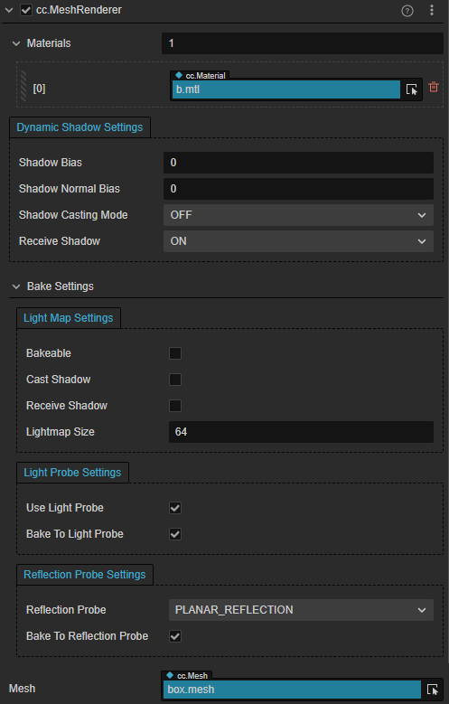

# MeshRenderer 组件参考

MeshRenderer 组件用于显示一个静态的 3D 模型。通过 `Mesh` 属性设置模型网格，通过 `Materials` 属性改变模型外观。

普通模型的组件接口请参考 [MeshRenderer API](__APIDOC__/zh/#/docs/3.3/zh/3d/Class/MeshRenderer)。

蒙皮模型的组件接口请参考 [SkinnedMeshRenderer API](__APIDOC__/zh/#/docs/3.3/zh/3d/Class/SkinnedMeshRenderer)

## MeshRenderer 属性

| 属性 | 功能 |
| :--- | --- |
| **Materials** | 用于渲染模型的材质，一个材质对应 mesh 中的一个 submesh。 |
| **LightmapSettings** | 用于烘焙 Lightmap，详情请参考 [光照贴图](../../concepts/scene/light/lightmap.md)。 |
| **ShadowCastingMode** | 指定当前模型是否会投射阴影，需要先在场景中 [开启阴影](../../concepts/scene/shadow.md#%E5%BC%80%E5%90%AF%E9%98%B4%E5%BD%B1)。 |
| **ReceiveShadow** | 指定当前模型是否会接收并显示其它物体产生的阴影效果，需要先在场景中 [开启阴影](../../concepts/scene/shadow.md#%E5%BC%80%E5%90%AF%E9%98%B4%E5%BD%B1)。该属性仅在阴影类型为 **ShadowMap** 时生效。 |
| **Mesh** | 用于渲染的 3D 模型资源。 |

## 模型分组渲染

分组渲染功能是通过相机组件的 [Visibility 属性](../../editor/components/camera-component.md#%E8%AE%BE%E7%BD%AE-visibility-%E5%B1%9E%E6%80%A7) 配合节点的 [Layer 属性](../../concepts/scene/node-component.md#%E8%AE%BE%E7%BD%AE%E8%8A%82%E7%82%B9%E7%9A%84-layer-%E5%B1%9E%E6%80%A7) 共同决定。用户可通过代码设置 Visibility 的值来完成分组渲染。所有节点默认都属于 DEFAULT 层，在所有相机都可见。

## 静态合批

目前静态合批方案为运行时静态合批，通过调用 `BatchingUtility.batchStaticModel` 可进行静态合批。 
该函数接收一个节点，然后将该节点下的所有 `MeshRenderer` 里的 `Mesh` 合并成一个，并将其挂到另一个节点下。 
在合批后，将无法改变原有的 `MeshRenderer` 的 transform，但可以改变合批后的根节点的 transform。只有满足以下条件的节点才能进行静态合批：
- 子节点中只能包含 `MeshRenderer`；
- 子节点下的 `MeshRenderer` 的 `Mesh` 的顶点数据结构必须一致；
- 子节点下的 `MeshRenderer` 的材质必须相同。

## 关于动态合批

引擎目前提供两套动态合批系统，instancing 合批和合并 VB 方式的合批，两种方式不能共存，instancing 优先级大于合并 VB。 
要开启合批，只需在模型所使用的材质中对应勾选 `USE_INSTANCING` 或 `USE_BATCHING` 开关即可。

> **注意**：合批能够正常参与 frustum culling 流程，但对透明模型无法执行排序，会导致混合效果不正确。引擎没有明确禁止对透明物体的合批，开发者可以自行掌握其中权衡。

### Instancing 合批

通过 Instancing 的合批适用于绘制大量顶点数据完全相同的动态模型，启用后绘制时会根据材质和顶点数据分组，每组内组织 instanced attributes 信息，然后一次性完成绘制。

关于蒙皮模型的支持及相关设定，参考 [骨骼动画组件](../animation/skeletal-animation.md#关于动态-Instancing)。

另外 instancing 还支持自定义额外的 instanced attributes，可以传递更多不同 instance 之间的差异性数据（比如不同人物间给一个漫反射颜色的外观差异，或大片草地中的风力影响）。 
这需要自定义 effect 的支持，更详细的说明可以参考 [语法指南](../../material-system/effect-syntax.md#自定义-Instanced-属性)。

### 合并 VB 合批

合并 VB 合批适用于绘制大量低面数且顶点数据各不相同的非蒙皮动态模型，启用后绘制时会根据材质分组，然后每组内每帧合并顶点和世界变换信息，然后分批完成绘制[1](#f1)。

每帧合并顶点等操作会引入一部分 CPU 开销，在 JS 中尤其昂贵；另外需要提醒 drawcall 数量并不是越少越好[2](#f2)，最佳性能往往是 CPU 与 GPU 负载均衡的结果，所以在尝试使用合批功能时，请一定多做测试，明确性能瓶颈，做有针对性的优化。

## 合批的最佳实践

通常来说合批系统的使用优先级为：静态合批 > instancing 合批 > 合并 VB 合批。 
首先要确保材质统一，在这个前提下，如果确定某些模型在游戏周期内完全静止不会变化，就可以使用静态合批。 
如果存在大量相同的模型重复绘制，相互间只有相对可控的小差异，就可以使用 instancing 合批。 
如果存在大量面数很低但顶点数据又各不相同的模型，可以考虑尝试合并 VB 合批。 

<b id="f1">[1]</b> 注意目前使用 uniform 上传合批后的世界变换矩阵，考虑到 WebGL 标准的 uniform 数量限制，目前一批最多绘制 10 个模型，所以对大量同材质的模型，开启合批后 drawcall 数量预期最多会减少 10 倍。 [↩](#a1) 
<b id="f2">[2]</b> 关于合批与性能的话题业界一直有不少探讨，比如可以参考 [这里](https://www.nvidia.com/docs/IO/8228/BatchBatchBatch.pdf) 的 slide [↩](#a2) 
