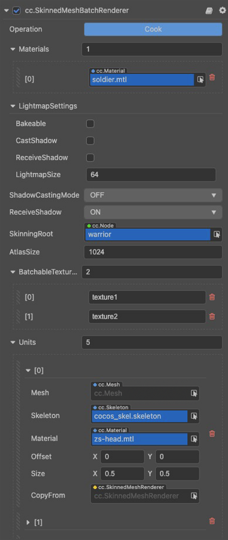

# SkinnedMeshBatchRenderer 组件参考

SkinnedMeshBatchRenderer 就是批量蒙皮网格渲染组件，用于将同一个骨骼动画组件控制的所有子蒙皮模型合并渲染。

## SkinnedMeshBatchRenderer 属性

| 属性 | 功能 |
| :--- | :--- |
| **Operation** | 任何修改不会立即生效，需要点 Cook 重新计算并应用。合批后使用的 “母材质”需要使用自己定制的合批版 effect |
| **Materials** | 网格资源允许使用多个材质资源，所有材质资源都存在 `materials` 数组中。 如果网格资源中有多个子网格，那么 Mesh Renderer 会从 `materials` 数组中获取对应的材质来渲染此子网格。 |
| **LightmapSettings** | 用于烘焙 Lightmap，详情请参考 [光照贴图](../../concepts/scene/light/lightmap.md)。 |
| **ShadowCastingMode** | 指定当前模型是否会投射阴影，需要先在场景中 [开启阴影](../../concepts/scene/light/shadow.md#%E5%BC%80%E5%90%AF%E9%98%B4%E5%BD%B1)。 |
| **ReceiveShadow** | 指定当前模型是否会接收并显示其它物体产生的阴影效果，需要先在场景中 [开启阴影](../../concepts/scene/light/shadow.md#%E5%BC%80%E5%90%AF%E9%98%B4%E5%BD%B1)。该属性仅在阴影类型为 **ShadowMap** 时生效。 |
| **SkinningRoot** |骨骼蒙皮的根节点，一般为 SkeletalAnimation 组件所在节点  |
| **AtlasSize**| 合图生成的最终图集的边长 |
| **BatchableTextureNames**| 材质中真正参与合图的贴图属性，不参与的属性统一使用第一个 unit 的贴图 |
| **Units**| 合批前的子蒙皮模型数据，是主要的是数据来源 |
| **Mesh** | 指定渲染所用的网格资源，网格渲染器组件中 [网格资源](./model-component.md#%E7%BD%91%E6%A0%BC%E8%B5%84%E6%BA%90) 部分的内容。 |
| **Skeleton** |当前模型的骨骼数据，一般直接来自 glTF 或 FBX 模型文件|
| **Materials** | 当前子模型使用的 “子材质”，使用的是非合批版的普通 effect，不同子模型使用的 effect 应保持一致 |
| **Offset** |当前子模型合图时的偏移，以图集左上角为原点，范围 [0,1]之间。比如图中数据代表子贴图与图集的左上角是重合的|
| **Size** |当前子模型合图时所占的尺寸，范围 [0,1]之间。比如图中数据代表子贴图占整个图集的 1/2|
| **CopyFrom** | 可以通过拖入 SkinningModelComponent 自动复制目标属性（除 offset 和 size），方便操作 |

批量蒙皮网格渲染器组件相关接口请参考 [SkinnedMeshBatchRenderer API](__APIDOC__/zh/#/docs/3.4/zh/3d/Class/SkinnedMeshBatchRenderer)。

具体合批相关内容，请参考文档 [骨骼动画](../../animation/skeletal-animation.md)
