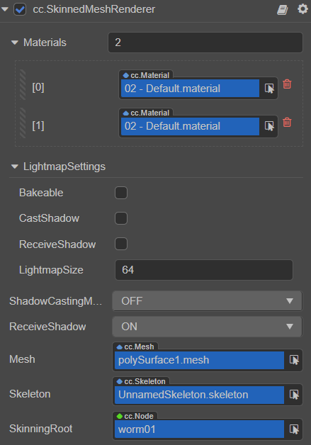

# SkinnedMeshRenderer 组件参考

SkinnedMeshRenderer 是一个蒙皮网格渲染器组件，主要用于 **渲染骨骼动画**。

当开发者在导入骨骼动画资源时，如果获取的网格拥有蒙皮信息，SkinnedMeshRenderer 组件将会自动添加到导入的网格当中。

## SkinnedMeshRenderer 属性

| 属性 | 功能 |
| :--- | :--- |
| **Materials** | 网格资源允许使用多个材质资源，所有材质资源都存在 `materials` 数组中。 如果网格资源中有多个子网格，那么 Mesh Renderer 会从 `materials` 数组中获取对应的材质来渲染此子网格。 |
| **LightmapSettings** | 用于烘焙 Lightmap，详情请参考 [光照贴图](../../concepts/scene/light/lightmap.md)。 |
| **ShadowCastingMode** | 指定当前模型是否会投射阴影，需要先在场景中 [开启阴影](../../concepts/scene/light/shadow.md#%E5%BC%80%E5%90%AF%E9%98%B4%E5%BD%B1)。 |
| **ReceiveShadow** | 指定当前模型是否会接收并显示其它物体产生的阴影效果，需要先在场景中 [开启阴影](../../concepts/scene/light/shadow.md#%E5%BC%80%E5%90%AF%E9%98%B4%E5%BD%B1)。该属性仅在阴影类型为 **ShadowMap** 时生效。 |
| **Mesh** | 指定渲染所用的网格资源，网格渲染器组件中 [网格资源](./model-component.md#%E7%BD%91%E6%A0%BC%E8%B5%84%E6%BA%90) 部分的内容。 |
| **Skeleton** |当前模型的骨骼数据，一般直接来自 glTF 或 FBX 模型文件|
| **SkinningRoot** |骨骼蒙皮的根节点，一般为 SkeletalAnimation 组件所在节点  |

蒙皮网格渲染器组件相关接口请参考 [SkinnedMeshRenderer API](__APIDOC__/zh/#/docs/3.4/zh/3d/Class/SkinnedMeshRenderer)。

SkinnedMeshRenderer 与普通的网格渲染组件 MeshRenderer 的区别在于：MeshRenderer 组件渲染的是静态模型，由 3D 模型数据组成，而 SkinnedMeshRenderer 组件不但渲染模型还会渲染骨骼动画，因此除了 3D 模型数据外还有骨骼数据以及顶点权重等数据。

如果 SkinnedMeshRenderer 上没有放置任何骨骼数据，那么它和普通的 MeshRenderer 组件没有什么区别。
