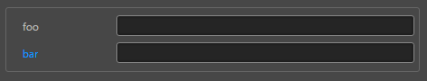

# ui-container 参考
方框容器，搭配其他组件一起使用
## 基础用法

```html
<ui-box-container>
    <!-- 一些标签元素 -->
    <ui-prop name="foo" type="string">
        <ui-input></ui-input>
    </ui-prop>
    <ui-prop name="bar" type="string">
        <ui-input></ui-input>
    </ui-prop>
    <!-- ............. -->
</ui-box-container>
```

## 样式控制
种类              | 参数值类型 | 功能说明
----------------|-----------|-------------
[shadow](#shadow)      | `class` 样式名，string，支持值"**shadow**" | 带内阴影容器

## 使用效果示例

### shadow
```html
<ui-box-container class="shadow">
    <!-- 一些标签元素 -->
    <ui-prop name="foo" type="string">
        <ui-input></ui-input>
    </ui-prop>
    <ui-prop name="bar" type="string">
        <ui-input></ui-input>
    </ui-prop>
    <!-- ............. -->
</ui-box-container>
```
