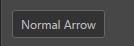
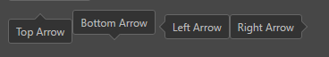
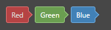
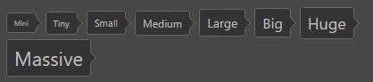
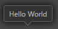
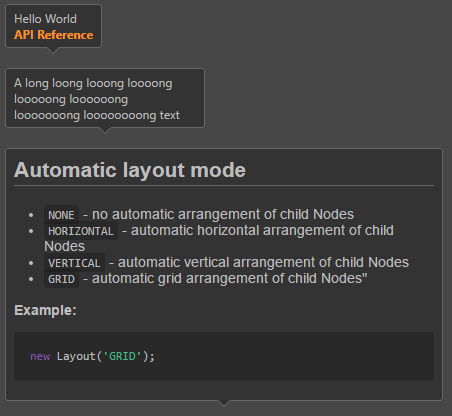

# ui-hint 参考

## 基础用法

```html
<ui-hint>Normal</ui-hint>
```


## 属性
属性名  | 参数值类型 | 功能说明
------|--------------|-------------  
[`position`](#`position`-控制箭头偏移量)| percentage/pixel values，百分值或像素值 | 控制箭头距离`上/左`的偏移量，支持负值

## 样式控制
种类              | 参数值类型 | 功能说明
----------------|-----------|-------------
[direction](#direction-控制箭头方向)      | `class` 样式名，string，支持值"**top, bottom, left, right**" | 控制箭头指向，未指定时不显示箭头
[color](#color-控制组件颜色)      | `class` 样式名，string，支持值"**red, blue, green**" | 控制组件颜色
[size](#size-控制大小)      | `class` 样式名，string，支持值"**mini, tiny, small, medium, large, big, huge, massive**" | 控制组件整体大小
[shadow](#shadow)      | `class` 样式名，string，支持值"**shadow**" | 带阴影版组件

## 使用效果示例

### `position` 控制箭头偏移量
```html
<div class="group">
    <ui-hint class="bottom" position="50%">Position = 20%</ui-hint>
    <ui-hint class="top" position="-20px">Position = -20px</ui-hint>
    <ui-hint class="left" position="30%">Hello World <br> Position = 30%</ui-hint>
    <ui-hint class="right" position="-15px">Hello World <br> Position = -15px</ui-hint>
</div>
```


### direction 控制箭头方向
```html
<div class="group">
    <ui-hint class="top">Top Arrow</ui-hint>
    <ui-hint class="bottom">Bottom Arrow</ui-hint>
    <ui-hint class="left">Left Arrow</ui-hint>
    <ui-hint class="right">Right Arrow</ui-hint>
</div>
```


### `color` 控制组件颜色
```html
<ui-hint class="red">Red</ui-hint>
<ui-hint class="green">Green</ui-hint>
<ui-hint class="blue">Blue</ui-hint>
```


### size 控制大小
```html
<ui-hint class="mini">Mini</ui-hint>
<ui-hint class="tiny">Tny</ui-hint>
 ····
```


### shadow
```html
<ui-hint class="shadow">Hello World</ui-hint>
```


### 搭配其他元素的混合效果
