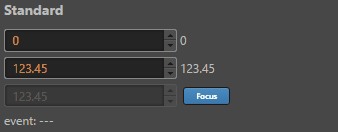

# ui-num-input 参考

## 基础用法

```html
<ui-num-input placeholder="Search..."></ui-num-input>
```



## 属性

属性名  | 参数值类型 | 功能说明
------|--------------|-------------  
`value`| number，超过最大值则值更改为最大值，小于最小值则值更改为最小值| 输入框中的内容值
[`focused`](#`focused,-disabled`-控制状态)| boolean | 控制 `focused` 状态
[`disabled`](#`focused,-disabled`-控制状态)| boolean | 控制 `disabled` 状态，设置此属性后不再响应事件
`readonly`| boolean | 控制 `readonly` 状态，设置此属性后不再响应事件
[`max`](#max)| number，默认为 infinite| 限制允许输入的最大值
[`min`](#min)| number，默认为 -infinite| 限制允许输入的最小值
[`step`](#step)| number，默认为 1| 递增的步长
[`precision`](#min)| number，默认为 20| 保留的小数点位数
`unnavigable`| boolean | 控制是否可导航，组件默认可以通过 tab 键获取焦点，设置此属性后无法通过 tab 获取焦点，并且鼠标获取焦点后不会有 focus 样式
`placeholder`| string | 组件不存在 `value` 值时显示的内容

## 样式控制

种类              | 参数值类型 | 功能说明
----------------|-----------|-------------
[size](#size-控制大小)      | `class` 样式名，string，支持值："**mini, tiny, small, medium, large, big, huge, massive**" | 控制组件整体大小，包括内部字体

## event 事件

事件名称|是否冒泡|触发机制
-------|-------|--------
`change` |是|组件进行输入改变值时或因触发 `cancel` 改值
`confirm` |是|发生 `change` 改值后，失去焦点或键入 **enter**
`cancel` |是|发生 `change` 改值后，键入 **esc**（将恢复原值）

## 使用效果示例

### `focused, disabled` 控制状态

```html
<ui-num-input placeholder="Normal..."></ui-num-input>
<ui-num-input placeholder="Focused..." focused></ui-num-input>
<ui-num-input placeholder="Disabled..." disabled></ui-num-input>
```


### size 控制大小

```html
<ui-num-input class="mini"></ui-num-input>
<ui-num-input class="tiny"></ui-num-input>
 ····
```


