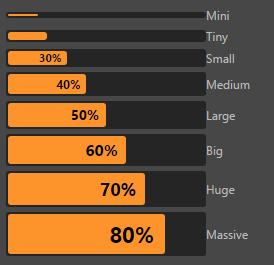

# ui-progress 参考

## 基础用法

```html
<ui-progress value="50"></ui-progress>
```

## 属性
属性名  | 参数值类型 | 功能说明
------|--------------|-------------  
`value`| number, 0 ~ 100| 当前进度条值

## 样式控制
种类              | 参数值类型 | 功能说明
----------------|-----------|-------------
[size](#size-控制大小)      | `class` 样式名，string，支持值"**mini, tiny, small, medium, large, big, huge, massive**" | 控制组件整体大小，包括内部字体

## 使用效果示例

### size 控制大小
```html
<ui-progress value="10" class="mini">Mini</ui-progress> Mini
<ui-progress value="20" class="tiny">Tiny</ui-progress> Tiny
<ui-progress value="30" class="small">Small</ui-progress> Small
<ui-progress value="40" class="medium">Medium</ui-progress> Medium
<ui-progress value="50" class="large">Large</ui-progress> Large
<ui-progress value="60" class="big">Big</ui-progress> Big
<ui-progress value="70" class="huge">Huge</ui-progress> Huge
<ui-progress value="80" class="massive">Massive</ui-progress> Massive
```
