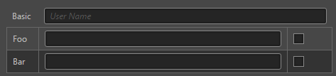
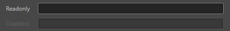
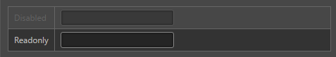

# ui-prop-table 参考

## 基础用法

```html
<ui-prop-table>
    <!-- 内部需使用 template 包裹 -->
    <template>
        <!-- ui-row 包裹单个组件时为两栏效果 -->
        <ui-row name="Basic">
            <ui-input  class="fill" value="Foobar" placeholder="User Name"></ui-input>
        </ui-row>
    </template>
</ui-prop-table>

<ui-prop-table class="debug">
    <template>
      <!-- ui-row 包裹多个组件时为多栏效果 -->
        <ui-row name="Foo">
            <ui-input class="fill"></ui-input>
            <ui-checkbox></ui-checkbox>
        </ui-row>
        <ui-row name="Bar">
            <ui-input class="fill"></ui-input>
            <ui-checkbox></ui-checkbox>
        </ui-row>
    </template>
  </ui-prop-table>
```


## 属性
> **以下属性均设置在 `ui-row` 上**

属性名  | 参数值类型 | 功能说明
------|--------------|-------------  
`value`| string | 输入框中的内容值
[`disabled`](#`disabled`、`readonly`)| boolean | 控制 `disabled` 状态，设置此属性后不再响应事件
[`readonly`](#`disabled`、`readonly`)| boolean | 控制 `readonly` 状态，设置此属性后不再响应事件
[`tooltip`](#tooltip)| string | 设置提示信息内容，鼠标上移至 label 显示

## 样式控制
种类              | 参数值类型 | 功能说明
----------------|-----------|-------------
[debug](#debug-控制表格边框)      | `class` 样式名，string，支持值"**debug**" | 设置是否显示表格边框

## event 事件
事件名称|是否冒泡|触发机制
-------|-------|--------
`change` |是|内部生成子组件触发 `change` 事件
`confirm` |是|内部生成子组件触发 `confirm` 事件
`cancel` |是|内部生成子组件触发 `cancel` 事件
>可以通过事件函数中的 event 对象，调用 `event.detail._path` 取到配置的 `path` 属性，调用 `event.detail._value` 获取当前触发事件组件的 `value` 值。

## 使用效果示例

### `disabled`、`readonly`
```html
<ui-prop-table>
    <template>
        <ui-row name="Disabled" disabled>
            <ui-input class="fill" value="Disabled"></ui-input>
        </ui-row>
        <ui-row name="Readonly" readonly>
            <ui-input class="fill" value="Readonly"></ui-input>
        </ui-row>
    </template>
</ui-prop-table>
```


### debug 控制表格边框
```html
<ui-prop-table class="debug">
    <template>
        <ui-row name="Disabled" disabled>
            <ui-input value="Disabled"></ui-input>
        </ui-row>
        <ui-row name="Readonly" readonly>
            <ui-input value="Readonly"></ui-input>
        </ui-row>
    </template>
</ui-prop-table>
```
