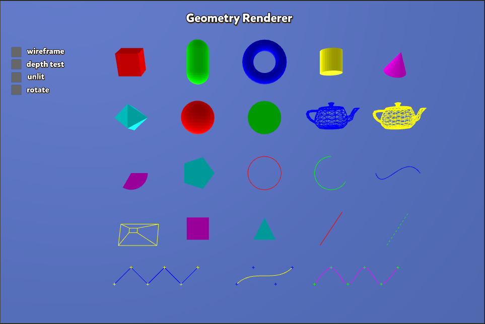
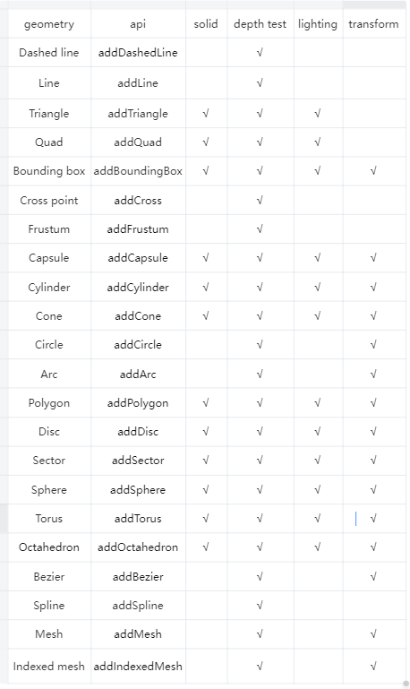

# 几何渲染器（Geometry-Renderer）

几何渲染器是引擎提供的一种批量渲染各种几何体的功能接口，主要用于调试（比如显示物体的包围盒）及 Cocos Creator 的 gizmo 批量显示。

几何渲染器的效果展示如图：

  

几何渲染器的功能特性如图：

  

   其中：
- solid：是否支持实心模式，如果不支持则显示线框模式
- depth test：是否支持深度测试，如果支持则被遮挡部分半透明显示，未被遮挡部分不透明显示，如果不支持则全部不透明显示
- lighting：是否支持简单光照，如果不支持就使用无光模式
- transform：是否支持变换，如果支持，开发者可传入一个变换矩阵，变换矩阵会作用到几何体的顶点上，方便显示任意坐标空间的几何体

## 接口描述

  几何渲染器位于 [geometry-render.ts](https://github.com/cocos/cocos-engine/blob/v3.6.0/cocos/core/pipeline/geometry-renderer.ts) 和原生 [GeometryRenderer.h](https://github.com/cocos/cocos-engine/blob/v3.6.0/native/cocos/renderer/pipeline/GeometryRenderer.h) 内，开发者可根据需求查看。其支持的几何体描述如下：

### 支持的几何体类型

| 类型 | 接口 |
|:--|:--|
| 虚线 | addDashedLine |
| 线段 | addLine |
| 三角形 | addTriangle |
| 四边形 | addQuad |
| 轴对齐包围盒 | addBoundingBox |
| 交叉点 | addCross |
| 视锥 | addFrustum |
| 胶囊体 | addCapsule |
| 圆柱 | addCylinder |
| 圆锥 | addCone |
| 圆形 | addCircle |
| 弧形 | addArc |
| 任意多边形 | addPolygon |
| 圆盘 | addDisc |
| 扇形 | addSector |
| 球体 | addSphere |
| 环面 | addTorus |
| 八面体 | addOctahedron |
| 贝塞尔曲线 | addBezier |
| 样条曲线，包含三种模式：折线段，多段贝塞尔曲线，Catmull-Rom 曲线 | addSpline |
| 网格线框 | addMesh |
| 基于索引的网格线框 | addIndexedMesh |

### 使用方式

由于每帧渲染完这些几何体后会清空顶点缓存，所以需要在 update 等函数中，每帧往 geometry renderer 对象（位于 camera 中）添加几何体，除此之外不需要额外的操作，示例 TS 代码如下：

```ts
let renderer = this.mainCamera.geometryRenderer;
renderer.addBoundingBox(box, color, wireframe, depthTest, unlit, useTransform, transform);
```
