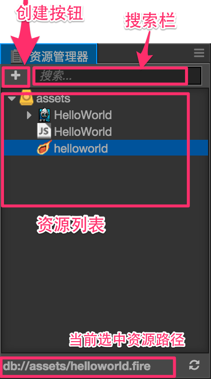
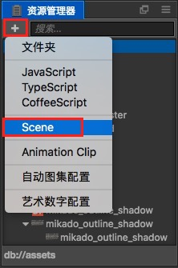
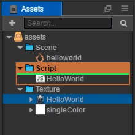

# 资源管理器（Assets）

**资源管理器** 是我们用来访问和管理项目资源的工作区域。在开始制作游戏时，添加资源到这里通常是必须的步骤。您可以使用 **HelloWorld** 模板新建一个项目，就可以看到 **资源管理器** 中包含了一些基本资源类型。

## 界面介绍

**资源管理器** 将项目资源文件夹中的内容以树状结构展示出来，注意只有放在项目文件夹的 `assets` 目录下的资源才会显示在这里。关于项目文件夹结构说明请阅读 [项目结构](../../project-structure.md) 一节。下面我们介绍各个界面元素：

- 左上角的  按钮是创建按钮，用来创建新资源。
- 右上的文本输入框可以用来搜索过滤文件名包含特定文本的资源。
- 右上角的 **搜索按钮** 用来选择搜索的资源类型。
- 面板主体是资源文件夹的资源列表，可以在这里用右键菜单或拖拽操作对资源进行增删修改。
- 文件夹前面的小三角  用来切换文件夹的展开/折叠状态。当用户按住 Alt/Option 的同时点击该按钮，除了执行这个文件夹自身的展开/折叠操作之外，还会同时展开/折叠该文件夹下的所有子节点。

## 资源列表

资源列表中可以包括任意文件夹结构，文件夹在 **资源管理器** 中会以  图标显示，点击图标左边的箭头就可以展开/折叠该文件夹中的内容。

除了文件夹之外列表中显示的都是资源文件，资源列表中的文件会隐藏扩展名，而以图标指示文件或资源的类型，比如 **HelloWorld** 模板创建出的项目中包括了三种核心资源：

- **图片资源**：目前包括 `jpg`、`png` 等图像文件，图标会显示为图片的缩略图。
-  **脚本资源**：程序员编写的 JavaScript 脚本文件，以 `js` 为文件扩展名。我们通过编辑这些脚本为添加组件功能和游戏逻辑。
-  **场景资源**：双击可以打开的场景文件，打开了场景文件我们才能继续进行内容创作和生产。

更多常见资源类型和资源工作流程，请阅读 [资源工作流程](../../../asset-workflow/index.md)一章。

### 创建资源

目前可以在 **资源管理器** 中创建的资源有以下几类：

- 文件夹
- 脚本文件
- 场景
- 动画剪辑
- 自动图集配置
- 艺术数字配置

点击左上角的 **创建按钮**，就会弹出包括上述资源列表的创建资源菜单。点击其中的项目就会在当前选中的位置新建相应资源。

### 选择资源

在资源列表中可以使用以下的资源选择操作：

- 点击来选中单个资源
- 按住 <kbd>Ctrl</kbd> 或 <kbd>Cmd</kbd> 点击，可以将更多资源加入选择中
- 按住 <kbd>Shift</kbd> 点击，可以连续选中多个资源

对于选中的资源，可以执行移动、删除等操作。

### 移动资源

选中资源后（可多选），按住鼠标拖拽可以将资源移动到其他位置。将资源拖拽到文件夹上时，会看到鼠标悬停的文件夹以橙色高亮显示。这时松开鼠标，就会将资源移动到高亮显示的文件夹下。

### 删除资源

对于已经选中的资源，可以执行以下操作进行删除：

- 右键点击，并选择弹出菜单中的 `删除`
- 选中资源后直接按 <kbd>Delete</kbd>（Windows）或 <kbd>Cmd + Backspace</kbd>（Mac）

由于删除资源是不可撤销的操作，所以会弹出对话框要求用户确认。确定后资源就会被删除，无法从回收站（Windows）或废纸篓（Mac）找回！请一定要谨慎使用，做好版本管理或手动备份。

### 其他操作

**资源管理器** 的右键菜单里还包括以下操作：

- `新建`：和 **创建按钮** 功能相同，会将资源添加到当前选中的文件夹下，如果当前选中的是资源文件，会将新增资源添加到和当前选中资源所在文件夹中。
- `复制`/`粘贴`：将选中的资源复制粘贴到该文件夹下或者另外的文件夹下。
- `重命名`：对资源进行重命名。
- `查找资源`：查找用到了该资源的文件，并在搜索框中过滤显示。
- `在资源管理器（Windows）或 Finder（Mac）中显示`：在操作系统的文件管理器窗口中打开该资源所在的文件夹。
- `打开 Library 中的资源`：打开所选中的资源被 Creator 导入后生成的数据。
- `前往 Library 中的资源位置`：打开项目文件夹的 `Library` 中导入资源的位置，详情请阅读 [项目结构](../../project-structure.md) 一节。
- `显示资源 UUID 和路径`：在 **控制台** 窗口显示当前选中资源的 UUID。

另外对于特定资源类型，双击资源可以进入该资源的编辑状态，如场景资源和脚本资源。

## 过滤资源

在 **资源管理器** 右上的搜索框中输入文本，可以过滤出文件名包括输入文本的所有资源。也可以输入 `*.png` 这样的文件扩展名，会列出所有特定扩展名的资源。

