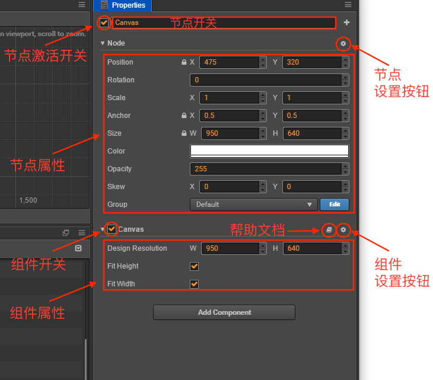
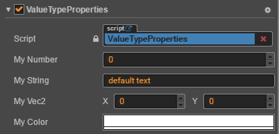
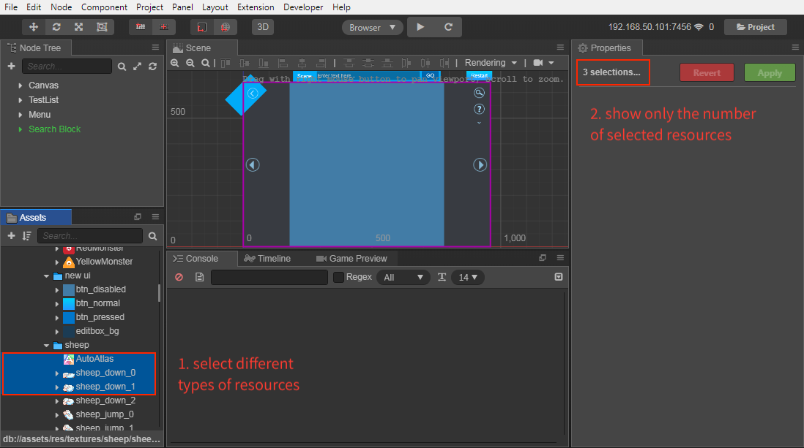

# 属性检查器（Properties）

**属性检查器** 是我们查看并编辑当前选中节点、节点组件和资源的工作区域。在 **场景编辑器**、**层级管理器** 中选中节点或者在 **资源管理器** 中选中资源，就会在 **属性检查器** 中显示它们的属性，可供查询和编辑。

## 节点名称和激活开关

左上角的复选框表示节点的激活状态，使用节点处于非激活状态时，节点上所有图像渲染相关的组件都会被关闭，整个节点包括子节点就会被有效的隐藏。

节点激活开关右边显示的是节点的名称，和 **层级管理器** 中的节点显示名称一致。

## 节点属性

**属性检查器** 接下来会显示节点的属性，节点的属性排列在 `Node` 标题的下面，点击 `Node` 可以将节点的属性折叠或展开。`Node` 标题右侧有一个节点设置按钮，可以重置节点属性或者重置节点属性和 所有组件属性的修改，或者粘贴复制的组件。

节点的属性除了位置（Position）、旋转（Rotation）、缩放（Scale）、尺寸（Size）等变换属性以外，还包括锚点（Anchor）、颜色（Color）、不透明度（Opacity）等。修改节点的属性通常可以立刻在场景编辑器中看到节点的外观或位置变化。 
如果需要批量修改节点属性，可在 **层级管理器** 中按 Shift 键选中多个节点，然后在 **属性检查器** 中批量设置。节点属性的批量设置与资源类似，具体可参考本文档下方的资源多选批量设置部分。

更多关于节点属性编辑的细节，请阅读 [坐标系和变换](../../../content-workflow/transform.md) 一节。

## 组件属性

节点属性下面，会列出节点上挂载的所有组件和组件的属性。和节点属性一样，点击组件的名称就会切换该组件属性的折叠/展开状态。在节点上挂载了很多组件的情况下，可以通过折叠不常修改的组件属性来获得更大的工作区域。组件名称的右侧有帮助文档和组件设置的按钮。帮助文档按钮可以跳转到该组件相关的文档介绍页面，组件设置按钮可以对组件执行移除、重置、上移、下移、复制、粘贴等功能。

用户通过脚本创建的组件，其属性是由脚本声明的。不同类型的属性在 **属性检查器** 中有不同的控件外观和编辑方式。我们将在 [声明属性](../../../scripting/class.md#properties) 一节中详细介绍属性的定义方法。

## 编辑属性

**属性** 是组件脚本中声明的公开并可被序列化存储在场景和动画数据中的变量。通过 **属性检查器** 我们可以快捷的修改属性设置，达到不需要编程就可以调整游戏数据和玩法的目的。

通常可以根据变量使用内存位置不同将属性分为 **值类型** 和 **引用类型** 两大类。

### 值类型属性

**值类型** 包括数字、字符串、枚举等简单的占用很少内存的变量类型：

- `数值（Number）`：可以直接使用键盘输入，也可以按输入框旁边的上下箭头逐步增减属性值。
- `向量（Vec2）`：向量的控件是两个数值输入组合在一起，并且输入框上会以 `x` 和 `y` 标识每个数值对应的子属性名。
- `字符串（String）`：直接在文本框里用键盘输入字符串，字符串输入控件分为单行和多行两种，多行文本框可以按回车换行。
- `布尔（Boolean）`：以复选框的形式来编辑，选中状态表示属性值为 `true`，非选中状态表示 `false`。
- `枚举（Enum）`：以下拉菜单的形式编辑，点击枚举菜单，然后从弹出的菜单列表里选择一项，即可完成枚举值的修改。
- `颜色（Color）`：点击颜色属性预览框，会弹出 **颜色选择器** 窗口，在这个窗口里可以用鼠标直接点选需要的颜色，或在下面的 RGBA 颜色输入框中直接输入指定的颜色。点击 **颜色选择器** 窗口以外的任何位置会关闭窗口并以最后选定的颜色作为属性颜色。

### 引用类型属性

**引用类型** 包括更复杂的对象，比如节点、组件或资源。和值类型各式各样的编辑方式不同，引用类型通常只有一种编辑方式：**拖拽节点或资源到属性栏中**。

引用类型的属性在初始化后会显示 `None`，因为无法通过脚本为引用类型的属性设置初始值。这时可以根据属性的类型将相应类型的节点或资源拖拽上去，即可完成引用赋值。

需要拖拽节点来赋值的属性栏上会显示白色的标签，标签上可能会显示 `Node`，表示任意节点都可以拖拽上去，或者标签显示组件名如 `Sprite`、`Animation` 等，这时需要拖拽挂载了相应组件的节点才行。

需要拖拽资源赋值的属性栏上会显示蓝色的标签，标签上显示的是资源的类型，如 `sprite-frame`、`prefab`、`font` 等。只要从 **资源管理器** 中拖拽相应类型的资源过来就可以完成赋值。

值得注意的是，脚本文件也是一种资源，所以上图中最上面表示组件使用的脚本资源引用属性也是用蓝色标签表示的。

## 资源多选批量设置

在 **资源管理器** 中选中资源，即可在 **属性检查器** 中显示资源的属性以便查询和编辑。各个资源的具体参数说明可参考 [常见资源工作流程](../../../asset-workflow/index.md#%E5%B8%B8%E8%A7%81%E8%B5%84%E6%BA%90%E5%B7%A5%E4%BD%9C%E6%B5%81%E7%A8%8B)。

当需要批量设置 **同类型** 资源属性时，可在 **资源管理器** 中按 Shift 键选中多个资源，**属性检查器** 中便会显示选中的资源数量以及可编辑的资源属性。设置完成后点击右上方的 **应用** 按钮即可。

如果 **属性检查器** 中的属性显示以下几种状态，表示该属性在选中的多个资源中的属性值不一致，可根据需要选择是否继续批量修改该属性。

- 勾选框显示 **灰色**
- 输入框显示 **-**
- 选择框显示 **空白**

> **注意**：
>
> 1. 目前 Material 资源以及 Texture 中的压缩纹理不支持批量设置操作。
> 2. **不同类型** 的资源可同时选中，但是不支持批量设置属性，**属性检查器** 中只会显示当前同时选中了几个资源。
>
>     
