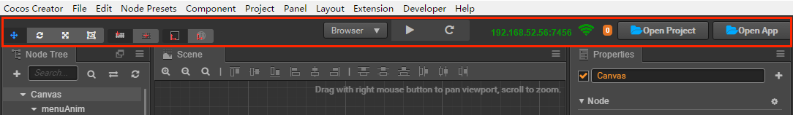

# 工具栏

**工具栏** 位于编辑器主窗口的正上方，包含了五组控制按钮或信息，用来为特定面板提供编辑功能或方便我们实施工作流。

### 选择变换工具

为 **场景编辑器** 提供编辑节点变换属性（移动、旋转、缩放、尺寸）的功能，详情请阅读 [使用变换工具布置节点](editor-panels/scene.md#%E4%BD%BF%E7%94%A8%E5%8F%98%E6%8D%A2%E5%B7%A5%E5%85%B7%E5%B8%83%E7%BD%AE%E8%8A%82%E7%82%B9)。

### 变换工具显示模式

使用以下两组按钮控制 **场景编辑器** 中 **变换工具** 的显示模式。

位置模式：

- 锚点：变换工具将显示在节点 **锚点（Anchor）** 所在位置。
- 中心点：变换工具将显示在节点中心点所在位置（受约束框大小影响）。

旋转模式：

- 本地：变换工具的旋转（手柄方向）将和节点的 **旋转（Rotation）** 属性保持一致。
- 世界：变换工具的旋转（手柄方向）保持不变，x 轴手柄、y 轴手柄和世界坐标系方向保持一致。

### 运行预览游戏

包括三个按钮：

- 选择预览平台：点击下拉菜单选择预览平台为 `模拟器` 或者 `浏览器`。
- 运行预览：点击后在浏览器中运行当前编辑的场景。
- 刷新设备：在所有正在连接本机预览游戏的设备上重新加载当前场景（包括本机浏览器和其他链接本机的移动端设备）。

### 预览地址

这里显示运行 Cocos Creator 的桌面电脑的局域网地址，连接同一局域网的移动设备可以访问这个地址来预览和调试游戏。数字表示连接的设备数量。

### 打开项目文件夹

- **打开项目文件夹**：打开项目所在的文件夹。
- **打开程序安装路径**：打开程序的安装路径。