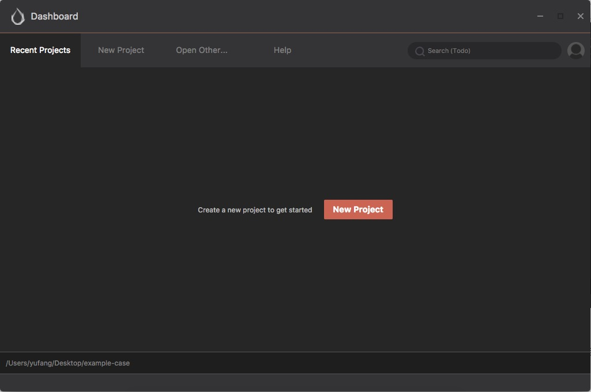
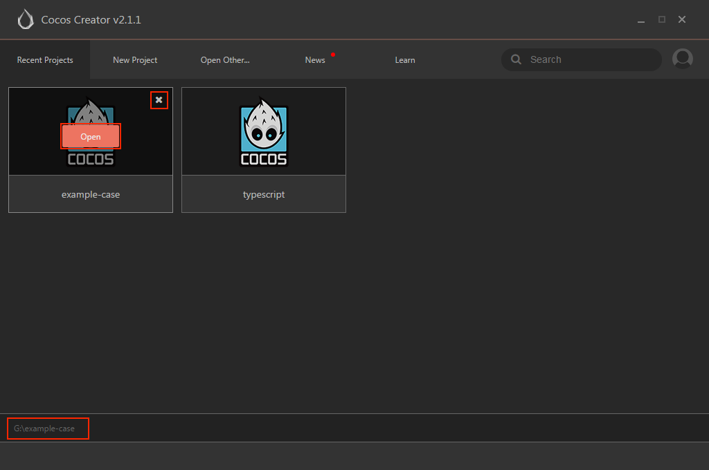
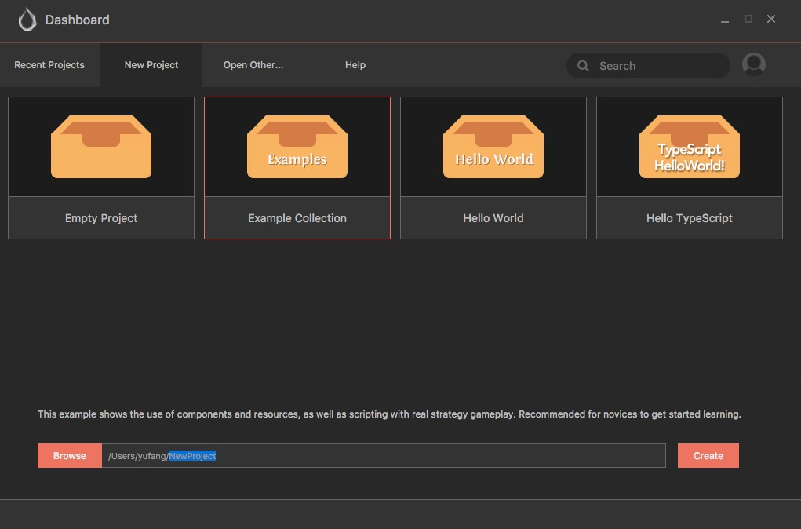

# Dashboard

启动 Cocos Creator 并使用 Cocos 开发者帐号登录以后，就会打开 Dashboard 界面，在这里你可以新建项目、打开已有项目或者获得帮助信息。

> **注意**：Cocos Creator 从 **v2.3.2** 开始接入了全新的 Dashboard 系统，将做为 Creator 各引擎统一的下载器和启动入口，支持同时对多版本 Creator 和项目进行统一升级和管理！具体的下载、安装及使用方法请参考 [Cocos Dashboard](https://docs.cocos.com/creator/3.0/manual/zh/getting-started/install/)。

## 界面总览

上图所示的就是 Cocos Creator 的 Dashboard 界面，包括以下几种选项卡：

- **最近打开项目**: 列出最近打开项目，第一次运行 Cocos Creator 时，这个列表是空的，会提示 **新建项目** 的按钮。
- **新建项目**: 选择这个选项卡，会进入到 Cocos Creator 新项目创建的指引界面。
- **打开其他项目**: 如果你的项目没有在最近打开的列表里，你也可以点击这个按钮来浏览和选择你要打开的项目。
- **教程**: 帮助信息，一个包括各种新手指引信息和文档的静态页面。

下面我们来依次介绍这些分页面。

### 最近打开项目

你可以通过 **最近打开项目** 选项卡快速访问近期打开过的项目。第一次运行 Cocos Creator 时，这个列表是空的，在界面上会显示 **新建项目** 的按钮。你可以在创建了一些项目后回来，并看到你新建的项目出现在列表里。

当你的鼠标悬停在一个最近打开项目的条目上时，会显示出可以对该项目进行操作的行为：

- 点击 **打开** 在 Cocos Creator 编辑器中打开该项目
- 点击 **关闭** 将该项目从最近打开项目列表中移除，这个操作不会删除实际的项目文件夹。

此外，当鼠标点击选中或悬停在项目上时，可以在 Dashboard 下方的状态栏看到该项目所在路径。

### 新建项目

你可以在 **新建项目** 选项卡里创建新的 Cocos Creator 项目。

在 **新建项目** 页面，我们首先需要选择一个项目模板，项目模板会包括各种不同类型的游戏基本架构，以及学习用的范例资源和脚本，来帮助你更快进入到创造性的工作当中。

> **注意**：早期的 Cocos Creator 版本中还没有很多可选择的项目模板，我们会随着 Cocos Creator 功能逐渐完整持续添加更多模板为用户提供方便。

点击选择一个模板，你可以在页面下方看到该模板的描述。

在页面下方你可以看到项目名称和项目存放地址。可以在项目路径输入框手动输入项目存放路径和项目名称，路径的最后一节就是项目名称。

你也可以点击 **浏览** 按钮，打开浏览路径对话框，在你的本地文件系统中选择一个位置来存放新建项目。

一切都设置好后，点击 **新建项目** 按钮来完成项目的创建。Dashboard 界面会被关闭，然后新创建的项目会在 Cocos Creator 编辑器主窗口中打开。

### 打开其他项目

如果你在 **最近打开项目** 页面找不到你的项目，或者刚刚从网上下载了一个从未打开过的项目时，你可以通过 **打开其他项目**
选项卡按钮在本地文件系统浏览并打开项目。

点击 **打开其他项目** 后，会弹出本地文件系统的选择对话框，在这个对话框中选中你的项目文件夹，并选择打开就可以打开项目。

*注意：Cocos Creator 使用特定结构的文件夹来作为合法项目标识，而不是使用工程文件。选择项目时只要选中项目文件夹即可。*

### 教程

你可以通过 **教程** 页面访问 Cocos Creator 用户手册和其他帮助文档。

