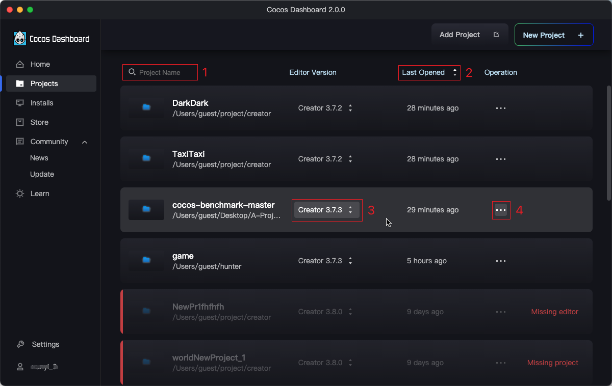
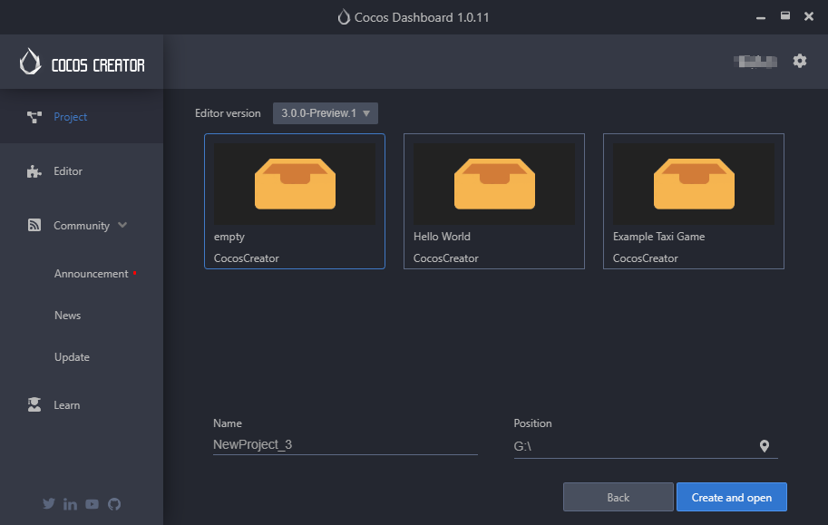
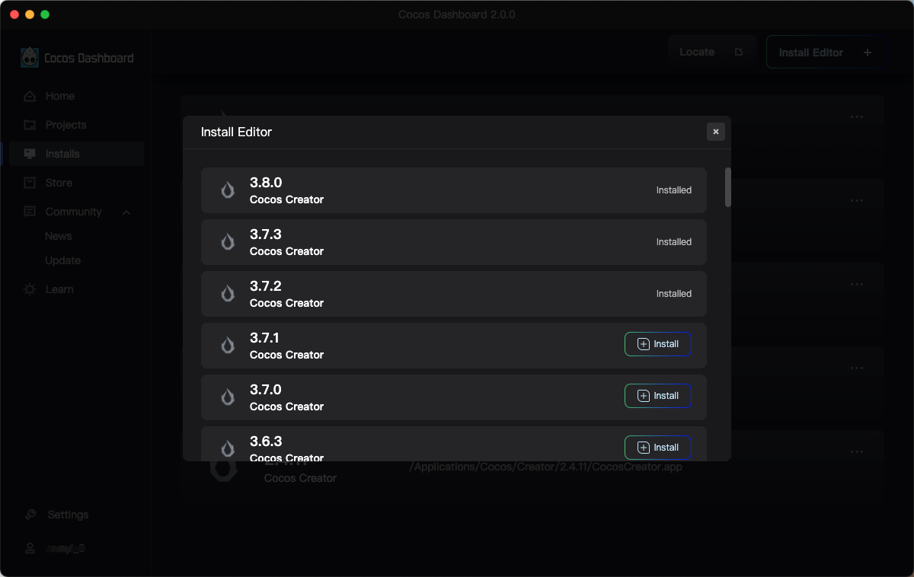
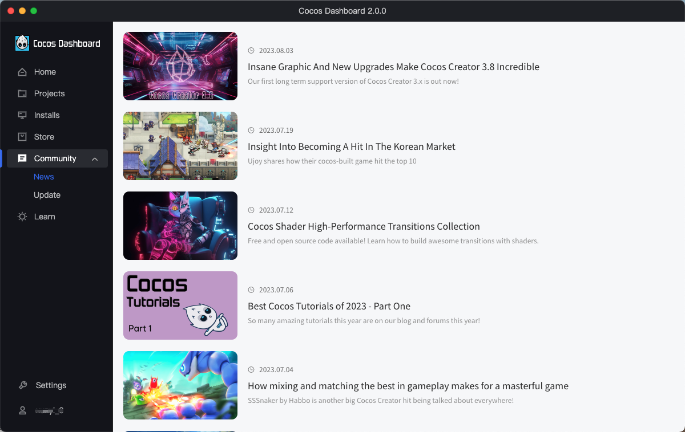
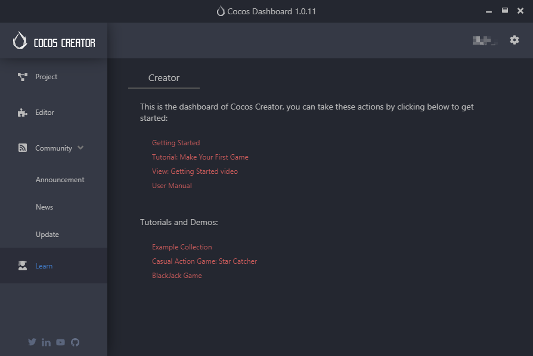
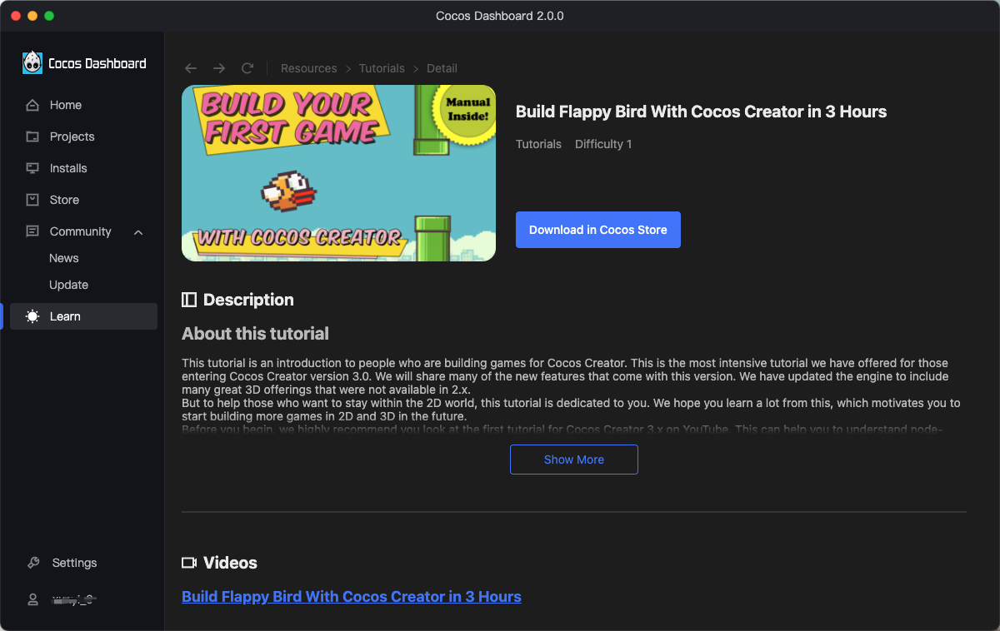
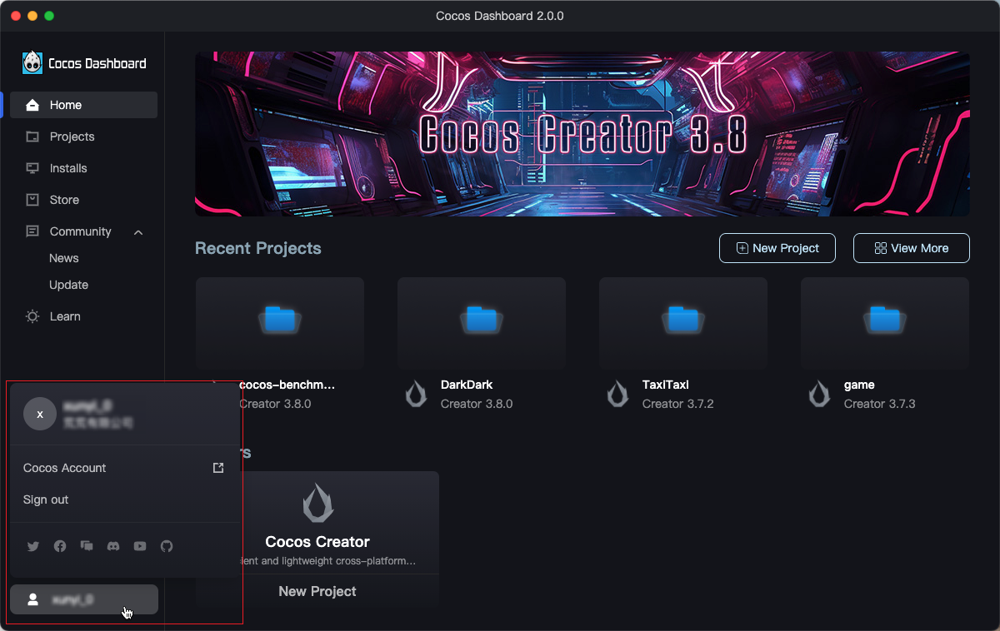

# 使用 Dashboard

启动 Cocos Dashboard 并使用 Cocos 开发者帐号登录以后，就会打开 Dashboard 窗口，在这里你可以下载引擎、新建项目、打开已有项目或者获得帮助信息。

左侧导航菜单栏包括：**首页**、**项目**、**编辑器**、**商城**、**动态**、**学习**、**设置** 和 **账号**，具体说明请查看下文。

## 首页

首页集合当前 Cocos 的产品动态、版本动态以及用户最近打开的项目，可在此快捷打开项目、新建项目、安装编辑器、获取最新编辑器版本等。

主要包括以下三部分内容：

- 轮播图：展示 Cocos 最近的产品动态；
- 最近打开：展示用户最近打开的项目，**双击** 可打开项目；右上方的 **新建项目** 按钮可快捷打开新建项目页以创建项目，**查看更多** 按钮可前往项目列表页面。
- 编辑器：展示 Cocos 已发布的产品，可在此快捷安装编辑器版本、新建项目，以及获取最新发布的编辑器版本。

## 项目

项目页展示所有创建/导入的项目，**双击** 可打开项目；第一次运行 Cocos Dashboard 时列表是空的，可以在右上角新建/导入项目；

右上方的 **导入项目** 按钮用于导入其他本地项目；**新建项目** 按钮用于新建项目，点击该按钮会打开 **新建项目** 页面，详情可参考下方介绍。

项目列表支持以下功能：

- **1**：通过项目名称直接搜索项目；
- **2**：可根据最近打开时间正序/反序排列项目；
- **3**：可选择其他已安装成功的编辑器版本打开项目；
- **4**：操作菜单，也可通过右键打开。支持 **打开（项目）**、**在 Finder/资源管理器中显示**、**从列表中移除**、**选择项目的图标**、**重命名项目**、**设置项目的描述**。
  - **选择项目的图标**：自定义项目封面图，目前支持 BMP、PNG、GIF、JPG 四种格式；
  - **重命名项目**：重命名项目名称，同时也将重命名项目文件夹；
  - **设置项目的描述**：可用于备注项目相关的描述信息。

### 新建项目

Creator 提供了一些项目模板，包括了各种不同类型的游戏基本架构，以及学习用的范例资源和脚本，来帮助开发者更快进入到创造性的工作当中。随着 Cocos Creator 功能越来越完整，我们也会持续添加更多的项目模板。

点击左上方的 **模版** 和 **案例** 可切换项目类型；**编辑器版本** 用于选择创建项目的编辑器版本，下拉框中包括所有已安装成功的版本。

选中任一项目模板，页面下方可以看到 **项目名称** 和 **位置**。

- **项目名称**：项目名称只能包含 **a-z**、**A-Z**、**0-9** 以及 **_** 和 **-**；
- **位置**：点击项目路径输入框后面的图标即可选择项目的存放路径，也可以在输入框中手动输入。

一切都设置好后，点击 **创建并打开** 按钮来完成项目的创建；Dashboard 窗口会被隐藏，然后新创建的项目会在 Cocos Creator 编辑器主窗口中打开。

## 安装

安装页展示已安装成功的产品编辑器，可以点击右上方的按钮导入/安装编辑器版本；

需要注意的是，第一次运行 Cocos Dashboard 时，这个列表是空的，可以点击右上方的两个按钮导入本地已有的编辑器或者直接下载安装：

- **添加本地版本**：用于添加本地已有的编辑器，支持直接将本地已有的 Creator 编辑器从操作系统的文件管理器拖拽到版本列表中；
- **安装编辑器**：点击该按钮会打开编辑器安装页，显示所有已安装和未安装的编辑器版本，可根据需要下载安装：

  

## 商城

Cocos 游戏开发资源商城，可浏览、下载和安装官方或者第三方插件、源码、资源等，具体说明可参考 [Cocos Store](https://store.cocos.com/document/zh/)。

## 动态

动态页主要展示 Cocos Creator 的一些官方信息、活动和 Creator 版本更新说明等，包括 **新闻** 和 **更新日志** 两个模块。

## 学习

集合 Cocos 官方产出的教程资源，以及编辑推荐文章和论坛精华。

主要由教程资源、编辑推荐、论坛精华三部分组成：

- **资源**：包括教程、引擎特性、示例项目资源，各资源可查看文档教程或者视频教程或者下载项目文件。资源区分难易程度，用户可根据需要单击打开资源详情查看：

    

- **编辑推荐**：展示编辑推荐的一些优质文章，可单击前往查看；
- **论坛精华**：展示 [论坛](https://forum.cocos.org/c/58) 的置顶/热门主题，可单击前往查看。

## 账号

展示当前登录的账号信息，可前往账户中心，以及退出登录等。

点击下方各网站的图标可访问 Cocos 官方获取更多教程等信息，目前包括：

- 微信公众号
- [微博](https://weibo.com/cocos2dx)
- [Twitter](https://twitter.com/cocos2dx)
- [哔哩哔哩](https://space.bilibili.com/491120849)
- [YouTube](https://www.youtube.com/channel/UCAsPLdpiAQbFuYqiZvi0P5A)
- [GitHub](https://github.com/cocos/cocos-engine)
