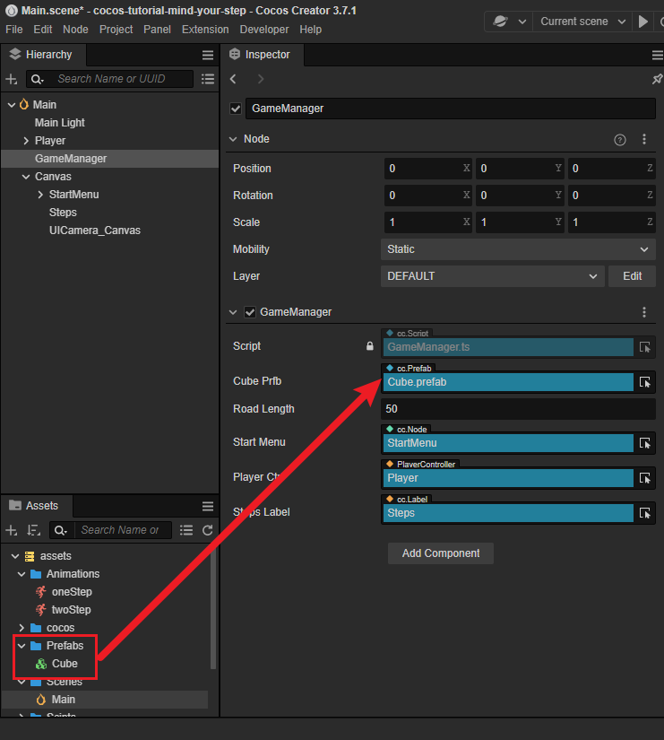

# 快速上手：制作第一个游戏

本节我们将向您介绍一些 Cocos Creator 的特定，并如何使用 Cocos Creator 制作一个虽然简单但是完整的跳跃游戏。

下面我们将跟随教程制作一款名叫 **一步两步** 的魔性小游戏。这款游戏考验玩家的反应能力，根据路况选择是要跳一步还是跳两步，“一步两步，一步两步，一步一步似爪牙似魔鬼的步伐”。

可以在 [这里](https://gameall3d.github.io/MindYourStep_Tutorial/index.html) 体验一下游戏的完成形态。

## 添加主角

对于绝大多数游戏来说，都需要一个可以操控的角色。接下来我们将一步一步的制作游戏中的主角：胶囊体先生/女士。

为了方便制作，我们在这里稍微回顾下编辑器内是如何创建节点的：


引擎左侧的名为 **层级管理器** 的窗口显示所有当前场景内的节点，并且您在里面点击鼠标右键后可以弹出创建新的节点的菜单。

### 创建主角节点

首先创建一个名为 Player 的空节点，然后在这个空节点下创建名为 Body 的主角模型节点，为了方便，我们采用编辑器自带的胶囊体模型做为主角模型。


分为两个节点的好处是，我们可以使用脚本控制 Player 节点来使主角进行水平方向移动，而在 Body 节点上做一些垂直方向上的动画（比如原地跳起后下落），两者叠加形成一个跳越动画。

然后将 Player 节点设置在（0，0，0）位置，使得它能站在第一个方块上。效果如下：


### 编写主角脚本

想要主角影响鼠标事件来进行移动，我们就需要编写自定义的脚本。如果您从没写过程序也不用担心，我们会在教程中提供所有需要的代码，只要复制粘贴到正确的位置就可以了。我们也会对所以的代码进行讲解，以帮助您尽快上手 Cocos Creator。

#### 创建脚本

1. 如果还没有创建 Scripts 文件夹，首先在 **资源管理器** 中右键点击 **assets** 文件夹，选择 **新建 -> 文件夹**，重命名为 Scripts。
2. 右键点击 Scripts 文件夹，选择 **新建 -> TypeScript**，创建一个 TypeScript 脚本，有关 TypeScript 资料可以查看 [TypeScript 官方网站](https://www.typescriptlang.org/)。
3. 将新建脚本的名字改为 `PlayerController`，双击这个脚本，打开代码编辑器（例如 VSCode）。

    

**注意**：Cocos Creator 中脚本名称就是组件的名称，这个命名是大小写敏感的！如果组件名称的大小写不正确，将无法正确通过名称使用组件！

#### 编写脚本代码

在打开的 PlayerController 脚本里已经有了预先设置好的一些代码块，如下所示：

```ts
import { _decorator, Component } from 'cc';
const { ccclass, property } = _decorator;

@ccclass("PlayerController")
export class PlayerController extends Component {
    /* class member could be defined like this */
    // dummy = '';

    /* use `property` decorator if your want the member to be serializable */
    // @property
    // serializableDummy = 0;

    start () {
        // Your initialization goes here.
    }

    // update (deltaTime: number) {
    //     // Your update function goes here.
    // }
}
```

这些代码就是编写一个组件（脚本）所需的结构。其中，继承自 `Component` 的脚本称之为 **组件（Component）**，它能够挂载到场景中的节点上，用于控制节点的行为，更详细的脚本信息可以查看 [脚本](../../scripting/index.md)。

接下来我们来完善 `PlayerController` 的代码以让角色可以真正的动起来。

#### 监听输入

在游戏中，我们需要通过监听计算机的输入（鼠标、键盘或者手柄等）来操作角色，在 Cocos Crateor 中，您可以通过监听 `input` 的事件来完成：

```ts
input.on(Input.EventType.MOUSE_UP, this.onMouseUp, this);
```

上述代码表示了 我们通过监听 **输入系统（`input`）** 的 **鼠标弹起事件（`MOUSE_UP`）**，当接收到鼠标弹起事件后，这个脚本内的 `onMouseUp` 会被调用。

通常我们会将这些初始化代码放在 **组件** 的 `start` 方法内，以确保当角色初始化后，可以正确的监听鼠标输入。

> `start` 函数表示该组件已正确的初始化，您可以放心的使用。

因此我们可以看到下面的代码：

```ts
import { _decorator, Component, input, Input, EventMouse } from 'cc';
const { ccclass, property } = _decorator;

@ccclass("PlayerController")
export class PlayerController extends Component {

    start () {
        // Your initialization goes here.
        input.on(Input.EventType.MOUSE_UP, this.onMouseUp, this);
    }

    onMouseUp(event: EventMouse) {
       

    }
}
```

#### 让角色动起来

为了让角色动起来，我们需要给角色添加一些额外的属性来描述他，回想一下我们在中学阶段学习物理时处理的小方块或者小球的问题。是的没错，在游戏开发中，我们要让角色动起来也可以通过描述他的位置、速度等因素的变化来实现。

在当前游戏中，我们要完成这样的行为：用户按下鼠标左键/右键 -> 判定是位移一步/两步 -> 将角色根据输入向前移动直到到达目标点。

因此我们在脚本中添加这样的属性：

```typescript
// 是否接收到跳跃指令
private _startJump: boolean = false;
```

通过 `_startJump` 这样的布尔值变量，我们可以标记角色当前是否在跳跃中，以帮助我们在 `update` 中区分不同的分支逻辑。因为很显然，当没有接受到输入时，我们是不需要移动角色的。

> Q：为什么要在 `update` 处理？
>
> A：在游戏开发中，`update` 会以特定的时间间隔进行，如我们游戏为 60 FPS（即每秒渲染 60 帧），那么update 每秒就会被调用 60 次。通过这种方式，我们可以尽可能的去模拟现实中连续的行为。

因此我们可以将代码写成这样：

```typescript
import { _decorator, Component, input, Input, EventMouse } from 'cc';
const { ccclass, property } = _decorator;

@ccclass("PlayerController")
export class PlayerController extends Component {

    // 是否接收到跳跃指令
    private _startJump: boolean = false;
    // 跳跃步长
    private _jumpStep: number = 0;

    start () {
        // Your initialization goes here.
        input.on(Input.EventType.MOUSE_UP, this.onMouseUp, this);
    }

    onMouseUp(event: EventMouse) {
       

    }

    update(dt: number): void {
        if( this._startJump){ // 处理跳跃的分支逻辑

        }
    }
}
```

很好，我们已经有了一个角色控制器的主体框架了，接下来我们只需要思考下，如何在 `update` 里面让角色动起来就好了！

在牛顿力学里面我们学过，如果要让一个物体匀速的运动，那么他的位置一定是这样：

```math
P_1 = P_0 + v*t
```

也就是说，我们需要将物体当前的位置加上速度乘以时间，那么就可以得到物体新的位置。

在我们的游戏中，鼠标按下那一刻，如果跳跃步数为 1，角色会向前移动 1 个单位，而如果跳跃步数为 2，那么移动 2 个单位。因此我们可以计算出角色的目标位置（_targetPos）。

```
目标位置(_targetPos) = 当前位置(_curPos) + 步长(step)
```

可以看到，我们上述的公式中有 3 个信息：_targetPos、_curPos 以及 step，记录下这些信息，这样我们可以在 `update` 里面去使用他们。

在 `PlayerController` 内添加如下的成员以记录这些信息：

```ts
// 跳跃步长
private _jumpStep: number = 0;
// 当前角色位置
private _curPos: Vec3 = new Vec3();
// 角色目标位置
private _targetPos: Vec3 = new Vec3();
```

此时的代码看起来是这样的：

```ts
import { _decorator, Component, input, Input, EventMouse, Vec3 } from 'cc';
const { ccclass, property } = _decorator;

@ccclass("PlayerController")
export class PlayerController extends Component {

    // 是否接收到跳跃指令
    private _startJump: boolean = false;
    // 跳跃步长
    private _jumpStep: number = 0;
    // 当前角色位置
    private _curPos: Vec3 = new Vec3();
    // 角色目标位置
    private _targetPos: Vec3 = new Vec3();
    start () {
        // Your initialization goes here.
        input.on(Input.EventType.MOUSE_UP, this.onMouseUp, this);
    }

    onMouseUp(event: EventMouse) {
       

    }

    update(dt: number): void {
        if( this._startJump){

        }
    }
}
```

接下来我们要处理的是，如何通过计算得到这些信息。

首先需要判定下，玩家究竟是按了鼠标左键还是右键？

这样的判定我们可以通过 `onMouseUp` 这个方法中取到鼠标的按键来得到。在 `EventMouse` 中，如果是鼠标左键，那么 `getButton` 方法会返回 0，而如果是右键，则返回 2。

那么我们扩展下 `onMouseUp` 方法如下：

```ts
onMouseUp(event: EventMouse) {
    if (event.getButton() === 0) {
        
    }
    else if (event.getButton() === 2) {
        
    }
}
```

我们在给组件添加一个用于计算目标位置、速度的方法 `jumpByStep` 来协助我们的计算。因为输入可能是 1 步或 2 步。因此给 `jumpByStep` 方法添加一个参数 `step` 可以更好的实现复用性（Reusability）。

> 复用性？ 这样的概念听来就很复杂！
> 不用紧张，这只是一些工程上的术语，我们初学的时候可以忽略掉他们。
> 这里只是为了能更清楚的解释下为什么我们要添加一个名为 `jumpByStep` 的方法。

这个函数应该看起来是这样的：

```ts
jumpByStep(step: number) {
    
}
```

我们用 step 来表示跳跃几步。

我们的游戏中，跳跃是一个完整的步骤，当这个步骤没有完成时，我们不接受任何输入，因此我们也通过 `_startJump` 来跳过跳跃过程中的用户输入。

之后我们将计算，在特定时间内，角色要从当前位置移动到目标位置，那他的移动速度应该为多少。

这个流程看起来是这样的：

1. 计算移动速度（_curJumpSpeed）
2. 计算目标位置（_targetPos）

为了在 `update` 里面我们可以正确的将 `if( this._startJump)` 分支退出，我们还需要记录下当前开始跳跃的时间（_curJumpTime），因为当跳跃的过程超过这个时间时，我们认为这个跳跃过程结束了。

因此 `jumpByStep` 看起来是这样的：

```ts
jumpByStep(step: number) {
    if (this._startJump) {
        return;
    }
    this._startJump = true; // 表示开始跳跃
    this._jumpStep = step; // 本次跳跃的步数
    this._curJumpTime = 0; // 重置下跳跃的时间
    this._curJumpSpeed = this._jumpStep / this._jumpTime; // 计算跳跃的速度
    this.node.getPosition(this._curPos); // 获取角色当前的位置
    // 目标位置 = 当前位置 + 步长
    Vec3.add(this._targetPos, this._curPos, new Vec3(this._jumpStep, 0, 0));  
}
```

- `Vec3.add` 这是什么？
    - `Vec3` 是 Cocos Creator 提供用于记录和操作三维向量（Three-Dimensionval Vector）类
    - `add` 是将两个向量加起来的方法，注意到我们这里并没有 `this` 是因为这个方法是一个 **静态方法**
    - `Vec3.add(this._targetPos, this._curPos, new Vec3(this._jumpStep, 0, 0));` 这段代码的意思就是将 **当前位置（`_curPos`）** 加上 `new Vec3(this._jumpStep, 0, 0)` 并得到一个新的向量，而这个向量的结果是存放在 **目标位置（`_targetPos`）** 里面。
当然我们也可以采用简单的直接操作位置信息的 X 坐标的方式来移动角色，但是在制作 3D 游戏时，通常会有多个轴的移动，尽快熟悉 3 维向量的用法可以让我们更快的上手制作 3D 游戏。

此时我们的代码看起来是这样的：

```ts
import { _decorator, Component, input, Input, EventMouse, Vec3 } from 'cc';
const { ccclass, property } = _decorator;

@ccclass("PlayerController")
export class PlayerController extends Component {

    // 是否接收到跳跃指令
    private _startJump: boolean = false;
    // 跳跃步长
    private _jumpStep: number = 0;
    // 当前跳跃时间
    private _curJumpTime: number = 0;
    // 每次跳跃时长
    private _jumpTime: number = 0.3;
    // 当前跳跃速度
    private _curJumpSpeed: number = 0;
    // 当前角色位置
    private _curPos: Vec3 = new Vec3();
    // 每次跳跃过程中，当前帧移动位置差
    private _deltaPos: Vec3 = new Vec3(0, 0, 0);
    // 角色目标位置
    private _targetPos: Vec3 = new Vec3();
    
    start () {
        // Your initialization goes here.
        input.on(Input.EventType.MOUSE_UP, this.onMouseUp, this);
    }

    onMouseUp(event: EventMouse) {
        if (event.getButton() === 0) {
         
        }
        else if (event.getButton() === 2 ) {
         
        }
    }

    jumpByStep(step: number) {
        if (this._startJump) {
            return;
        }
        this._startJump = true;
        this._jumpStep = step;
        this._curJumpTime = 0;
        this._curJumpSpeed = this._jumpStep / this._jumpTime;
        this.node.getPosition(this._curPos);
        Vec3.add(this._targetPos, this._curPos, new Vec3(this._jumpStep, 0, 0));
    }


    update(dt: number): void {
        if( this._startJump){

        }
    }
}
```

非常好，到这里我们已经得到了角色在每次移动时所需要的数据，那么接下来就是在 `update` 方法里面去移动他。

还记上我们上文说到的牛顿问题吗？接下来就是真正解决这个问题的时候了。

我们需要首先需要检测下，整个跳跃的时长（_curJumpTime）是否已经超过我们预定义的时间（_jumpTime）。

这里的检测很简单，我们在输入时，已经设定了 _curJumpTime 为 0，那么 `update` 只需：

```
跳跃时间 = 上次的跳跃时间 + 帧间隔 
```

就可以了。

而 `update` 方法恰好提供了 `deltaTime` 这样的参数作为帧间隔。

因此我们就将 `_curJumpTime` 加上 `deltaTime` 即可：

```ts
update (deltaTime: number) {
    if (this._startJump) {
        this._curJumpTime += deltaTime;        
    }
}
```

> 可以看到我们使用了 '+=' 这个运算符，相当是 `this._curJumpTime = this._curJumpTime + deltaTime`。

当 `_curJumpTime` 大于我们提前定义好的 `_jumpTime` 时，这意味着跳跃结束，因此我们就需要两个分支，分别处理跳跃结束和跳跃中这两个状态：

```ts
update (deltaTime: number) {
    if (this._startJump) {
        this._curJumpTime += deltaTime; 
        if (this._curJumpTime > this._jumpTime) { // 跳跃结束
            
            
        } else { // 跳跃中
                        
        }
    }
}
```

可以注意到 `_jumpTime` 这里我们给了一个 0.3 秒的常量，事实上这是不合理的。您能猜到他不合理的原因吗？

最后我们针对不同分支，完善他们的逻辑：

- 跳跃结束：结束跳跃过程，将角色强制位移到目标位置
- 跳跃中：根据速度将角色向前移动

因此我们的 `update` 方法会变成这样：

```ts
update (deltaTime: number) {
    if (this._startJump) {
        this._curJumpTime += deltaTime;
        if (this._curJumpTime > this._jumpTime) { // 跳跃结束
            // end
            this.node.setPosition(this._targetPos);  // 强制位移到目标位置
            this._startJump = false; // 标记跳跃结束
        } else { // 跳跃中
            // tween
            this.node.getPosition(this._curPos);  // 获取当前的位置 
            this._deltaPos.x = this._curJumpSpeed * deltaTime; // 计算本帧应该位移的长度
            Vec3.add(this._curPos, this._curPos, this._deltaPos); // 将当前位置加上位移的长度
            this.node.setPosition(this._curPos); // 设置位移后的位置
        }
    }
}
```

太棒了！您已经完成了本游戏的核心内容 -- 角色控制。

如果您觉得这样的说明仍然有些困难的话，请点击 [获取帮助和支持](../support.md) 让我们知道。

#### 完整的 PlayerController

我们已经拥有了完整的 PlayerController 代码，此时只需要将其挂在某个节点上就可以使其生效了。

如果还是觉得有些困难，可以尝试将下面的代码复制粘贴到你的项目内的 PlayerController.ts 文件内。

```ts
import { _decorator, Component, Vec3, input, Input, EventMouse, Animation } from 'cc';
const { ccclass, property } = _decorator;

@ccclass("PlayerController")
export class PlayerController extends Component {
    /* class member could be defined like this */
    // dummy = '';

    /* use `property` decorator if your want the member to be serializable */
    // @property
    // serializableDummy = 0;

    // for fake tween
    // 是否接收到跳跃指令
    private _startJump: boolean = false;
    // 跳跃步长
    private _jumpStep: number = 0;
    // 当前跳跃时间
    private _curJumpTime: number = 0;
    // 每次跳跃时长
    private _jumpTime: number = 0.3;
    // 当前跳跃速度
    private _curJumpSpeed: number = 0;
    // 当前角色位置
    private _curPos: Vec3 = new Vec3();
    // 每次跳跃过程中，当前帧移动位置差
    private _deltaPos: Vec3 = new Vec3(0, 0, 0);
    // 角色目标位置
    private _targetPos: Vec3 = new Vec3();

    start () {
        // Your initialization goes here.
        input.on(Input.EventType.MOUSE_UP, this.onMouseUp, this);
    }

    onMouseUp(event: EventMouse) {
        if (event.getButton() === 0) {
            this.jumpByStep(1);
        }
        else if (event.getButton() === 2) {
            this.jumpByStep(2);
        }

    }

    jumpByStep(step: number) {
        if (this._startJump) {
            return;
        }
        this._startJump = true;
        this._jumpStep = step;
        this._curJumpTime = 0;
        this._curJumpSpeed = this._jumpStep / this._jumpTime;
        this.node.getPosition(this._curPos);
        Vec3.add(this._targetPos, this._curPos, new Vec3(this._jumpStep, 0, 0));
    }

    update (deltaTime: number) {
        if (this._startJump) {
            this._curJumpTime += deltaTime;
            if (this._curJumpTime > this._jumpTime) {
                // end
                this.node.setPosition(this._targetPos);
                this._startJump = false;
            } else {
                // tween
                this.node.getPosition(this._curPos);
                this._deltaPos.x = this._curJumpSpeed * deltaTime;
                Vec3.add(this._curPos, this._curPos, this._deltaPos);
                this.node.setPosition(this._curPos);
            }
        }
    }
}
```

现在我们可以把 `PlayerController` 组件添加到主角节点 `Player` 上。在 **层级管理器** 中选中 `Player` 节点，然后在 **属性检查器** 中点击 **添加组件** 按钮，选择 **添加用户脚本组件 -> PlayerController**，为主角节点添加 `PlayerController` 组件。


为了能在运行时看到物体，我们需要将场景中 Camera 的参数进行一些调整，`Position`  设置为（0，0，13），`Color` 设置为（50，90，255，255）：


然后点击工具栏中心位置的 Play 按钮：


在打开的网页中点击鼠标左键和右键，可以看到如下画面：


更多的预览功能，可以参考 [项目预览调试](../../editor/preview/index.md)

## 添加角色动画

从上面运行的结果可以看到单纯对 Player 进行水平方向的移动是十分呆板的，我们要让 Player 跳跃起来才比较有感觉，可以通过为 Player 添加垂直方向的动画来达到这个效果。有关 **动画编辑器** 的更多信息，请阅读 [动画编辑器](../../animation/index.md)

1. 选中场景中的 Body 节点，然后在编辑器下方的 **动画编辑器** 中添加 Animation 组件并创建 Clip，命名为 `oneStep`。

    

2. 进入动画编辑模式，添加 position 属性轨道，并添加三个关键帧，position 值分别为（0，0，0）、（0，0.5，0）、（0，0，0）。

    

    **注意**：退出动画编辑模式前记得要保存动画，否则做的动画就白费了。

3. 我们还可以通过 **资源管理器** 来创建 Clip。创建一个名为 `twoStep` 的 Clip 并将它添加到 Body 的 `Animation` 上，这里为了录制方便调整了一下面板布局。

    > **注意**：若发现无法拖动到 `Animation` 上，请检查 `import {...} from "cc"` 语句中是否包含了 `Animation`。

    

4. 进入动画编辑模式，选择并编辑 `twoStep` 的 Clip，类似第 2 步，添加三个 position 的关键帧，分别为（0，0，0）、（0，1，0）、（0，0，0）。

    

5. 在 `PlayerController` 组件中引用 **动画组件**，我们需要在代码中根据跳的步数不同来播放不同的动画。

    首先需要在 `PlayerController` 组件中引用 Body 身上的 `Animation`。

    ```ts
    @property({type: Animation})
    public BodyAnim: Animation | null = null;
    ```

    然后在 **属性检查器** 中将 Body 身上的 `Animation` 拖到这个变量上。

    

    在跳跃的函数 `jumpByStep` 中加入动画播放的代码：

    ```ts
    if (this.BodyAnim) {
        if (step === 1) {
            this.BodyAnim.play('oneStep');
        } else if (step === 2) {
            this.BodyAnim.play('twoStep');
        }
    }
    ```

6. 最后点击 Play 按钮，点击鼠标左键和右键，可以看到新的跳跃效果：

    

## 跑道升级

为了让游戏有更久的生命力，我们需要一个很长的跑道让 Player 在上面一直往右跑。在场景中复制一堆 Cube 并编辑位置来组成跑道显然不是一个明智的做法，我们可以通过脚本完成跑道的自动创建。

### 游戏管理器（GameManager）

一般来说，场景内会有不同功能，不同类型的节点，这些节点存放在场景里面我们可以将其视为我们游戏最要的数据部分。而很多情况下我们需要动态的生成、访问、删除这些节点。虽然在 Cocos Creator 里面我们可以通过 `find` 方法来查找这些节点，但实际上由于 `find` 方法需要访问场景内的所有节点，查找的命中率很低，这会造成大量的性能浪费。因此在开发中，我们一般会做一些单独的脚本，使用他们来管理场景内的 **某一类** 节点，或 **某一些** 数据，我们可以称他们为 **管理器**。

举个例子，我们有很多角色，我们游戏可能需要不断的创建新的角色，删除某些已经死亡的角色，查询某些角色的状态，那么我们可以创建一个名为 ActorManager 的类来作为角色管理器，使其支持这些功能。

因此在一个游戏中，我们同样可以声明一个游戏管理器来管理和游戏相关的节点或者数据，我们将其称为 GameManager。

这样我们可以将跑道的生成、删除等功能都放在 GameManager 里面，这样可以很方便的对数据进行集合。

这种聚合的方式在游戏开发中非常常见，如果您遇见其他如 ConfigManager、NetworkManager 之类的脚本，请不要感到奇怪。

当然更复杂的游戏会有很复杂的结构设计，这些复杂、庞大的设计理念可以更好的提升我们代码的健壮性、可维护性。

那么我们接下来就去创建这样的管理器。

### 创建管理器

1. 在场景中创建一个名为 GameManager 的节点。
2. 然后在 `assets/Scripts` 中创建一个名为 GameManager 的 TypeScript 脚本文件。
3. 将 `GameManager` 组件添加到 GameManager 节点上。

### 制作Prefab

对于需要重复生成的节点，我们可以将它保存成 [Prefab（预制）资源](../../asset/prefab.md)，作为我们动态生成节点时使用的模板。

> 预制体是引擎内置的一种资源，其主要的作用是为某些节点提供克隆的可能。想象一下如果游戏有 1000 个相同的敌人，那么制作 1000 个这样节点是非常耗时的，预制体可以帮助我们很好的解决这个问题，我们只需将这个角色的预制体克隆 10000 次就可以了

将生成跑道的基本元素 **正方体（Cube）** 制作成 Prefab，之后可以把场景中的三个 Cube 都删除了。


### 添加自动创建跑道代码

Player 需要一个很长的跑道，理想的方法是能动态增加跑道的长度，这样可以永无止境地跑下去，这里为了方便先生成一个固定长度的跑道，跑道长度可以自己定义。另外，我们可以在跑道上生成一些坑，当 Player 跳到坑上就 GameOver 了。

首先我们需要定义一些常量用于表示当前的坐标代表的究竟是坑还是石块。在 Typescript 里面可以通过枚举来定义。

通过关键字 `enum` + 枚举的名称我们定义了如下的枚举，其中 `BT_NONE` 代表坑，而 `BT_STONE` 代表可行走的地面。

```typescript
enum BlockType{
    BT_NONE,
    BT_STONE,
};
```

同样我们需要定义下游戏管理器使用那个或者那些预制体来创建地图。

```ts
// 赛道预制
@property({type: Prefab})
public cubePrfb: Prefab | null = null;
```

`@property({type: Prefab})` 可以让编辑器将 `cubePrfb` 在编辑器内识别为预制体，这样我们可通过编辑器来给这属性分配前面已经制作好的方块。

> `@property` 这样的语法被称为 [装饰器](../../scripting/decorator.md)。Cocos Cretor 提供不同的装饰器，您可以用来修饰脚本以给编辑器添加多样化的内容。

为了方便快速查找到当前所在的位置是方块还是坑，我们通过一个数组来描述整个赛道的情况：

```ts
_road: BlockType[] = [];
```

这样一个基础的 GameManager 就定义好了，他看起来应该是这样的：

```ts
import { _decorator, Component, Prefab } from 'cc';
const { ccclass, property } = _decorator;

// 赛道格子类型，坑（BT_NONE）或者实路（BT_STONE）
enum BlockType {
    BT_NONE,
    BT_STONE,
};

@ccclass("GameManager")
export class GameManager extends Component {

    // 赛道预制
    @property({type: Prefab})
    public cubePrfb: Prefab | null = null;
    // 赛道长度
    @property
    public roadLength = 50;
    private _road: BlockType[] = [];

    start () {
        this.generateRoad();
    }

    generateRoad() {
  
    }
}
```

接下来我们根据一些原则来生成整个赛道。这些原则包括：

- 第一个赛道必须是石块以确保角色生成的时候不会掉下去
- 后面的方块我们将随机生成方块或者坑，但是考虑到我们角色贫瘠的跳跃能力（最多只能跳 2 个单位）因此我们不能连续生成超过 2 个坑。因此我们在生成新的格子时，需要判断前一个格子是石块还是坑，如果是坑，那么这个格子必须是石块。
- 最后我们根据当前的路况信息 `_road` 将方块实例化到场景内，完成地图的展示。

因此地图生成方法 `generateRoad` 可以写成这样：

```ts
generateRoad() {
    // 防止游戏重新开始时，赛道还是旧的赛道
    // 因此，需要移除旧赛道，清除旧赛道数据
    this.node.removeAllChildren();
    this._road = [];
    // 确保游戏运行时，人物一定站在实路上
    this._road.push(BlockType.BT_STONE);

    // 确定好每一格赛道类型
    for (let i = 1; i < this.roadLength; i++) {
        // 如果上一格赛道是坑，那么这一格一定不能为坑
        if (this._road[i-1] === BlockType.BT_NONE) {
            this._road.push(BlockType.BT_STONE);
        } else {
            this._road.push(Math.floor(Math.random() * 2));
        }
    }

    // 根据赛道类型生成赛道
    for (let j = 0; j < this._road.length; j++) {
        let block: Node = this.spawnBlockByType(this._road[j]);
        // 判断是否生成了道路，因为 spawnBlockByType 有可能返回坑（值为 null）
        if (block) {
            this.node.addChild(block);
            block.setPosition(j, -1.5, 0);
        }
    }
}
```

生成石块的方法 `spawnBlockByType` 看起来是这样的：

```ts
spawnBlockByType(type: BlockType) {
    if (!this.cubePrfb) {
        return null;
    }

    let block: Node | null = null;
    // 赛道类型为实路才生成
    switch(type) {
        case BlockType.BT_STONE:
            block = instantiate(this.cubePrfb);
            break;
    }

    return block;
}
```

可以注意到当格子的类型是石块时，我们将通过 `instantiate` 克隆一个新的预制体出来；而格子的类型不为石块时，我们什么也不做。

> instantiate: 是 Cocos Creator 提供的克隆预制体的方法。当然它不仅能克隆预制体，你甚至可以用它克隆别的类型比如某个对象！

完整的 `GameManager` 脚本中的代码如下：

```ts
import { _decorator, Component, Prefab, instantiate, Node, CCInteger } from 'cc';
const { ccclass, property } = _decorator;

// 赛道格子类型，坑（BT_NONE）或者实路（BT_STONE）
enum BlockType {
    BT_NONE,
    BT_STONE,
};

@ccclass("GameManager")
export class GameManager extends Component {

    // 赛道预制
    @property({type: Prefab})
    public cubePrfb: Prefab | null = null;
    // 赛道长度
    @property
    public roadLength = 50;
    private _road: BlockType[] = [];

    start () {
        this.generateRoad();
    }

    generateRoad() {
        // 防止游戏重新开始时，赛道还是旧的赛道
        // 因此，需要移除旧赛道，清除旧赛道数据
        this.node.removeAllChildren();
        this._road = [];
        // 确保游戏运行时，人物一定站在实路上
        this._road.push(BlockType.BT_STONE);

        // 确定好每一格赛道类型
        for (let i = 1; i < this.roadLength; i++) {
            // 如果上一格赛道是坑，那么这一格一定不能为坑
            if (this._road[i-1] === BlockType.BT_NONE) {
                this._road.push(BlockType.BT_STONE);
            } else {
                this._road.push(Math.floor(Math.random() * 2));
            }
        }

        // 根据赛道类型生成赛道
        for (let j = 0; j < this._road.length; j++) {
            let block: Node = this.spawnBlockByType(this._road[j]);
            // 判断是否生成了道路，因为 spawnBlockByType 有可能返回坑（值为 null）
            if (block) {
                this.node.addChild(block);
                block.setPosition(j, -1.5, 0);
            }
        }
    }

    spawnBlockByType(type: BlockType) {
        if (!this.cubePrfb) {
            return null;
        }

        let block: Node | null = null;
        // 赛道类型为实路才生成
        switch(type) {
            case BlockType.BT_STONE:
                block = instantiate(this.cubePrfb);
                break;
        }

        return block;
    }

    // update (deltaTime: number) {
    //     // Your update function goes here.
    // }
}
```

将上面制作好的 Cube 的 prefab 拖到 GameManager 在 **属性检查器** 中的 CubePrfb 属性上。



在 GameManager 的 **属性检查器** 面板中可以通过修改 roadLength 的值来改变跑道的长度。
此时点击预览可以看到自动生成了跑道。

## 跟随相机

可以观察到 Camera 没有跟随 Player 移动，所以看不到后面的跑道，我们可以将场景中的 Camera 设置为 Player 的子节点。


这样 Camera 就会跟随 Player 的移动而移动，现在点击预览可以从头跑到尾地观察生成的跑道了。

## 增加开始菜单

用户界面（UI）是游戏中不可缺少的一部分，通过 UI，我们可以给玩家提供到某些关键上数据信息、状态等，这样玩家在游戏时可以思考自己的行为策略。我们可以在也这里加入游戏名称、游戏简介、制作人员等信息。

UI 是游戏开发中的 2D 部分，您可以通过查阅 [2D/UI](../../2d-object/index.md) 相关的文档来了解。

下面我们将以开始菜单为例子，简述 UI 的制作流程。

1. 在 **层级管理器** 中添加一个 Button 节点并命名为 PlayButton。

    

    可以看到在 **层级管理器** 中生成了一个 Canvas 节点，一个 PlayButton 节点和一个 Label 节点。因为 UI 组件需要在带有 `Canvas` 的父节点下才能显示，所以编辑器在发现没有 Canvas 节点时会自动创建一个。

    然后将 Label 节点上 `cc.Label` 组件中的 **String** 属性从 Button 改为 Play。

    > 您可能会注意到，在您所使用的 Cocos Creator 版本中在创建 UI 时会自动添加一个相机（Camera）节点。
    > 这个节点是新版本的 Cocos Creator 的特性，这个相机将负责渲染整个 UI/2D 部分的内容。以此引擎可以通过更高效的渲染管线来处理这些 UI/2D 的内容。

2. 在 Canvas 底下创建一个名为 StartMenu 的空节点，将 PlayButton 拖到它底下。我们可以通过点击工具栏上的 2D/3D 按钮切换到 2D 编辑视图下进行 UI 编辑操作，详细的描述请查阅 [场景编辑](../../editor/scene/index.md)。

    

3. 在 StartMenu 下新建一个名为 `BG` 的 Sprite 节点作为背景框，调整它的位置到  PlayButton 的上方。

    

    然后在 **属性检查器** 中将 `cc.UITransform` 组件的 `ContentSize` 设置为（200，200），同时将 **资源管理器** 中的 `internal/default_ui/default_sprite_splash` 拖拽到 **SpriteFrame** 属性框中。

    

4. 在 **层级管理器** 的 StartMenu 节点下添加一个名为 Title 的 Label 节点用于开始菜单的标题。

    

5. 在 **属性检查器** 中设置 Title 节点的属性，例如 `Position`、`Color`、`String`、`FontSize` 等。

    

6. 根据需要增加操作的 Tips 节点，然后调整 PlayButton 的位置，一个简单的开始菜单就完成了

    

## 增加游戏状态逻辑

对于大多数游戏来说，我们可以将其粗略的分解为 3 个不同的状态：初始化、游玩、结算。就和我们玩任意的棋子游戏一样，摆放棋子的过程我们称之为初始化；下棋的过程则为游玩过程；最后两名棋手下棋结束结算胜利/失败时的状态，我们称之为结算状态。

因此同理的我们可以定义如下的枚举来代表游戏状态。

```ts
enum GameState{
    GS_INIT,
    GS_PLAYING,
    GS_END,
};
```

- 初始化（Init）：显示游戏菜单，初始化一些资源。
- 游戏进行中（Playing）：隐藏游戏菜单，玩家可以操作角色进行游戏。
- 结束（End）：游戏结束，显示结束菜单。

这样的作用是我们可以比较方便的通过读取 `GameState` 的枚举值就可以知道现在游戏处于什么状态；或者当状态切换时，我们的游戏需要处理些什么。

为了在游戏开始时不让用户操作角色，而在游戏进行时让用户操作角色，我们需要动态地开启和关闭角色对鼠标消息的监听。在 `PlayerController` 脚本中做如下修改：

```ts
start () {
    // Your initialization goes here.
    // input.on(Input.EventType.MOUSE_UP, this.onMouseUp, this);
}

setInputActive(active: boolean) {
    if (active) {
        input.on(Input.EventType.MOUSE_UP, this.onMouseUp, this);
    } else {
        input.off(Input.EventType.MOUSE_UP, this.onMouseUp, this);
    }
}
```

然后在 `GameManager` 脚本中引用 `PlayerController` 脚本：

```ts
@property({type: PlayerController})
public playerCtrl: PlayerController | null = null;
```

完成后保存脚本，回到编辑器，将 **层级管理器** 中挂载了 `PlayerController` 脚本的 Player 节点拖拽到 GameManager 节点的 `playerCtrl` 属性框中。

同时，为了动态地开启/关闭开始菜单，还需要在 `GameManager` 脚本中引用 StartMenu 节点：

```ts
@property({type: Node})
public startMenu: Node | null = null;
```

完成后保存脚本，回到编辑器，将 **层级管理器** 中的 StartMenu 节点拖拽到 GameManager 节点的 `startMenu` 属性框中。


### 增加状态切换代码

增加状态切换代码并修改 GameManager 脚本的初始化方法：

```ts
start () {
    this.curState = GameState.GS_INIT;
}

init() {
    // 激活主界面
    if (this.startMenu) {
        this.startMenu.active = true;
    }
    // 生成赛道
    this.generateRoad();
    if(this.playerCtrl){
        // 禁止接收用户操作人物移动指令
        this.playerCtrl.setInputActive(false);
        // 重置人物位置
        this.playerCtrl.node.setPosition(Vec3.ZERO);
    }
}

set curState (value: GameState) {
    switch(value) {
        case GameState.GS_INIT:
            this.init();
            break;
        case GameState.GS_PLAYING:
            if (this.startMenu) {
                this.startMenu.active = false;
            }
            // 设置 active 为 true 时会直接开始监听鼠标事件，此时鼠标抬起事件还未派发
            // 会出现的现象就是，游戏开始的瞬间人物已经开始移动
            // 因此，这里需要做延迟处理
            setTimeout(() => {
                if (this.playerCtrl) {
                    this.playerCtrl.setInputActive(true);
                }
            }, 0.1);
            break;
        case GameState.GS_END:
            break;
    }
}
```

可以观察到我们增加的 `init` 方法，他初始化了整个赛道，同时激活主界面并禁止玩家输入。之后在游戏状态切换到 `GS_INIT` 时，我们将会调用该方法。

而首次出现的 `set curState` 这样的存取器可以让我们在设置游戏状态时更加的安全。

### 添加对 Play 按钮的事件监听

为了能在点击 Play 按钮后开始游戏，我们需要对按钮的点击事件做出响应。在 `GameManager` 脚本中加入响应按钮点击的代码，以便用户在点击按钮后进入游戏的 Playing 状态：

```ts
onStartButtonClicked() {
    this.curState = GameState.GS_PLAYING;
}
```

然后在 **层级管理器** 中选中 PlayButton 节点，在 **属性检查器** 的 `cc.Button` 组件中添加 ClickEvents 的响应函数，将 GameManager 节点拖拽到 `cc.Node` 属性框中：


现在预览场景就可以点击 Play 按钮开始游戏了。

## 添加游戏结束逻辑

目前游戏角色只是呆呆的往前跑，我们需要添加游戏规则，让它跑的更有挑战性。

1. 角色每次跳跃结束都需要发出消息，并将自己当前所在的位置做为参数发出消息，在 `PlayerController` 脚本中记录自己跳了多少步：

    ```ts
    private _curMoveIndex = 0;
    // ...
    jumpByStep(step: number) {
        // ...

        this._curMoveIndex += step;
    }
    ```

    并在每次跳跃结束发出消息：

    ```ts
    onOnceJumpEnd() {
        this.node.emit('JumpEnd', this._curMoveIndex);
    }
    ```

2. 在 `GameManager` 脚本中监听角色跳跃结束事件，并根据规则判断输赢，增加失败和结束判断，如果跳到空方块或是超过了最大长度值都结束：

    ```ts
    checkResult(moveIndex: number) {
        if (moveIndex < this.roadLength) {
            // 跳到了坑上
            if (this._road[moveIndex] == BlockType.BT_NONE) {
                this.curState = GameState.GS_INIT;
            }
        } else {    // 跳过了最大长度
            this.curState = GameState.GS_INIT;
        }
    }
    ```

    监听角色跳跃消息，并调用判断函数：

    ```ts
    start () {
        this.curState = GameState.GS_INIT;
        // ?. 可选链写法
        this.playerCtrl?.node.on('JumpEnd', this.onPlayerJumpEnd, this);
    }

    // ...
    onPlayerJumpEnd(moveIndex: number) {
        this.checkResult(moveIndex);
    }
    ```

    此时预览，会发现重新开始游戏时会有判断出错的问题，这是由于重新开始时没有重置 `PlayerController.ts` 中的 `_curMoveIndex` 属性值导致的。所以我们需要在 `PlayerController` 脚本中增加一个 `reset` 函数：

    ```ts
    reset() {
        this._curMoveIndex = 0;
    }
    ```

    然后在 `GameManager` 脚本的 `init` 函数中调用 `reset` 来重置 `PlayerController.ts` 中的 `_curMoveIndex` 属性。

    ```ts
    init() {
        // ...
        this.playerCtrl.reset();
    }
    ```

## 步数显示

我们可以将当前跳的步数显示在界面上，这样在跳跃过程中看着步数的不断增长会十分有成就感。

1. 在 Canvas 下新建一个名为 Steps 的 Label 节点，调整位置、字体大小等属性。

    

2. 在 `GameManager` 脚本中引用这个 Label：

    ```ts
    @property({type: Label})
    public stepsLabel: Label | null = null;
    ```

    保存脚本后回到编辑器，将 Steps 节点拖拽到 GameManager 在属性检查器中的 stepsLabel 属性框中：

   

3. 将当前步数数据更新到 Steps 节点中。因为我们现在没有结束界面，游戏结束就跳回开始界面，所以在开始界面要看到上一次跳的步数，因此我们需要在进入 Playing 状态时，将步数重置为 0。

    ```ts
    // GameManager.ts
    set curState (value: GameState) {
        switch(value) {
            case GameState.GS_INIT:
                this.init();
                break;
            case GameState.GS_PLAYING:
                if (this.startMenu) {
                    this.startMenu.active = false;
                }

                if (this.stepsLabel) {
                    this.stepsLabel.string = '0';   // 将步数重置为0
                }
                setTimeout(() => {      // 直接设置 active 会直接开始监听鼠标事件，这里做了延迟处理
                    if (this.playerCtrl) {
                        this.playerCtrl.setInputActive(true);
                    }
                }, 0.1);
                break;
            case GameState.GS_END:
                break;
        }
    }
    ```

    然后在响应角色跳跃的函数 `onPlayerJumpEnd` 中，将步数更新到 Label 控件上

    ```ts
    onPlayerJumpEnd(moveIndex: number) {
        if (this.stepsLabel) {
            // 因为在最后一步可能出现步伐大的跳跃，但是此时无论跳跃是步伐大还是步伐小都不应该多增加分数
            this.stepsLabel.string = '' + (moveIndex >= this.roadLength ? this.roadLength : moveIndex);
        }
        this.checkResult(moveIndex);
    }
    ```

到这里您已经基本上掌握了我们本章的绝大多部分内容，接下来您可以通过提升美术资源的品质、更多游戏玩法来完善游戏的内容，为此我们也准备了 [进阶篇](./advance.md) 供您选择。当然如果您对引擎更多的特性感兴趣，也可以点击文档左侧的索引查看不同模块的内容。

如果您有本章有任何建议或者意见，欢迎访问我们的 [论坛](https://forum.cocos.org/) 或者 [GIT](https://github.com/cocos/cocos-docs) 并向我们提交 issue。
