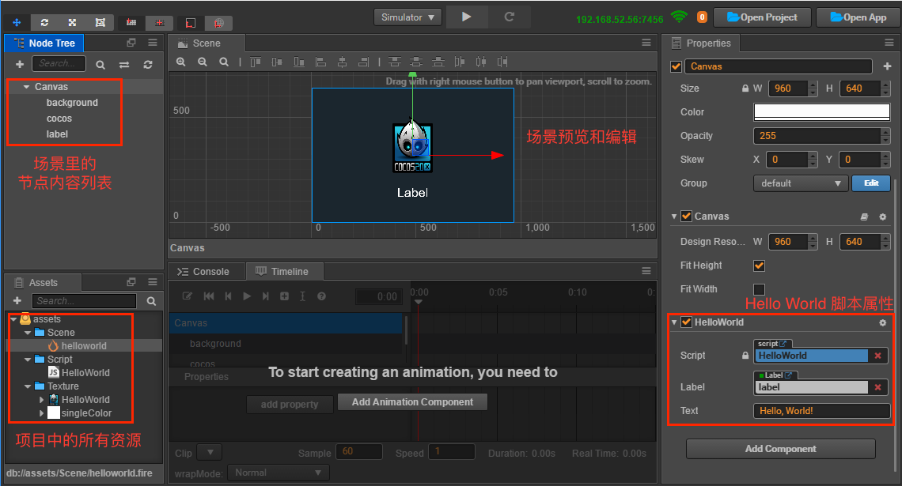
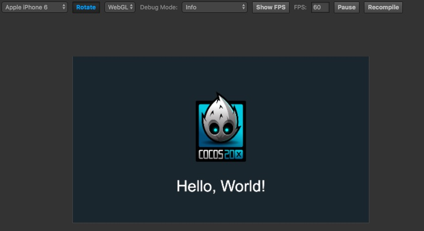
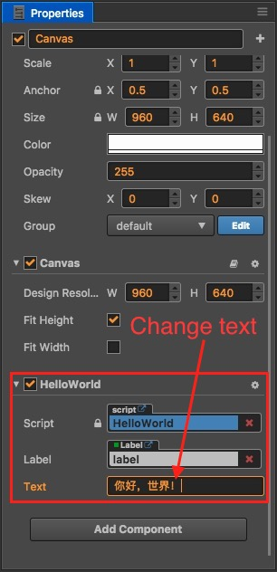

# Hello World

了解 [Dashboard](./dashboard.md) 以后，我们现在看看如何创建和打开一个 Hello World 项目。

## 创建项目

在 Dashboard 中，打开 **新建项目** 选项卡，选中 `Hello World` 项目模板。

然后在下面的项目路径栏中指定一个新项目存放路径，路径的最后一部分就是项目文件夹名称。

填好路径后点击右下角的 **新建项目** 按钮，就会自动以 Hello World 项目模板创建项目并打开。

## 打开场景，开始工作

Cocos Creator 的工作流程是以数据驱动和场景为核心的，初次打开一个项目时，默认不会打开任何场景，要看到 Hello World 模板中的内容，我们需要先打开场景资源文件。

在 **资源管理器** 中双击箭头所指的 `helloworld` 场景文件。Cocos Creator 中所有场景文件都以  作为图标。

## 预览场景

要预览游戏场景，点击编辑器窗口正上方的 **预览游戏** 按钮。

Cocos Creator 会使用您的默认浏览器运行当前游戏场景，效果如图所示：

点击预览窗口左上角的下拉菜单，可以选择不同设备屏幕的预览效果。

## 修改欢迎文字

Cocos Creator 以数据驱动为核心的最初体现，就在于当我们需要改变 Hello World 的问候文字时，不需要再编辑脚本代码，而是直接修改场景中保存的文字属性。

首先在 **层级管理器** 中选中 `Canvas` 节点，我们的 `HelloWorld` 组件脚本就挂在这个节点上。

接下来在 **属性检查器** 面板下方找到 `HelloWorld` 组件属性，然后将 `Text` 属性里的文本改成 `你好，世界！`：

再次运行预览，可以看到欢迎文字已经更新了：

## 小结

这一节的内容，让我们认识了如何从场景开始 Cocos Creator 的工作流程，并且通过修改欢迎文字小小展示了数据驱动的工作方式。接下去我们会用逐步讲解的方式引导大家完成一个较为完整的休闲游戏。相信之后您对 Cocos Creator 的工作流会有更完整的认识。